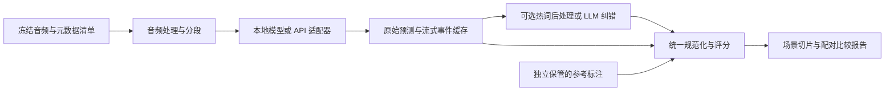

# ASR Benchmark 深度研究：榜单、开源评测框架与跨模型／跨方法实验

研究日期：2026-09-23。研究对象：自动语音识别，涵盖多语言、混说、离线转写、长录音及流式系统；交流语言不作为目标识别语言偏好的依据。本报告独立于此前 ASR 全景研究。

**结论：有可用的开源评测框架。要比较“不同模型＋不同手段”，优先考察可插拔的运行框架，把公开榜单作为外部参照，并独立管理评分规则和实验配置。** 目前核查的工具中，没有一个能无需适配就完整覆盖中文、所有商业 API、实时延迟、多人归属和 LLM 纠错。

本文基于官方仓库、实际脚本、作者论文和榜单方法说明，没有安装框架、下载大规模语料或运行模型实测。下文的“支持”指文档／代码可核实的能力；推荐优先级和实验设计属于研究判断。研究日期不代表所有网页都有同日结果：仓库默认分支、论文、展示榜单可能对应不同版本。

**范围修订：** 本文初版对中文场景着墨过多；日语、韩语及各主要榜单的具体排名、分数与协议已补充到[排名专题](ASR-benchmark-rankings-JA-KO-2026-09-23.md)。以下中文测试方案仅为一个可选示例，不代表用户需求。

## 1. 先回答应该选什么

| 你的主要目的 | 优先考察 | 选择理由／需要补充的部分 |
|---|---|---|
| 复现主流 ASR 公共榜单、比较多模型推理 | [Open ASR Leaderboard](https://github.com/huggingface/open_asr_leaderboard) | 已有多个模型家族和 API 评测入口；适合建立外部基线。复杂方法组合仍需修改 runner |
| 中文／英文、专用 ASR 与 Audio LLM、本地与 API 的统一评测 | [UltraEval-Audio](https://github.com/OpenBMB/UltraEval-Audio) | 已有模型／数据／prompt注册和模型隔离环境；VAD、热词、纠错组合仍需封装 adapter |
| 在自有数据上比较本地与 API、流式与离线、不同 pipeline | [SibNN/asr_eval](https://github.com/SibNN/asr_eval) | 值得优先做适配试验；核查 named pipeline、wrapper、流式输出和多参考转写能力，中文规则需单独配置 |
| 系统测试降噪、混响、压缩、响度处理对各模型的影响 | [ASR.lab](https://github.com/berangerthomas/ASR.lab) | 明确把音频退化、增强和响度组成实验网格；更匹配声学前处理消融 |
| 比较常见商业 API 与本地引擎，并看流式词发射延迟 | [Picovoice speech-to-text-benchmark](https://github.com/Picovoice/speech-to-text-benchmark) | 现成多引擎 benchmark；需要检查语言覆盖、SDK 和厂商默认设置 |
| 中文方言、领域术语、上传已有预测后统一打分 | [GigaSpeechBench](https://github.com/SpeechColab/GigaSpeechBench) | 覆盖方言与行业实体；主要是数据与结果评分流程，不等于自动调用任意模型 |
| 自定义流式策略、长流、输出修订的研究 | [simulstream](https://github.com/hlt-mt/simulstream) | 可扩展 speech processor、事件日志与延迟评测；默认质量评分偏语音翻译，ASR CER/WER 应另接 |
| 只需统一文本错误率 | [JiWER](https://github.com/jitsi/jiwer) | 评分组件，不能替代模型运行框架 |
| 多人会议：内容与说话人归属一起评 | [MeetEval](https://github.com/fgnt/meeteval) | 补充 cpWER、tcpWER 等；需要输出格式和时间戳适配 |

**按任务选择的建议：中文／多模型接入可优先验证 `UltraEval-Audio`；复杂 pipeline 与流式研究验证 `asr_eval`；声学前处理网格选 `ASR.lab`。用 Open ASR Leaderboard 做公共可比性基线，JiWER／MeetEval 做独立评分。** 如果主要研究中文＋热词＋LLM 后处理，可以保留现成 runner，但应把每一条完整 pipeline 视作独立参赛系统。推荐依据及许可证、维护证据、代码入口见[框架详细调查](research-asr-evaluation-frameworks.md)。

## 2. 五种经常被混称为 benchmark 的东西

| 层次 | 实际交付 | 例子 | 能否直接跑自己的实验 |
|---|---|---|---|
| 榜单 | 已测系统的展示与排序 | HF Open ASR、Artificial Analysis | 通常不够，还需要运行代码和数据 |
| 测试集／任务协议 | 音频、参考稿、划分、任务规则 | WenetSpeech、CHiME、GigaSpeechBench | 需要模型接入和 scorer |
| 运行框架（eval harness） | 数据加载、模型适配、执行、缓存、结果导出 | asr_eval、ASR.lab、部分榜单仓库 | 最接近“测不同模型不同手段” |
| 评分器 | reference 与 hypothesis 的比较 | JiWER、MeetEval | 不负责音频推理和 API 调度 |
| 训练／推理工具箱 | 训练配方、解码、模型生态 | ESPnet、NeMo、SpeechBrain、FunASR | 可以构成被测系统，但不是天然中立的跨厂商评测台 |

“仓库公开”还需拆成代码、权重、数据、隐藏测试、评分器五项；只开放其中一项不足以保证别人能复现整张榜单。

## 3. 值得关注的榜单与基准

### 3.1 Open ASR Leaderboard：公共横向比较的首选入口

入口：[实时榜单](https://huggingface.co/spaces/hf-audio/open_asr_leaderboard)、[评测仓库](https://github.com/huggingface/open_asr_leaderboard)、[原论文](https://arxiv.org/abs/2510.06961)。

当前仓库有英语短音频、长音频、多语言与私有测试说明；既有本地模型家族，也有 API 入口。README 的 2026-07-24 流程采用 HF Jobs、模型家族独立 Docker 镜像和 H200；仍描述本地评测入口。不要把旧论文或历史 H100 结果与新流程吞吐数字直接合并。评分输出含 WER 与 RTFx。[当前运行说明](https://github.com/huggingface/open_asr_leaderboard#evaluate-a-model-as-of-24-july-2026)

2026 年 5 月发布的私有数据扩展用于补充公开集，并对公开测试集过拟合提出检查方法。这意味着“开源评测代码”与“所有测试音频可下载”已经不是同一回事。[私有数据说明](https://huggingface.co/blog/open-asr-leaderboard-private-data)

**怎么用：** 用它筛选候选系统、复现同一 track 的分数、检查精度与吞吐取舍。中文业务判断仍应增加中文实际场景测试；独立报告短切片、整段长录音和分块重组。已有参考切片不能证明自动 VAD 和长流端点也同样有效。

### 3.2 Artificial Analysis：API 服务比较，而非可完整下载的统一框架

入口：[离线榜](https://artificialanalysis.ai/speech-to-text/non-streaming)、[流式榜](https://artificialanalysis.ai/speech-to-text/streaming)、[方法说明](https://artificialanalysis.ai/methodology/speech-to-text)。

当前 AA-WER 由 AA-AgentTalk、VoxPopuli-Cleaned-AA、Earnings22-Cleaned-AA 组成，权重分别为 50%、25%、25%；数据集内使用时长加权，不能当成通常的 corpus micro-WER。AgentTalk 为私有集，整套测试不能独立完整复现。它适合观察模型与服务商组合的质量、速度、价格；不是中文综合榜。[方法说明](https://artificialanalysis.ai/methodology/speech-to-text)

一个容易误读的点：其 streaming “Time to First Partial” 关注语音结束后的 partial，而不是从开始说话到首次显示文字。它还定义 forced endpoint 和 fallback 规则。因此拿这个数字与产品里“首字延迟”直接比较会出错。[流式测量细则](https://artificialanalysis.ai/methodology/speech-to-text)

**怎么用：** 选 API 候选、检查服务实际体验的维度；自测仍需固定地域、端点策略和数据。不要把某版本榜单分数当成模型永久属性。

### 3.3 SpeechColab／SpeechIO：看评分口径如何影响结果

入口：[仓库与榜单](https://github.com/SpeechColab/Leaderboard)、[论文](https://arxiv.org/abs/2403.08196)。它将开源系统与商业服务置于公开评测流程，并专门讨论评分细节对结果的影响。适合借鉴 reference/hypothesis 组织、数据集规范化与已有系统适配；最新模型覆盖和运行环境需要按仓库版本检查，不能只因名称是 leaderboard 就假定持续收录所有新模型。

### 3.4 GigaSpeechBench：对中文方言和专业词很有价值的新补充

[2026 年论文](https://arxiv.org/abs/2606.28884)描述 680 小时人工标注数据，包括低资源语言、中文方言、英语口音、行业术语和老人／儿童语音。研究重点与干净朗读集不同，值得纳入候选测试。

[当前仓库](https://github.com/SpeechColab/GigaSpeechBench)可接收带音频／片段 ID 的预测 JSON，输出 WER/CER 和实体相关 B-WER/B-CER；Gradio 可加入自有结果。对我们而言，最有用的是“任意系统先生成预测，再进入统一评分”。

进一步检查 [run_ASR.sh](https://github.com/SpeechColab/GigaSpeechBench/blob/ca782bff09a424233cd3aa1aff11c346cd0f2ed7/run_ASR.sh)：主要做格式转换、规范化、评分和报表，没有自动推理所有模型的步骤；另生成时长过滤后的结果。比较时需一致选择过滤规则，并审计缺失预测，不能让 partial coverage 抬高成绩。该版本还使用 `mapfile` 和 GNU `find -printf`，在 macOS 默认 shell 工具链上直接运行可能需要适配；建议 Linux 容器复现。

本次默认分支最新提交快照为 `ca782bf`（2026-07-21）；GitHub API 未识别许可证，递归文件树也未发现 LICENSE。**将其归为公开代码与 benchmark 候选，不能直接等同于已明确授权的开源底座。** 数据许可另查数据发布条款。[固定版本树](https://github.com/SpeechColab/GigaSpeechBench/tree/ca782bff09a424233cd3aa1aff11c346cd0f2ed7)

### 3.5 FFASR：最适合观察前处理是否真正改善远场识别

入口：[榜单](https://huggingface.co/spaces/treble-technologies/ffasr)、[2026-06-24 官方介绍](https://huggingface.co/blog/ffasr-leaderboard)。

它以不同房间、混响和 SNR 条件比较远场 ASR，并在统一 L4 上报告 WER／RTFx。可提交模型 ID，也可提交包含增强步骤的自定义 `evaluate()`，后者需平台审核。测试音频 held-out，声学模拟使用 Treble 的专有引擎；因此可参与的开放榜单并不代表整套生成器与测试集都开放。

**怎么用：** 外部验证“降噪／增强＋ASR”系统；内部消融仍应保留同一原音的干净、退化、增强版本。不要把发布时列为 roadmap 的多人、阵列或回声消除能力当作已完成赛道。[官方范围与提交说明](https://huggingface.co/blog/ffasr-leaderboard)

### 3.6 多人会议与中文纠错：需要专门任务

- [CHiME-8 DASR](https://www.chimechallenge.org/challenges/chime8/task1/)：这里选择它作为成熟远场会议任务参考，而非声称是最新一届；其任务覆盖多设备、不同场景、长短会议和不同说话人数。适合研究增强、分离、diarization、ASR 的完整组合。
- [ASR-EC](https://github.com/WANGWC1996/2025EMNLP-ASR-EC-Benchmark)：中文 ASR 错误纠正 benchmark；作者比较 prompting、微调和音频＋文本方案。适合研究后处理，不能用固定旧模型的错误分布代替所有新模型的真实输出。[论文](https://arxiv.org/abs/2412.03075)
- [ChineseHP](https://github.com/tzyll/ChineseHP)：面向中文 ASR 纠错的数据资源，可补同音／拼音相关研究；数据来源、划分与当前主 ASR 的错误分布仍需对齐。[作者论文](https://arxiv.org/abs/2407.01909)

## 4. 给中文／混说项目怎样配数据

以下是建议套件，不是统一官方 benchmark；各集分开出成绩，不把所有字符直接堆成一个总榜。

| 测试层 | 候选来源 | 回答的问题 | 使用注意 |
|---|---|---|---|
| 普通话基础 | [AISHELL-1](https://www.openslr.org/33/) | 基础识别与流程是否正常 | 作为 sanity check，不能代表真实会议 |
| 跨领域中文 | [WenetSpeech TEST_NET／TEST_MEETING](https://github.com/wenet-e2e/WenetSpeech) | 网络与会议分布落差 | 固定标签修订；仓库已有测试标注纠错提示 |
| 中文多人会议 | [AISHELL-4](https://www.openslr.org/111/) | 远场、说话人、重叠与多通道链路 | 声道设置、oracle 切片与自动切片分 track |
| 中英混说 | [TALCS](https://arxiv.org/abs/2206.13135) | 语言切换与英语词保留 | 教学场景，不能直接泛化所有混说 |
| 方言／行业术语 | [GigaSpeechBench](https://github.com/SpeechColab/GigaSpeechBench) | 方言及专名优势是否成立 | 固定 CER／WER 与实体 token 规则 |
| 多语言参照 | [FLEURS](https://arxiv.org/abs/2205.12446)、HF multilingual track | 多语言能力边界 | 朗读与真实自发语音分开 |
| 后处理 | ASR-EC＋本项目缓存的模型原始稿 | 纠错是否改善新模型 | 固定源 ASR 输出，再比较纠错方法 |
| 私有业务主集 | 经授权的真实录音 | 最终是否值得上线 | 按会话／说话人隔离；盲测集冻结 |
| 失败挑战集 | 静音、音乐、长停顿、截断、低 SNR、罕见专名 | 漏段、幻觉、错误注入 | 单列失败指标，不能淹没在普通语音总分中 |

建议起步用少量但覆盖关键场景的开发集做适配，之后扩大冻结测试。样本小时数本身不是统计保证；如果主要差异只有极少数严重错误，要按事件数和暴露时长判断，不能只看总体 CER。

## 5. “不同手段”应该拆成哪些实验

下表是建议实验设计。所有实验保留相同参考稿、manifest 和评分版本；调参只使用开发集。

| 研究问题 | 变量 | 对照要求 | 除 CER/WER 外还要看 |
|---|---|---|---|
| 换模型是否更好 | checkpoint／API model version | 统一输入和任务；声明语言提示与上下文资源 | 失败率、成本、长音频覆盖 |
| 同模型换引擎 | 官方实现／faster-whisper／whisper.cpp 等 | 固定权重版本与尽可能一致的解码；不一致处记录 | RTFx、内存、硬件、数值精度 |
| 量化与 batch | dtype／量化／batch size | 固定模型、音频、解码；分别测冷／热启动 | 吞吐、p95延迟、资源峰值 |
| VAD／端点 | 关闭／不同阈值／padding | 既跑给定切片，又跑自动分段 | 首尾丢字、漏语音、提交延迟 |
| 降噪与增强 | 原音／增强器／响度策略 | 同一原音配对；计入增强耗时 | 干净语音退化、低 SNR 改善 |
| chunking | 块长／重叠／拼接／历史上下文 | 保留整段 ID，重组后评分 | 跨块漏字、重复、专名一致性 |
| 解码／热词 | greedy／beam／语言模型／热词强度 | 热词来自事前资源；加入干扰热词 | 热词召回与误插入、实体完整匹配 |
| 多模型融合 | 单模型／级联／投票／择优路由 | 固定调用预算；记录被选择规则 | 每音频成本、尾延迟、覆盖收益 |
| LLM 纠错 | 不纠错／规则／文本 LLM／音频＋文本 | 共享缓存原始稿；固定可用上下文 | 改对、改坏、无依据添加、数字否定 |
| 流式策略 | native streaming／滑窗／稳定前缀策略 | 按真实时间送音频，禁止看到未来 | 稳定词延迟、修订、端点错误 |
| 多人系统 | diarization／分离／多通道 | 固定麦克风与可用元数据 | DER、tcpWER、重叠区错误 |

不要一开始跑整个笛卡尔积。假设 5 个模型×3种VAD×3种增强×4种块长×3种纠错，就有 540 条 pipeline。更有效的顺序是：默认模型筛选 → 单因素消融 → 对有依据的交互做 2×2 实验 → 冻结最终配置盲测。

单因素也不能解释全部交互。例如 VAD 改善旧模型而损害新模型，或降噪破坏某个模型依赖的音色线索。因此最终保留至少“模型×处理方法”的小型交叉验证，不把某方法在一个模型上的收益外推成普遍规律。

## 6. 评分协议比排行榜截图更重要

### 6.1 三条文本评分轨道

建议同时保存并评分：

1. **原始内容轨道**：最少变换，固定大小写／空白约定，保留口语与原始模型输出；用于发现说明文字、翻译、幻觉等。
2. **规范化识别轨道**：固定中文繁简、标点、数字、缩写与中英 token 规则，再计算 CER/WER；用于公平比较识别内容。
3. **业务字段轨道**：人名、数字、金额、单位、日期、否定和专业词；评 exact match、召回／精确率及严重错误事件。

评分用 normalizer 与被测系统的 ITN／LLM 后处理必须分开：前者是裁判规则，后者是参赛能力。修改裁判后要对缓存的全部系统结果统一重算，不能只重算新系统。JiWER 提供变换和编辑距离，但不会自动替你确定中文任务规范。[JiWER 文档](https://jitsi.github.io/jiwer/)

中英混说可采用汉字按字、英文按词的 Mixed Error Rate，但必须公开 tokenizer。“MER”在 JiWER 等库中也可能指 Match Error Rate；不能只写三个字母。[JiWER 指标实现](https://github.com/jitsi/jiwer)

### 6.2 聚合与缺失样本

主分数建议采用 corpus micro error rate：`Σ(S+D+I)/ΣN`，同时报告按会话／场景／语言的分组结果。每句错误率的均值、按时长加权均值、按语言宏平均，回答的并不是同一个问题。

超时、异常、返回空文本不应从测试清单静默删除。建议报告预期样本数、成功数、失败数和覆盖时长；非空 reference 对空输出按删除计入内容错误，同时独立报告服务失败率。纯静音 reference 的分母为零，另报非语音误触发率和每分钟插入词／字数。

所有置信区间建议采用按原始会话分组的配对 bootstrap；比较同一录音的差值。若切出许多相邻片段，把它们视为完全独立会低估不确定性。API 和随机生成重复试验时，应同时保留运行间波动，不能只挑最好一次。

### 6.3 后处理的“收益”要拆开

建议对同一条原始 ASR 稿、同一 reference、固定 alignment 分析：修复了哪些原有错误、破坏了哪些原本正确内容、引入了哪些新信息。另报“原稿完全正确但被改坏”的句比例，并人工复核数字、实体和否定。多对多改写的编辑归因可能不唯一，需明确对齐规则；最终 CER 改善不自动意味着事实忠实度改善。

ASR-EC 适合提供现成任务起点，但对本项目更有价值的是缓存当前候选模型在同一私有集上的原始稿，再统一评测纠错器。上下文只允许使用真实上线时可获得的词表或历史内容；把测试 reference 里的专名整理成每句“热词”会产生答案泄漏。

## 7. 流式 benchmark 要单独建设

离线 RTFx 很高仍可能长时间不出字；模拟流式把整个文件一次性送入模型也不等于实时评测。

建议记录以下事件，并声明起止时钟：

| 指标 | 建议定义 | 解决的歧义 |
|---|---|---|
| first visible text | 从首段实际语音送达客户端到首次非空显示 | 区别于句末之后首个 partial |
| stable word/character latency | 参考单位结束到正确输出且前缀不再修订 | 区别于第一次猜中又改掉 |
| end-of-turn commit | 参考语音结束到最终提交 | 区别于推理耗时；保留自然／强制端点两种模式 |
| revision burden | 删除／替换过的可见 token 数、最大回退 | 识别“看起来一直在输出但不断闪烁” |
| endpoint errors | 过早截断、话轮误合并、长停顿误判 | 防止只优化延迟 |
| p50/p95/p99 | 同一定义下按会话／chunk分层 | 平均值不能代替尾部体验 |

未正确识别的参考词不能默认为零延迟；稳定延迟需同时报告可对齐覆盖率和识别错误。流式回放需限制模型只看已到达的采样，保留采集／发送／接收时间，并把网络、排队、endpoint、后处理开销计入端到端轨道。吞吐测量与真实时间回放分开。

### simulstream 的位置

它是 Apache-2.0 的可扩展流式处理与测量底座：用 `SpeechProcessor` 接入方法，输出 JSONL 事件，已有 latency 和 flickering 统计。[官方仓库](https://github.com/hlt-mt/simulstream)

本次检查 `86e0f1e`（2026-07-09）版本，quality scorer 目录主要是 COMET、SacreBLEU 及相关模块；没有据此确认现成中文 CER scorer。可复用流式日志，把最终文本交给 JiWER，再补产品需要的端点和稳定字延迟。[固定版本 quality scorer](https://github.com/hlt-mt/simulstream/tree/86e0f1ed82cb59018515b246e115e298bb0bd7da/simulstream/metrics/scorers/quality)

经典 [SimulEval](https://github.com/facebookresearch/SimulEval) 已于 2025-09-18 归档，适合复现旧同传工作，不建议未经维护评估就作为新 ASR 产品唯一底座。也不要把语音翻译的 AL／LAAL 等指标直接改名成用户首字延迟。

## 8. 推荐的评测系统结构

以下是建议架构，不声称是某个现有仓库的直接配置。

最重要的边界是参考标注只进入 scorer，不能默认传给模型／处理链；方法确实需要领域词表时，单独保存其来源与版本。

建议把已有模型 adapter 复用起来，自有扩展控制在四个接口：`transcribe`、`stream`、`postprocess`、`score`。不要让评分器重新运行 ASR；修改文本规则时可以直接重算缓存结果，比较多个纠错器时也可复用同一份原始稿。

### 最少应保存的记录

| 文件／记录 | 必备字段 |
|---|---|
| manifest | sample_id、session_id、音频哈希、起止、语言／场景、ref版本、split |
| run配置 | model revision、引擎commit、dtype、硬件、batch、prompt、VAD、块长、热词来源、后处理、随机种子 |
| predictions | 原始响应、解析后的文本、segments、错误类型、重试次数、耗时、费用 |
| stream events | 音频已发送位置、客户端时间、partial／final、可见文本、revision序号 |
| scores | normalizer/tokenizer版本、S/D/I/N、字段正确性、会话聚合、失败覆盖 |
| run摘要 | 软件环境、数据版本、所有配置哈希、执行日期、API区域与模型标识 |

缓存键至少包含音频与处理参数哈希、模型／引擎版本、prompt／热词、解码设置及后处理版本。仅用模型名会把不同实验误当成同一次推理。商业 API 无法冻结内部权重时，保留返回的版本标识、请求参数、日期与原始响应，并承认复现边界。

## 9. 可以直接照着实施的首轮方案

这是一套建议实施顺序，不包含已完成的模型实测。

1. **固定任务。** 先按实际产品确定目标语言、混说组合与场景，不默认普通话；离线转写与流式字幕分榜，若含会议，再新增说话人归属轨道。
2. **验证框架。** 用相同几十条音频，在 `UltraEval-Audio` 或 `asr_eval` 跑一个本地模型和一个目标 API（先确认对应 adapter，未内置则包装）；在 ASR.lab 验证原音／降噪的配对结果。检查是否能导出原始稿、处理配置、失败记录与每条样本结果。
3. **冻结评分。** 中文 CER、英文 WER、Mixed Error Rate、实体／数字、超时覆盖；为繁简、数字、英文缩写和空输出准备人工可核验样例。
4. **建立默认基线。** 候选模型先保持各自合理默认设置；另跑统一切片的可比轨道。依赖环境按模型隔离，避免一个模型的 CUDA／SDK 依赖破坏所有实验。
5. **跑方法消融。** 优先 VAD、chunk、热词、一个后处理方案；如果困难样本主要来自声学，再投入增强网格。用相同原音进行配对比较。
6. **针对入围模型扩展。** 加长音频、混说、方言、静音；流式用真实时间回放，输出质量—稳定延迟曲线。
7. **冻结最终候选盲测。** 包括运行成本与失败率，按会话报告差值与不确定性。不要在看到测试分数后反复调参仍称“测试”。

首轮成功标准是：同一个测试清单能跑完多种系统；分数能从缓存重算；每个优势能归因到模型或方法；最差场景与失败可回听。不以做出漂亮总榜代替这些能力。

## 10. 选型结论及尚未核实项

对于“不同模型不同手段”的需求，最值得优先验证的是 **UltraEval-Audio 的中文与跨模型接入、asr_eval 的多系统／pipeline 能力、ASR.lab 的声学处理网格**。公共对齐另用 Open ASR Leaderboard；评分使用独立、版本化的 JiWER／MeetEval。模型训练工具箱按 adapter 接入，不必为了评测把所有模型迁移到一个训练框架。

如果只想快速比较已有模型输出，GigaSpeechBench 或 SpeechColab 的结果评分路线更轻；如果主要验证商业 API，Picovoice 的多引擎脚本值得复用；如果研究音频大模型的提示词与任务格式，还需考察 lmms-eval／UltraEval-Audio。各项详细核查在[框架调查附录](research-asr-evaluation-frameworks.md)。

尚未完成运行验证的部分包括：目标模型最新版本 adapter 是否可用、商业服务账号与接口是否匹配、中文 normalizer 是否满足本项目规则、GPU／macOS 安装兼容性、完整数据授权和隐藏榜单的独立可复现性。本次研究不据此宣称某个框架“开箱即用”或某个模型“全场景最佳”。
