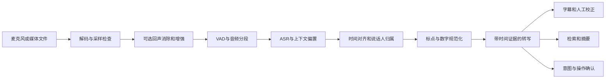
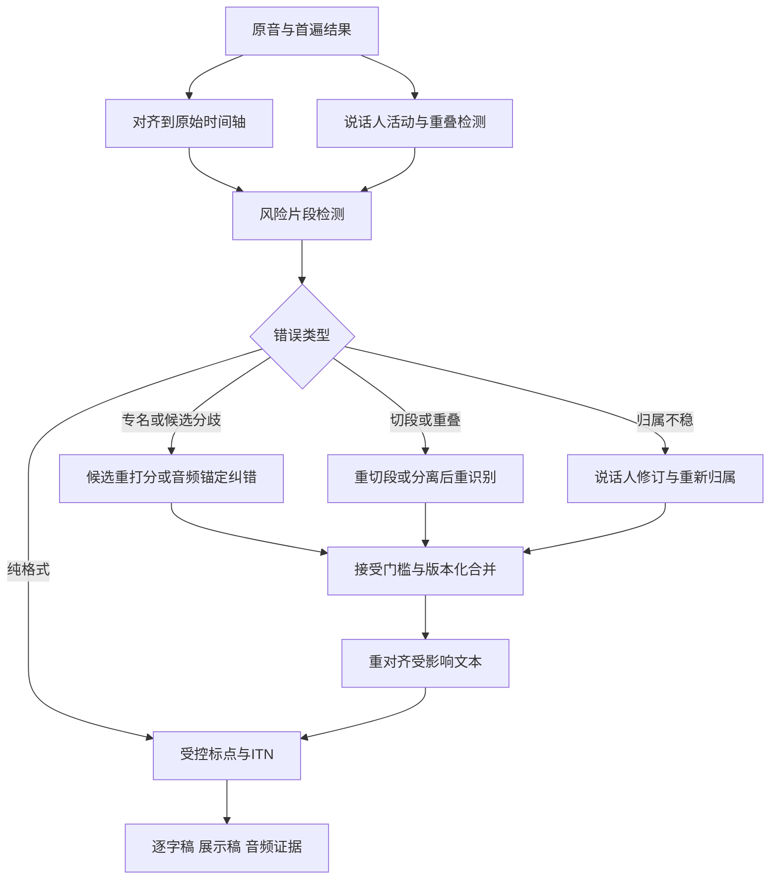

# ASR 深度研究：从声音、数据与模型，到实时系统和技术路线

**研究日期：2026-09-23｜同日修订：优先覆盖新发布与重大更新｜用途：全景理解与技术路线判断**

模型覆盖原则：保留必要的历史基线，优先核查2026年、尤其最近三个月的新模型与能力更新；明确区分权重发布、论文提交、API更新与预览状态。

这份研究的核心判断是：ASR 选型应围绕“在指定条件下交付可信、及时、可用的记录”展开。模型只是实现这一目标的一个环节。

先记住六点：

- 编码器结构、训练目标、预训练方式、流式约束是不同维度，不能排成单一淘汰链。
- 文件转写、实时字幕、语音对话有不同的时间与错误契约，适合不同架构。
- 中文、方言、混说和多人会议需独立评测，平均 WER/CER 不足以说明业务质量。
- 声道、VAD、端点、对齐、说话人和数字规范化会决定模型优势能否转化为产品优势。
- 计算/API单价之外，人工校正、闲置容量和维护决定完整成本。
- 优先积累稳定评测、可回放错误和版本化数据；这些资产能帮助判断下一代模型是否值得替换。

以上为报告综合判断；依据、例外和验证方式在正文展开。

**阅读导航**

1. [问题地图与架构总览](#part-1)
2. [近期模型进展、学习范式与候选路线](#part-2)，优先阅读[新发布与重大更新](#recent-models)
3. [数据、中文、多语言与评测](#part-3)
4. [生产链路、实时部署与成本](#part-4)
5. [商业生态、治理与技术路线决策](#part-5)
6. [后处理与说话人驱动的质量提升](#postprocessing)
7. [来源索引](#sources)


<a id="part-1"></a>

## 第一部分：问题地图与架构总览

### 阅读与证据说明

本报告是基于公开一手论文、作者仓库、官方数据集、服务文档和定价页的案头研究，没有运行跨模型基准测试，也没有进行供应商账户内验证。文中“支持”通常指文档声明，不等于已经证明在你的语言、设备和场景上可用；“建议”“判断”“推断”是对证据的工程综合。价格是查询时快照，不能当作合同报价。搜索摘要可能滞后于正文，例如本次 AssemblyAI 搜索摘要仍出现 Universal-3 Pro，打开定价正文则已是 Universal-3.5 Pro；涉及选型时应固定模型版本和接口。

建议先读本篇的问题地图与路线表，再读模型、数据评测、生产系统三个专题，最后回到路线决策与研究机会。本文不提供缺乏可比实验的“最佳 ASR 排名”，也不引用口径不透明的市场规模预测。

### 一、先理解 ASR 究竟交付什么

将波形变成文字只是最窄的任务定义。可用的语音系统还必须说明：哪一段声音产生了哪段文字、何时可以把文字视为稳定结果、谁在说话、什么内容不确定、用户说的是事实记录还是操作命令。识别、对齐、说话人分段、身份识别、翻译、摘要和语音理解是不同任务，能做其中一项不意味着能做其余各项。官方转写 API 对普通文字、说话人结果、时间戳的模型限制分别定义，正反映了这些边界。[OpenAI 文件转写文档](https://developers.openai.com/api/docs/guides/speech-to-text)

| 任务 | 需要回答的问题 | 常见混淆 |
|---|---|---|
| ASR / STT | 说了哪些词或字？ | 语句通顺不代表忠于原音 |
| VAD | 当前有没有语音活动？ | 静音不必然代表说完 |
| Endpoint / turn detection | 一句或一轮是否结束？ | 识别出最后一个词不等于可以开始回复 |
| Diarization | 什么时间由哪个匿名说话人发言？ | speaker_1 不等于某个真实姓名 |
| Speaker verification / identification | 是否为声明的人、属于哪个已登记的人？ | 需要身份依据，风险与匿名分段不同 |
| Forced alignment | 给定文字在声音中对应何时？ | 对齐器不能证明给定文字正确 |
| Punctuation / ITN | 如何恢复标点和数字书写？ | “一二三”可能是编号，也可能是一百二十三的口语 |
| Speech translation | 用另一种语言表达什么？ | 翻译会失去原语言逐字证据 |
| Spoken language understanding | 意图、实体、事件是什么？ | 完成意图任务未必需要逐字转写 |
| Speech-to-speech | 如何直接用语音交互？ | 可听见的流畅回答不是可审计的原话记录 |

以上表是本报告的任务划分，不是某一厂商的产品分类。

### 二、决定技术路线的六个维度

**第一是时间约束。** 文件转写拥有完整后文，可以离线分段、批量计算、反复校正。实时字幕必须在说话过程中提供文字，还要控制回改。对话系统除了尽快出字，还要避免过早抢话、过晚回应。单纯传输使用 WebSocket 并不足以证明模型是因果流式；文件上传后逐步返回文本也可以被称为 streaming。火山文档明确区分双向流式和流式输入、句级输出；OpenAI 文件流式输出也有单独说明。[火山产品说明](https://docs.volcengine.com/docs/6461/1354871?lang=zh)、[OpenAI 文件流式转写](https://developers.openai.com/api/docs/guides/speech-to-text)

**第二是错误代价。** 播客搜索可容忍少量虚词错误，订单里的数量、否定词和地址却可能直接影响任务。建议用业务实体与操作结果补充 WER/CER，并保留关键实体确认机制。这里的取舍是风险设计，不是对某个模型精度的主张。

**第三是声学条件。** 近讲输入、电话、远场会议、车内语音不是同一种数据分布。产品路线应先确定话筒位置、声道来源、回声和重叠说话情况，再挑识别模型。尤其不能把能保留的独立声道提前混成单声道，再指望后端完全恢复身份与重叠内容。

**第四是语言与文字契约。** 普通话、带地方口音的普通话、粤语、吴语、中英混说必须分别描述；还要确定简繁体、口语词、数字和专名如何记录。语言数量只能作覆盖提示，不能作质量分数。阿里云官方表对不同实时/文件版本分别列出语言和功能，说明能力应落到精确版本。[阿里云 ASR 模型概述](https://help.aliyun.com/zh/model-studio/asr-model)

**第五是部署边界。** 云 API 降低启动负担，自托管提供版本与数据路径控制，端侧能适应离线与隐私要求，但约束是硬件覆盖、电耗、内存和分发维护。Apple SpeechAnalyzer 提供系统级语音分析与端侧转写路径，说明端侧路线也应把操作系统能力纳入候选。[Apple WWDC25 SpeechAnalyzer](https://developer.apple.com/videos/play/wwdc2025/277/)

**第六是可追溯性。** 对一份需要核对的记录，原始转写、显示文本和摘要应作为三个版本存储；每次规范化与纠错都应保留出处。建议把“准确且可追溯的文本”定义为系统输出，而不是只保存一段被 LLM 润色的字符串。

### 三、全链路地图与三种架构



这是逻辑责任图；实际模型可能合并若干节点，说话人模块也可以与 ASR 并行，不要求严格按图串行。目标是保证每项责任被测量，而不是增加模块数量。

| 架构 | 优先优化 | 典型组成 | 最应验证的风险 |
|---|---|---|---|
| 离线高质量转写 | 完整性、长音频吞吐、校对成本 | VAD分段 + 大模型 + 对齐/分人 + 可选二次复核 | 切段遗漏、长文漂移、说话人串号 |
| 原生实时识别 | 稳定文字延迟、连续运行 | 有限右上下文编码器 + 增量解码 + 状态缓存 | 回改、端点误判、断线恢复 |
| 流式首遍 + 句后/会后二遍 | 交互速度与最终质量 | 快速草稿 + 音频复核 + 版本更新 | 用户已按旧文字行动，后台才修正 |
| 直接语音交互 | 轮次自然度、韵律和打断 | 语音理解与生成 + 工具执行边界 | 缺乏忠实逐字记录，动作与转写不同步 |

**判断：这几条路线会共存。** 一旦要求稳定字幕、可追溯记录、断网运行或低价高吞吐，问题就不会归约为“哪个参数量更大”。模型能力合并能简化部署，系统仍需保留可观察的时间、归属与置信边界。

<a id="part-2"></a>

## 第二部分：近期模型进展、学习范式与候选路线

<a id="recent-models"></a>

### 近期 ASR 发布与重大更新：优先覆盖新进展

核查截止：2026-09-23。选取原则：历史模型保留解释技术路线所必需的代表；2026年发布或发生重大能力变化的模型优先核查，尤其关注最近三个月。以下不是全部新模型清单，覆盖的是本次检索到、有一手证据且影响路线判断的新进展。日期明确区分发布公告、论文提交与文档查询，不把三者混同。

#### 1. 最近进展速览

| 模型/更新 | 时间依据 | 对技术路线的意义 | 证据与边界 |
|---|---|---|---|
| ElevenLabs Scribe v2 Medical | 2026-09-22 官方GA公告 | 通用转写之上做医疗领域适配 | 批量接口，不能当作Medical实时模型；见下节 |
| Xiaomi-CocktailASR-1 | 技术报告2026-09-10提交 | 用参考声音识别目标说话人，处理多人重叠 | 不是默认转写所有人的普通ASR。[论文](https://arxiv.org/abs/2609.11274) |
| MAI-Transcribe-2 | 2026-09-03 官方公告 | 微软自研转写升级；把时间、分人、文本风格整合到接口 | Azure接入仍有预览及长音频分人限制，见下节 |
| VibeVoice-ASR-Streaming | 2026-09-03 官方仓库公告 | 长音频联合建模之外发展专门流式版本 | 与离线ASR、TTS分开测。[仓库](https://github.com/microsoft/VibeVoice) |
| NVIDIA Nemotron-Labs-Audex-30B-A3B | 2026年7月技术报告 | ASR融入统一音频—文本理解与生成模型 | 30B MoE/3B激活不等于3B内存；模型卡为非商业许可。[论文](https://arxiv.org/abs/2607.05196)、[模型卡](https://huggingface.co/nvidia/Nemotron-Labs-Audex-30B-A3B) |
| MOSS-Transcribe-Diarize | 2026-07-09权重发布；论文初稿更早 | 一次产生转写、时间与说话人 | 单独展开，不以MOSS-TTS代替ASR介绍 |
| AssemblyAI Universal-3.5 Pro | Realtime 2026-06-23；文件版07-07，官方发布索引 | 上下文、混说和说话人结合的产品化 | 文件与Realtime分别验证；09-15 Dictation API属于工作流更新。[发布索引](https://www.assemblyai.com/collection/releases) |
| Soniox v5 | Realtime 2026-06-16公告；另有v5 Async | 输出向带说话人和语言信息的结构化流发展 | 使用v5精确ID，不能停留在旧v4介绍。[实时公告](https://soniox.com/blog/soniox-v5-real-time)、[Async公告](https://soniox.com/blog/soniox-v5-async) |
| Deepgram Flux Multilingual | 2026年4月：changelog 04-15，新闻稿04-29 | 把轮次与识别一起优化并扩到多语种 | 首发10语言不含中文；两份官方日期不同，保留来源口径。[变更记录](https://developers.deepgram.com/changelog/2026/4/15)、[新闻稿](https://deepgram.com/learn/deepgram-launches-flux-multilingual-press-release) |
| Granite-4.0-1B-Speech | 2026-03-06 模型卡 | 小型Speech-LLM、关键词偏置 | 语音输入语言与翻译输出语言不同。[IBM模型卡](https://huggingface.co/ibm-granite/granite-4.0-1b-speech) |
| Voxtral Mini 4B Realtime 2602 | 2026年2月发布系列 | 开放权重的专门实时识别路线 | 独立于文件版Voxtral Mini Transcribe V2。[Mistral公告](https://mistral.ai/news/voxtral-transcribe-2/) |
| Qwen3-ASR / FireRedASR2 | 2026年新系列，详见后文模型专题 | 中文、多语言与专门ASR持续演进 | 保留精确权重、流式和语言能力差异。[Qwen论文](https://arxiv.org/abs/2601.21337)、[FireRed仓库](https://github.com/FireRedTeam/FireRedASR2S) |
| GPT-Transcribe；Qwen-Audio-3.1-ASR-Flash | 2026-09-23当前官方文档已列出；此处不推断首发日 | 上下文转写、实时/文件商品分化 | 已进入商业生态；未核实发布日期不写成“本月发布”。[OpenAI模型页](https://developers.openai.com/api/docs/models/gpt-transcribe)、[阿里模型概述](https://help.aliyun.com/zh/model-studio/asr-model) |

#### 2. MAI：应研究 Transcribe-2，而非只提第一代

微软2026-09-03发布 MAI-Transcribe-2，公告以多语言准确率与效率作为主要改进方向。公告中的“最快、最准确、最便宜”是厂商比较结论，本报告不将其转换为无条件排名。[Microsoft AI发布](https://microsoft.ai/news/mai-transcribe-2-is-the-fastest-most-accurate-and-cheapest-speech-recognition-model-in-the-world/)

当前Azure官方页列出60语言、词级时间戳、说话人分段、关键词偏置和逐字/清洁文本风格，并列出2与1.5，标注1在2026-08-20弃用。该接入页仍为public preview；特别说明约15分钟及更长录音开启分人可能失败，建议长录音关闭分人后另做处理。这是实际接口边界，不能只凭模型发布公告判断生产就绪。[Azure MAI文档](https://learn.microsoft.com/en-us/azure/ai-services/speech-service/mai-transcribe?pivots=ai-foundry)

**路线判断：** 应把MAI-Transcribe-2列入托管文件转写候选，并把“有无分人、长短录音、逐字或清洁模式”作为不同配置验收。不能因为Azure Speech支持实时识别，就自动认定这里的MAI文件接口具有同样的增量流式能力。其研究价值在于检查“语义与结构能力增强”能否减少整个流水线和人工工作量。

#### 3. ElevenLabs：Scribe家族应拆成三条路线

Scribe v2 的官方发布于2026-01-09，定位长、复杂录音的批量转写；Realtime面向低延迟交互，两者不是同一延迟设置。最新API概述还列出Medical，并分别规定能力与参数。[Scribe v2发布](https://elevenlabs.io/blog/introducing-scribe-v2)、[API能力概述](https://elevenlabs.io/docs/overview/capabilities/speech-to-text)

2026-09-22的公告将 Scribe v2 Medical 宣布为GA，模型ID为 `scribe_v2_medical`，运行于batch端点。厂商在Eka英文临床集上报告WER由8.6%降到7.0%：下降1.6个百分点，约18.6%相对下降；不能理解为提高18个百分点，也不能外推为中文医疗准确率。公告引用的Omi新榜单计划09-25更新，晚于本报告截止日，因此这里只视为厂商提前披露，未称已独立核对该榜单。[Medical GA公告](https://elevenlabs.io/blog/scribe-v2-medical-generally-available)

**路线判断：** 医疗版说明垂直领域适配仍有价值。可用同一医疗测试集比较通用版、通用版加术语、医疗版三种配置，观察收益来自模型适配还是词表；同时测药名、剂量与单位，并保留一般语音回归。对于实时产品则独立评估Scribe v2 Realtime，不将batch版的分人和长文能力直接移植过去。实际术语参数以API文档为准，当前batch与realtime限制不同，旧帮助页数字可能滞后。

#### 4. 新路线不只发生在通用转写

**目标说话人识别。** Xiaomi-CocktailASR-1以参考说话人声音确定要识别的目标，包含非目标声音拒识。官方表还把剔除空输出后的WER与误拒率分开报告，因此不能直接拿其“非空WER”与其他系统完整WER比较。应联合评估目标文字、错转他人声音、错误拒识和参考样本质量。[小米官方仓库](https://github.com/xiaomi-research/xiaomi-cocktailasr-1)

**统一音频模型。** Audex同时涉及ASR、翻译、声音理解与生成，适合研究语音任务和LLM能力统一；本报告不把它当作低成本转写的默认替代。公开权重标注非商业许可，部署候选资格须先核对；思考模式、指令模式与各任务解码设置也不能混用。[NVIDIA模型卡](https://huggingface.co/nvidia/Nemotron-Labs-Audex-30B-A3B)

**轻量端侧。** ABR的Niagara与SDK代表小型本地流式路线，官方SDK文档包含 `niagara-38m-live.en` 示例。这里把它列为端侧候选线索，尚未对所有目标芯片、语言和发布包做实测或许可审查，不从“端侧”推导所有手机均可用。[ABR包说明](https://docs.appliedbrainresearch.com/sdk/concepts/application-packages/)、[ASR说明](https://docs.appliedbrainresearch.com/sdk/asr/overview/)

**相邻音频研究。** Step-Audio-R1.5涉及音频理解、推理与对话，应作为ASR外围路线跟踪；2026年9月的StepAudio 3 Gen和Music主要是生成任务，不能为了追新就列作新的ASR引擎。[R1.5论文](https://arxiv.org/abs/2604.25719)、[3 Gen论文](https://arxiv.org/abs/2609.12945)、[3 Music论文](https://arxiv.org/abs/2609.16034)

**综合判断：** 最近变化至少沿五个方向展开：原生流式与轮次控制，转写/时间/说话人联合输出，领域适配，目标说话人选择，音频理解与语言模型统一。选型应为每条相关路线放一个近期候选，再用稳定基线测收益；“模型新”代表值得验证，不代表可以跳过同条件评测。

### OpenMOSS 新近语音路线补查

核查日期：2026-09-23。范围是影响 ASR 路线判断的近期发布；官方功能声明不等于独立复现实测。

#### 1. 必须进入主报告：MOSS-Transcribe-Diarize 0.9B

这比笼统补一个“MOSS-Audio”条目更重要：它直接面向长录音中的“谁在何时说了什么”。**0.9B 权重于 2026-07-09 发布**；官方模型卡列明 Apache-2.0、50 多种语言、最长 90 分钟单次输入、热词提示，并联合生成文本、时间戳和匿名说话人编号，也可输出声学事件。它适合会议、播客、访谈和字幕，是近期专用 ASR 系统候选。[官方模型卡](https://huggingface.co/OpenMOSS-Team/MOSS-Transcribe-Diarize)

应区分论文和权重日期：技术报告初稿是 **2026-01-04**，截至核查日最新版为 **2026-07-17 的 v7**，不能将七月开源误写为论文首次提出。论文把任务称为 Speaker-Attributed, Time-Stamped Transcription，报告 128k 上下文及 90 分钟输入支持。[论文版本记录](https://arxiv.org/abs/2601.01554)

公开配置可交叉核实 Qwen3 文本模块、Whisper 类型音频模块、4 倍音频帧合并和 131072 最大位置数；这些配置支持其音频—语言联合结构的描述。具体训练初始化仍应以报告为准，不能仅凭配置断言全部权重来源。[模型配置](https://huggingface.co/OpenMOSS-Team/MOSS-Transcribe-Diarize/blob/main/config.json)

**工程边界：**官方仓库已提供 SGLang Omni / vLLM 服务接入及字幕工具，长录音需足够的输出 token 预算，否则可能截断。Pro 仅在仓库中指向在线体验，不能将其效果和开源 0.9B 混写；未查得公开权重证据。现有文件上传和长音频能力也不足以证明低延迟、可持续会话的原生流式能力。[官方仓库与服务说明](https://github.com/OpenMOSS/MOSS-Transcribe-Diarize)

**路线意义（研究判断）：**把 ASR、说话人归属和时间戳联合建模，使轻量开源模型可以竞争原来需要多模块拼接的会议转写系统。应同时测文本误差、归属错误、重叠讲话、长录音后段漂移、时间边界和截断率。匿名编号只在单条输入内成立，不是实名声纹识别。官方自报 CER/cpCER 表可作筛选线索，不宜转述成跨场景冠军。[输出标签与评测定义](https://huggingface.co/OpenMOSS-Team/MOSS-Transcribe-Diarize#output-format)

#### 2. MOSS-Audio：通用音频理解，保留独立条目

**2026-04-13** 发布，**06-01** 公布技术报告。提供 4B/8B 的 Instruct、Thinking 四款；模型名对应语言骨干量级，包含音频模块的总参数约 **4.6B / 8.6B**。采用自研音频编码器、适配器和 Qwen3，连续音频表示为 12.5 Hz，并以跨层特征注入及时间标记保留声学、时间信息。它覆盖转写、词/句时间戳、环境声音、音乐、音频问答与推理；8B-Instruct 模型卡标注 Apache-2.0。[发布与架构](https://github.com/OpenMOSS/MOSS-Audio)、[参数和许可](https://huggingface.co/OpenMOSS-Team/MOSS-Audio-8B-Instruct)

路线意义是：当任务需要环境事件、音色线索或时间定位，纯文字转写可能丢失必要信息。但更大的通用音频模型并不自然优于专用 ASR；Thinking 也不应被默认用于逐字字幕。应把“听懂和回答”的准确率与“忠实转写”的错误率分开评估。

#### 3. 相邻前沿：Speech 和 Tokenizer 不能当成 ASR 产品

**MOSS-Speech** 的论文首发于 **2025-10-01**，官方仓库标注 ICLR 2026，基于 Qwen3-8B，通过模态分层和冻结预训练实现不依赖文本引导的 speech-to-speech。仓库代码许可为 Apache-2.0，但其 TODO 仍列出 Base 模型开放与 Gradio 流式输出，不能据此宣称完整开放、成熟实时转写服务。它说明原生语音交互可以绕过显式文本中间层；需要审计文本的业务仍须额外设计可核验转写通路。[论文](https://arxiv.org/abs/2510.00499)、[仓库现状](https://github.com/OpenMOSS/MOSS-Speech)

**MOSS-Audio-Tokenizer** 是音频离散表示基础设施：初版 **2026-02-09** 发布，1.6B、24 kHz 单声道；**04-13** 增加约 20M 的 Nano；**06-07** 发布 **v2，2B、48 kHz 双声道**，支持 12.5 Hz 表示、32 层 RVQ 和分块编解码，v2 模型卡标注 Apache-2.0。它输出音频 codes / 重建音频，不直接输出转写；codec 的流式能力不等于上层 ASR 的流式能力。[版本时间线](https://github.com/OpenMOSS/MOSS-Audio-Tokenizer)、[v2 规格](https://huggingface.co/OpenMOSS-Team/MOSS-Audio-Tokenizer-v2)

因此主报告应按“联合转写与分离／通用音频理解／原生语音交互／音频表示基础设施”四层纳入 MOSS，而非把所有名字并成一个模型家族排名。
### 1. 不要把架构发展理解成一条淘汰链

ASR 至少有四个正交设计维度：**编码器如何表示声音、训练目标如何学习对齐、解码器如何利用语言知识、运行时能看多少未来音频**。Conformer 是编码器结构，CTC/RNN-T 是对齐与序列建模方式，Whisper 是完整模型家族，wav2vec 2.0 是预训练范式；把它们排成同层“模型排行榜”会误导技术决策。相同编码器可以接不同输出头；同一模型家族也可能同时有流式和离线权重。[Conformer 论文](https://arxiv.org/abs/2005.08100)、[NeMo 模型文档](https://docs.nvidia.com/nemo-framework/user-guide/26.02/nemotoolkit/asr/models.html)

#### 从显式模块到端到端对齐

传统声学模型、发音词典与语言模型分工明确，便于注入领域词汇，但训练、搜索和维护链条复杂。端到端方法把更多模块联合训练，不等于词典、语言模型与外部知识从此没有价值；外部重打分仍可以提高识别结果。LAS 的早期工作就同时报告有无语言模型重打分的结果，说明“端到端”描述的是学习方式，而不是禁止系统组件。[LAS 原始论文](https://arxiv.org/abs/1508.01211)

| 方法 | 关键机制 | 工程含义与代价 |
|---|---|---|
| CTC | 对含 blank 的帧级路径求和，再折叠重复标签；无需逐帧人工对齐 | 输出路径有条件独立假设，解码相对简单；适合与外部语言模型或词表约束结合 |
| RNN-T / Transducer | 编码器处理声音，预测网络处理已输出符号，联合网络决定符号或 blank | 同时考虑声学与输出历史；使用因果/受限上下文编码器时适合增量识别 |
| Attention Encoder-Decoder | 解码器每一步关注音频表示，并条件于历史输出 | 擅长全句上下文；普通全局注意力配置需要额外设计才能在线运行 |
| 非自回归模型 | 预测长度或对齐后并行输出多个符号 | 降低逐 token 解码串行开销，但必须解决长度、对齐和词间依赖 |

表中机制分别来自 [CTC](https://www.cs.toronto.edu/~graves/icml_2006.pdf)、[RNN-T](https://arxiv.org/abs/1211.3711)、[在线 LAS 分析](https://arxiv.org/abs/2008.05514)、[Paraformer](https://arxiv.org/abs/2206.08317)。工程含义为机制推导，不表示任意 CTC 都天然流式，也不表示任意 attention 模型只能离线。

CTC 的“条件独立”不意味着编码器不看上下文：双向编码器可以先综合全句声音，然后在输出分布分解时采用独立假设。相反，RNN-T 名称中的 RNN 也不限制现代实现只能采用循环网络。选型时应检查**实际编码器的右侧上下文、缓存和解码策略**，不能仅看损失函数名字。[CTC 论文](https://www.cs.toronto.edu/~graves/icml_2006.pdf)、[NeMo 实现说明](https://docs.nvidia.com/nemo-framework/user-guide/26.02/nemotoolkit/asr/models.html)

#### 编码器和解码效率仍是核心研究方向

Conformer 将局部卷积与全局自注意力结合，让语音的局部时频规律和长距离依赖同时得到建模。Zipformer 则通过不同时间分辨率等设计降低编码成本。两者的意义是更高效地提取声学证据；增加一个大型文本解码器并不能替代这个问题。[Conformer](https://arxiv.org/abs/2005.08100)、[Zipformer](https://arxiv.org/abs/2310.11230)

FastConformer 进一步优化下采样和注意力计算；Token-and-Duration Transducer（TDT）不仅预测符号，还预测推进时长，从而减少逐帧转移开销。推断：当业务是海量录音归档，改进编码与跳帧解码可能比增加参数更能改善单位小时成本，但实际收益取决于输入长度和批处理设置。[FastConformer](https://arxiv.org/abs/2305.05084)、[TDT](https://arxiv.org/abs/2304.06795)

### 2. 三种学习路线：它们解决不同的数据问题

**自监督预训练**利用无转写音频学习表示，再用标注语音微调。wav2vec 2.0 在潜在表示上掩码，通过量化目标的对比任务学习；HuBERT 先用聚类产生离散目标，再预测被遮挡的目标。二者都降低对人工转写量的依赖，但“无标注预训练”不等于无需下游标注，也不保证对任意业务领域泛化。[wav2vec 2.0](https://arxiv.org/abs/2006.11477)、[HuBERT](https://arxiv.org/abs/2106.07447)

**大规模弱监督**直接学习互联网音频与相应文字。Whisper 论文以 68 万小时多语言、多任务数据训练，重点展示跨数据集零样本泛化。其贡献不只是 Transformer 结构，而是训练数据规模与多样性改变了“每个领域先做大量微调”的使用模式。原论文数据量不能套用到后续所有版本。[Whisper 论文](https://arxiv.org/abs/2212.04356)

**多语言基础模型**把语言覆盖当成数据与迁移问题。Google USM 用大规模无标注多语言编码器预训练后微调；Meta MMS 将自监督与宗教文本朗读数据结合，分别报告了 1,107 语言 ASR 和更多语言的语言识别能力。关键边界：预训练语言数、可转写语言数和可识别语种数不同；低资源语言“有一个权重”也不等于自然会话、医疗或方言准确率已达商业要求。[USM](https://arxiv.org/abs/2303.01037)、[MMS](https://arxiv.org/abs/2305.13516)

数据策略的一个直接启示是：手中有大量目标场景录音但标注预算有限时，应考虑领域自监督适配或伪标签，而非只扩大通用模型。Robust wav2vec 2.0 的实验发现目标领域无标注数据能显著缩小域偏移差距；这是有设置边界的实验结论，并非承诺每项业务都能获得同等提升。[领域偏移研究](https://arxiv.org/abs/2104.01027)

SpecAugment 通过特征时间/频率遮挡等方式增强训练；这类方法说明，模型参数之外的数据增强仍能影响鲁棒性。工程推断：应分别验证远场混响、设备频响、压缩、口音与重叠语音，不能用单一“加噪训练”覆盖所有真实失配。[SpecAugment](https://arxiv.org/abs/1904.08779)

### 3. Speech-LLM：语言能力怎样帮助，又怎样越界

常见 Speech-LLM 由声音编码器、投影/适配器和文本 LLM 组成，先把音频表示映射到语言模型空间，再生成文字。Canary-Qwen 是可检查的例子：它组合 FastConformer、投影层和 Qwen3-1.7B，并采用 LoRA。其官方模型卡同时注明该权重主要用于英语 ASR，不能因为基座 LLM 会多语言，就假设语音识别也可靠支持这些语言。[Canary-Qwen 模型卡](https://huggingface.co/nvidia/canary-qwen-2.5b)

FireRedASR 同时提供 AED 和 Encoder-Adapter-LLM 两条路线，体现出准确率与效率的不同选择；大语言模型不是 ASR 的唯一终点。第一代仓库还明确列出输入长度边界和长输入重复/幻觉风险，因此“可以将一小时文件传给 API”与“模型一次处理一小时声音”是两回事。[FireRedASR 官方仓库](https://github.com/FireRedTeam/FireRedASR)

Qwen3-ASR 的技术报告把语音基础模型能力迁移到专门 ASR，并提供独立的非自回归强制对齐器。强制对齐的任务是给已知音频—文字对定位时间，不能验证文字确实正确。系统中应保留“转写正确性”与“时间定位正确性”两个独立指标。[Qwen3-ASR 技术报告](https://arxiv.org/abs/2601.21337)

研究判断：领域术语、人名和长程语境使语言先验有价值，但它也可能把含混声音补成语法通顺的错误。产品应明确选择逐字稿、去口吃稿或编辑稿；同一个 LLM 既做 ASR 又做润色时，不能仅凭文本更好读判断 ASR 更准确。验证应特别保留否定词、数字、罕见实体和不合常理但实际说出的句子，而不是只评估平均流畅度。此为从生成式解码与任务差异得出的设计建议。

### 4. 截至研究日值得纳入候选池的开放模型

下表是覆盖不同需求的候选清单，不是统一排名。参数量、语种数和能力应绑定具体 checkpoint；“支持”也不意味着每种语言同等可靠。

| 家族 / 具体版本 | 核实到的能力与适用方向 | 必须注意的边界 |
|---|---|---|
| Whisper large-v3 / turbo | 成熟多语言基线；turbo 为 809M、偏向更快转写 | 官方 `transcribe` 使用 30 秒滑窗；turbo 未针对翻译训练，不应把 `translate` 参数视作有效翻译能力。[仓库](https://github.com/openai/whisper) |
| Paraformer | 非自回归中文路线，FunASR 中有离线与流式相关模型 | 必须选对应在线权重与运行时，不能把“推理很快”叫做真正流式。[论文](https://arxiv.org/abs/2206.08317)、[工具库](https://github.com/modelscope/FunASR) |
| SenseVoiceSmall | 中文、粤语、英语、日语、韩语 ASR，以及情绪、事件标签 | 公开 Small 的五语种范围不同于研究中更大的语言覆盖；说话人分离需要外接流水线。[仓库](https://github.com/QwenAudio/SenseVoice) |
| Qwen3-ASR 0.6B / 1.7B | 30 种语言加 22 种中文方言；提供流式用法与语言识别 | 不应简称“52 种语言”；强制对齐另有权重。离线与流式成绩有差别，应独立测量。[仓库](https://github.com/QwenLM/Qwen3-ASR) |
| Fun-ASR-Nano / MLT-Nano | 两者均约 800M；前者中英日及中文方言，后者单独覆盖 31 种语言 | FunASR 是工具库，Fun-ASR 是模型家族；基础权重不直接输出说话人标签，时间戳还需检查分发渠道与修订版本。[仓库](https://github.com/QwenAudio/Fun-ASR) |
| GLM-ASR-Nano-2512 | 1.5B，普通话、英语、粤语及低音量场景是官方强调方向 | “17 种高可用语言”按作者 WER 阈值定义；不能据名称或平均分推出每一方言表现。[仓库](https://github.com/zai-org/GLM-ASR) |
| FireRedASR2-AED / LLM | 中文、英语、混说、方言与歌声；配套 VAD/LID/Punc | 整个 ASR2S 系统的 100+ 语种 LID/VAD 能力不等于 ASR 支持 100+ 语种；AED 有时间戳和置信分数。[仓库](https://github.com/FireRedTeam/FireRedASR2S) |
| Parakeet TDT 0.6B v3 | FastConformer-TDT，25 种欧洲语言，时间戳、标点，高吞吐方向 | 不覆盖中文；长音频上限与注意力模式及硬件绑定，不能将其吞吐成绩移植到笔记本。[模型卡](https://huggingface.co/nvidia/parakeet-tdt-0.6b-v3) |
| Canary-Qwen 2.5B | 语音编码器接 LLM 的英语识别路线 | 模型卡说明训练最长音频为 40 秒；通用语音理解能力并未因使用 Qwen 基座而自动保留。[模型卡](https://huggingface.co/nvidia/canary-qwen-2.5b) |
| VibeVoice-ASR / ASR-Streaming | 长音频的说话人、时间与内容联合输出；官方 2026-09-03 公布 10 语种 streaming 变体 | 长音频版本与流式版本分别评估；不可将家族里的 TTS 延迟、语言数或生成结构直接归给 ASR。[仓库](https://github.com/microsoft/VibeVoice) |

补充两条值得纳入比较的路线：Voxtral Mini 4B Realtime 2602 是专门流式权重，官方提供可调延迟并以 Apache 2.0 开放；不要将其与批量 Voxtral Mini Transcribe V2 混为一个模型，也不能把可配置的低延迟视为所有硬件上的端到端保证。[Mistral 官方发布](https://mistral.ai/news/voxtral-transcribe-2/)。IBM Granite-4.0-1B-Speech 支持英、法、德、西、葡、日语音输入及关键词偏置，采用 Apache 2.0；其英语到中文的翻译输出能力不意味着支持中文语音输入。[IBM 模型卡](https://huggingface.co/ibm-granite/granite-4.0-1b-speech)

许可会改变候选资格：Qwen3-ASR 技术报告说明模型以 Apache 2.0 发布，而 MMS-1B-all 模型卡标为 CC-BY-NC-4.0，含非商业限制。应分别检查代码、权重、适配器、数据和推理依赖，并保存实际使用版本的许可证；“可下载”与“可商用”不能互换。[Qwen3-ASR 报告](https://arxiv.org/abs/2601.21337)、[MMS 模型卡](https://huggingface.co/facebook/mms-1b-all)

仓库工具也影响路线选择：WeNet 的 U2 以统一流式/非流式训练和运行时为目标，适合把模型训练与生产部署一起研究；icefall 提供 CTC、Transducer、Zipformer 等训练配方。它们不是一个固定模型名，而是建立可重复训练和推理流程的入口。[WeNet 论文](https://arxiv.org/abs/2102.01547)、[icefall 官方仓库](https://github.com/k2-fsa/icefall)

### 5. 流式不是一个布尔字段

严格流式需要区分：音频分块能否增量编码、计算缓存能否复用、输出何时可暂时展示、何时不再回改、何时认定话轮结束。RNN-T 也可能延迟发射符号；FastEmit 专门通过训练目标促进更早发射，说明“可在线运行”和“用户看见字的延迟足够低”不是同一指标。[FastEmit](https://arxiv.org/abs/2010.11148)

建议分别记录音频右侧上下文、首个字延迟、稳定字延迟、最终结果延迟、回改率及声学证据到显示的 P95 延迟。分块跑离线模型可以形成准实时产品，但每个块重算、块边界漏词与错误的标点终止需要验证。模型宣称毫秒级 TTFT 时，必须检查是预先给全量音频后的生成首 token，还是声音实时到达时的真实延迟；高并发吞吐也不能代替单用户交互延迟。此为系统评估建议。

### 6. 如何读成绩，如何决定是否微调

厂商榜单最有价值的是暴露失效场景和候选差异，而非提供普适排名。中文 CER、英文 WER、标点归一化、繁简转换、数字 ITN、短句/长句比例、语音切分方式均会影响成绩。两张表即使出现同名数据集，也可能不同版本、不同归一化或不同推理设置。训练数据不完全公开的模型，还难以独立排除测试污染；应在主报告的数据与评测章节中单独讨论。

建议先做三个层次的对照实验：

1. **冻结模型、修复输入与系统**：采样率、声道、VAD 切分、解码长度、语言提示和热词；看错误究竟来自哪里。
2. **固定输出规范、加入业务词汇与少量领域适配**：用独立留出集检验热词误触发、通用能力退化和罕见实体召回。
3. **确有稳定领域差距再微调**：按说话人、设备、组织或时间划分数据，防止相似录音同时进入训练与测试；保留通用回归集。

以上是研究综合建议。是否从零训练取决于数据资产、目标语言、延迟/部署约束和长期维护能力；对于多数新业务，更有信息价值的第一步是建立真实场景盲测集，用成熟开放模型和 API 做统一比较。模型越强，剩余错误越集中于业务最在意的长尾，因而平均错误率下降不能直接替代业务验收。

### 7. 面向长期投入的路线判断

以下是基于机制与能力边界的研究判断，适合组织候选实验，不是未经实测的采购排名。

| 主要约束 | 应优先验证的路线 | 最容易忽略的代价 |
|---|---|---|
| 语音交互、车载、字幕首字延迟 | 受限上下文编码器配 Transducer，或明确支持增量缓存的专门流式模型 | 话轮结束、回改率和噪声误启动可能比离线 WER 更影响体验 |
| 数千万小时存量录音转写 | 高效 CTC/NAR/TDT，配批量调度 | 模型吞吐之外还有音频解码、VAD、小文件调度和存储成本 |
| 中文会议与复杂领域实体 | 中文专门模型与多语言基础模型并行盲测，比较热词及领域适配 | 会议重叠和说话人归属不是普通 CER 能反映的能力 |
| 大量陌生语言、标注稀缺 | 多语言基础模型、自监督迁移与当地人工评测 | 语言覆盖数容易掩盖方言、脚本、文化语境和语料来源偏差 |
| 一小时访谈的结构化记录 | 联合长音频模型与模块化 ASR＋对齐＋说话人流水线对照 | 联合模型省接口，但失败定位与局部重跑可能更困难 |
| 端侧隐私与离线运行 | 小编码器、量化、可维护运行时；在目标设备上验证 | 模型文件大小不是峰值内存；持续录音还受耗电、散热和系统抢占影响 |

长期来看，最有复用价值的资产通常是能回放的错误案例、严格定义的输出规范、覆盖真实设备与人群的评测集，以及可替换模型的接口。架构变化可以带来一次准确率或效率跃升，这些资产则能帮助团队判断下一次跃升是否对业务有效。建议把模型调用封装为音频输入、可修订文本事件、最终文本、时间戳及可选说话人字段，而不要把某家 SDK 的单一响应结构扩散到全部业务代码。这是工程设计建议。

### 8. 当前证据的局限与值得跟踪的研究问题

- 本报告核实能力声明和方法来源，没有下载权重运行，也没有证明任何候选在特定业务里最优。动态 README 可能变化，正式实验应锁定权重 revision、软件版本、解码配置与测试集散列。
- 长音频联合转写和说话人归属开始成为模型级任务，但应继续分别检查说话人漂移、重叠说话、时间戳误差和漏段，不能被漂亮的结构化输出掩盖。
- 继续研究的高价值方向包括：真实低延迟与低回改率的共同优化、低资源方言与混说、忠实转写与语言推断的边界、无需大规模人工标签的领域适配，以及能够拒绝无声/不可辨声音的校准机制。
- 模型开放应进一步拆成代码、权重、训练配方、训练数据和许可；仅能下载权重不足以意味着训练全过程可复现。许可证及商业使用条件应在部署决策时针对准确 artifact 单独核查。

<a id="part-3"></a>

## 第三部分：数据、中文、多语言与评测

### 1. 数据是产品能力的定义，不只是训练原料

ASR 的有效数据单位应是“有来源、授权、场景、说话人和标注规范的录音”，而非孤立的小时数。100 小时目标业务中的自然对话与100小时朗读，回答的是不同问题。以下为本报告建议的数据分层：

| 层次 | 内容 | 主要用途 | 容易漏掉的质量问题 |
|---|---|---|---|
| 原始声学层 | 原始音轨、采样率、声道、设备、压缩、时间 | 重建输入、诊断声学问题 | 重采样错误、削波、左右声道错配 |
| 人工金标层 | 逐字稿、语种、说话人、边界、重叠、不确定片段 | 测试、校准、难例微调 | 把口语润色成书面语、漏掉否定和语气词 |
| 弱监督层 | 字幕、网页文本、已有ASR输出 | 大规模训练 | 字幕不同步、摘要字幕、教师模型系统性错误 |
| 无标注层 | 经授权的音频与场景元数据 | 自监督预训练、发现分布变化 | 一种来源占比过大，污染测试集合 |
| 增强/合成层 | 噪声、混响、速度扰动、TTS、混音 | 补足条件、训练鲁棒性 | 合成分布与真实录音存在差距 |
| 线上反馈层 | 用户修订、低置信结果、故障样本 | 定向改进和回归 | 用户改写并非正确逐字稿、选择偏差 |

大规模弱监督的可行性有实证：Whisper 论文以68万小时多语言、多任务监督研究零样本迁移。但这只能支持该训练路线，不能推出“任意来源小时数都等价”。[Whisper 原论文](https://arxiv.org/abs/2212.04356)

WenetSpeech 展示了更细的数据分层：从网络视频和播客构造标签，并提供高置信、弱标签与无标签部分；其互联网测试与真实会议测试刻意区分匹配和失配场景。这说明筛选质量和分布设计应与规模同时报告。[WenetSpeech 官方仓库](https://github.com/wenet-e2e/WenetSpeech)

建议建立不可变数据清单：音频哈希、源录音ID、切片边界、授权记录、保留策略、脱敏状态、标注者/教师版本、质量分数和所属划分。先按原始录音、说话人、组织或节目分组，再分训练/开发/测试，最后切片；随机切短片再分集容易把同一会话分到两边。测试标注修订必须产生版本和差异，不能覆盖旧文件。这里是工程治理建议，不构成对特定数据集商用权利的判断；仓库代码许可证与音频授权须分别核实。

### 2. 数据集应该按“要证伪什么”选择

| 数据/基准 | 可核实的定位 | 适合验证 | 不能据此推断 |
|---|---|---|---|
| LibriSpeech | 约1000小时、16kHz英语朗读语音 | 基础英语识别与配方复现 | 自然会议、中文、电话效果。[官方页](https://www.openslr.org/12/) |
| AISHELL-1 | 400名中国不同口音地区参与者，安静室内录音 | 普通话基础识别 | 覆盖所有汉语方言或真实远场。[官方页](https://www.openslr.org/33/) |
| WenetSpeech | 多领域中文语料；含互联网与会议测试 | 普通话跨领域、远场落差 | 单一总分等价于所有业务效果。[官方仓库](https://github.com/wenet-e2e/WenetSpeech) |
| AISHELL-4 | 普通话多通道会议，面向增强、分离、识别与说话人分段 | 中文会议完整链路 | 单人短句能力能替代会议能力。[官方页](https://www.openslr.org/111/) |
| KeSpeech | 1542小时，27237名说话人，普通话及8种次方言 | 口音/次方言差异 | 全部汉语语言变体覆盖。[原论文](https://openreview.net/pdf?id=b3Zoeq2sCLq) |
| FLEURS | 102种语言的平行语音，每种约12小时监督数据 | 跨语言覆盖与低资源迁移 | 相同语言在电话、俚语、混说中同样有效。[原论文](https://arxiv.org/abs/2205.12446) |
| Common Voice | 社区创建语音数据；官网区分朗读与自发语音 | 地区/口音覆盖、社区数据 | 各版本或各语言质量和数量相等。[官网](https://commonvoice.mozilla.org/en?page=home) |
| GigaSpeech | 10000小时多领域英语转写语料，版本化元数据 | 英语跨来源评测 | 与中文或医疗语料直接比较绝对错误率。[官方仓库](https://github.com/SpeechColab/GigaSpeech/blob/main/README.md) |
| Earnings-22 | 125份、119小时企业财报电话录音，强调真实口音 | 金融专名、自然英语、长录音 | 代表全部金融业务或口音人群。[原论文](https://arxiv.org/abs/2203.15591) |
| TALCS | 约587小时在线一对一英语教学中的中英混说 | 句内语言切换、教学情境 | 泛化到其他地区或企业会议。[原论文](https://arxiv.org/abs/2206.13135) |
| CHiME-8 DASR | 多设备、多场景的远场识别挑战 | 增强、分段、ASR的联合效果 | 与给定干净短切片的ASR公平直接比较。[官方任务页](https://www.chimechallenge.org/challenges/chime8/task1/) |

多语言模型声明“支持某语言”只能作为候选资格。建议将语言、地区、口音、自发/朗读、领域、设备、年龄相关语音条件、混说比例作为交叉切片。地区标签不能代替个人发音特征，普通话带口音也不能代替粤语等独立识别任务。中文还需写明繁简体、儿化、数字读法、英文缩写、方言本字/普通话意译的目标规范。若产品需要原语言逐字转写，把方言译成普通话可能流畅但任务错误。

合成混说数据可补稀缺语言组合，但不能独占最终验收。CS-FLEURS明确包含真人朗读和多种TTS构造测试，因此必须按生成方式拆分结果。[CS-FLEURS 原论文](https://arxiv.org/abs/2509.14161)

### 3. WER/CER 是必要指标，但不是完整质量定义

标准编辑距离错误率为 `(替换S + 删除D + 插入I) / 参考单位数N`。WER按词，CER按字符。插入足够多时可以超过100%；把“1−WER”直接叫准确率会误导。中文主指标通常应使用明确预处理后的CER，英文用WER；中英混说可用“汉字按字、英文按词”的 Mixed Error Rate，同时单独报告两种语言与切换点。注意缩写 MER 在不同工具中可能表示 Match Error Rate，报告必须写全称。

评分器会改变答案。JiWER 默认WER预处理去除首尾及重复空格，并不自动进行大小写、数字、标点的全部规范化；CER默认处理也不同。不能认为“都用了JiWER”就已经统一。[JiWER 变换文档](https://jitsi.github.io/jiwer/reference/transformations/)

建议同时保留三条分数线：原始逐字稿、固定规范化稿、业务语义字段。`二零二六`与`2026`可能等价，`十五毫克`与`五十毫克`不等价；全局规范化不能消除真正有意义的错误。英文缩略词、中文数字、小数、货币、日期与单位都应有明确测试用例。

| 维度 | 建议指标 | 原因 |
|---|---|---|
| 文字 | corpus WER/CER、S/D/I、每录音分布 | 总分可能隐藏整段丢失 |
| 专名/数字 | 实体召回、精确率、完整实体正确率、数字单位联合正确率 | 错一个词可能破坏交易/检索 |
| 语义 | 否定、意图、槽位/任务成功率 | 识别“不要”错误的代价与语气词不同 |
| 可读性 | 标点、分段、ITN准确率 | 字幕和会议稿需要可读输出 |
| 长录音 | 漏段时长、重复率、时间戳偏差 | 短片评分看不到跨块故障 |
| 可靠性 | 空输入插入、失败/超时率、置信度校准 | 平均准确不等于稳定服务 |

以上为建议补充指标，定义须在评测前固定。LLM语义打分可以帮助归因，但不能替代音频人工复核：它可能偏好被润色的流畅幻觉。

### 4. 多说话人：文本正确与归属正确分别验收

DER由漏检语音、虚警语音、说话人归属错误构成；JER按说话人比较时间交并关系，两者权重不同。必须公布评分区域、边界容忍窗collar、是否计入重叠。dscore默认0ms collar且计入重叠，可配置改变，这就足以让看似同名DER失去可比性。[dscore 官方说明](https://github.com/nryant/dscore)

cpWER对每个说话人的文字拼接后寻找最优说话人映射，避免任意ID编号造成惩罚；tcpWER加入时间约束，限制相距很远的词被错误匹配。MeetEval提供这些指标及ORC-WER等用于不同输出任务的评分。[MeetEval 原论文](https://arxiv.org/abs/2307.11394)、[官方实现](https://github.com/fgnt/meeteval/blob/main/README.md)

建议会议验收至少同时看CER/WER、DER和带时间约束的说话人归属文字错误率，并单列重叠区。中文若转成逐字token评分，应该标明“基于字符的对应指标”，不能与英文tcpWER数值直接对比。还应检查说话人数量错误、短插话丢失、同人拆成多人、不同人合并、跨小时ID漂移。说话人A/B的稳定区分与现实身份识别是不同任务。

### 5. 实时评测：吞吐快不代表用户等得短

Open ASR Leaderboard论文统一文本规范化，并同时报告WER与RTFx，说明准确率与效率应共同观察；该论文描述的模型数量和结果只代表其研究版本。[2025年论文](https://arxiv.org/abs/2510.06961)

本报告建议采用下列可复现时钟定义，避免厂商指标口径混淆：

- 首次文本延迟：从首个实际语音样本的采集时刻，到客户端看到首个非空假设。
- 稳定词延迟：从参考词说完，到该词及此前前缀不再改变；不能只测首次猜中。
- 句末提交延迟：从参考语音结束，到最终文本提交；同时记录过早截断率和错误合并相邻话轮率。
- 修改负担：中间文本被改写的字符数、最大回退长度、每秒修订次数。
- 端到端延迟：含采集、chunk等待、编码、网络、排队、模型、解码、后处理；另报纯推理耗时。
- RTF：处理耗时/音频时长；RTFx为其倒数。固定硬件、精度、batch、并发及是否含I/O、冷启动。

每项报告p50/p95/p99及超时率，并按并发和网络条件画曲线。用真实时间重放音频，禁止提前把整段音频给“流式”系统。端点不能靠无限等待追求低CER，也不能靠过早截断追求低延迟；应提供延迟—截断—准确率的取舍曲线。

### 6. 排行榜可比性、污染与不确定性

WenetSpeech官方README于2026-01-09提示TEST_NET少量标签错误可手动修正；GigaSpeech也记录过元数据纠错。这种现实例子说明只报数据集名字不足以重现评测，必须保存文件清单、标注哈希、评分脚本版本和变更记录。[WenetSpeech](https://github.com/wenet-e2e/WenetSpeech)、[GigaSpeech](https://github.com/SpeechColab/GigaSpeech/blob/main/README.md)

建议审查训练数据暴露、评测集使用方式、短切片/长音频、oracle语言/边界/说话人数、热词是否包含答案、解码资源、规范化、失败样本是否被剔除。公开集可用于复现，但无法单独证明未见数据泛化；权重开放也不自动代表完整训练来源可审计。面对无法确认的训练重叠应写“未知”，不能宣布作弊或无污染。

建立两套互补测试：冻结公开套件检验可比性；授权采集、未公开且按时间后移的业务集合检验真实迁移。训练侧同时做音频指纹、源录音ID、文本近重复和切片重叠检查；单凭逐字稿相同不能证明污染，因为常用短句可独立出现。

统计上，主要报告按全部参考单位汇总的微平均，并补充按语言/场景的宏平均，公布各组时长、说话人数。比较模型用同一批录音的配对差值，以会话或说话人为cluster做bootstrap区间；把相关短片当独立样本会夸大把握。罕见严重错误还应报事件数与暴露时长，不能靠大段容易语音稀释。

### 7. 幻觉、鲁棒性与可执行落地方案

“Careless Whisper”在其特定版本和研究样本中发现约1%的转写包含音频中不存在的完整短语/句子，并观察到非发声时长与幻觉差异。这个比率不能外推到所有当前模型或所有场景，但足以说明“流畅文本”不能充当忠实度证据。[原论文](https://arxiv.org/abs/2402.08021)

建议故障分类如下：

| 故障类 | 典型表现 | 首先检查 |
|---|---|---|
| 输入/声学 | 全段失真、远场词尾丢失 | 采样、增益、声道、压缩、回声 |
| 分段/端点 | 第一字/末字丢、两人话接成一句 | VAD、缓冲、端点阈值 |
| 词汇/语言 | 人名错、切换英语后被翻译 | 语言ID、热词、领域覆盖 |
| 生成幻觉 | 静音补句、重复字幕、虚构数字 | 非语音区、解码、上下文累积 |
| 说话人 | 归错人、短插话漏掉 | 重叠、聚类、边界与人数 |
| 后处理 | 金额/否定变义 | ITN、标点、LLM纠错规则 |
| 服务 | 高并发缺字、断线重复 | 队列、重试、序号、去重 |

可执行的第一轮方案（以下规模是启动建议，非统计充分性保证）：

1. 明确产品任务：逐字稿/可读稿、中文及混说、流式/离线、需否归属说话人；在看模型分数前制定业务门槛。
2. 冻结约20—50小时业务评测，覆盖至少数十至上百名说话人，并独立保留开发集。困难切片不足时优先补数据，不为凑比例复制片段。
3. 双人标注后仲裁，保留无法确定的音频区间；逐字稿与编辑稿分开，增加实体、否定、时间戳、重叠标签。按源会话隔离。
4. 设置公开小套件、私有主套件、长录音套件和非语音套件；非语音含静音、音乐、风噪、咳嗽，补充极短发言、停顿、儿童/老年语音等实际相关条件。
5. 同一输入比较3—5个候选，先固定默认配置，再仅用开发集调整VAD/热词/解码。保存原始响应、中间假设与全部时间事件。
6. 同时输出CER/WER、实体错误、说话人指标、幻觉事件、端点和稳定延迟、资源消耗及超时；人工复核最差切片和全部高影响错误。
7. 以错误归因决定下一轮投入：采集、标注、前端、词汇、模型或后处理。每次修改都跑冻结回归，再添加新发现失败样本到独立挑战集。

验收门槛不应只是一条CER。更合理的形式是“主要场景精度达到要求、关键字段错误可控、p95稳定延迟达标、严重漏段和幻觉被单独约束”。具体数值由产品容忍度与实测共同确定，本文不虚构通用达标线。

在训练闭环中，建议同时维护“随机审计样本”和“主动挑选难例”。只收集低置信或用户投诉，会使新增数据偏向少数异常；只采随机样本又容易错过稀有高损失问题。两类样本分开统计，并记录入选概率或采样规则。伪标签过滤也应分语言、设备和场景检查：统一置信阈值可能删除最需要改善的低资源群体。教师与学生来自相同模型家族时，对相同错误的一致并不代表标签正确，应抽样人工听审。

业务复核界面建议把原音、时间戳和模型原始稿一并保留，显示不确定片段，允许局部回放和修订；避免自动把未被音频支持的“纠错”静默覆盖原始记录。涉及下游检索、摘要或操作时，应能追溯文本到对应音频区间。若系统宣称能拒绝不确定输入，验收还应报告拒绝率及拒绝后的剩余错误率，防止通过大量拒绝困难样本取得漂亮分数。这些均属于本报告的设计建议，需要在目标人群和实际工作流验证。

<a id="part-4"></a>

## 第四部分：生产链路、实时部署与成本

### 1. ASR 产品交付的不是一段字符串

一套可用的语音系统至少涉及：采集与传输、音频质量控制、语音活动检测、切分、识别、端点决策、文本稳定化、时间对齐、说话人处理、格式恢复，以及检索或业务执行。模型的 CER/WER 只覆盖其中一部分。**工程判断：选型对象应是满足目标业务的完整配置，而非孤立模型名称。**

可以用下面的数据流组织系统；说话人处理、对齐和识别未必严格串行，离线方案可分别运行后再合并。

```text
麦克风／文件／电话多通道
  → 解码、声道管理、重采样、时钟校准
  → AEC／降噪／增益控制（按场景启用）
  → VAD＋分块／缓存 → ASR＋上下文词表
  → partial 修订 → 端点判定 → final
  → 时间对齐＋说话人归属＋标点／ITN
  → 原文、展示稿、音频定位、业务字段／检索
```

工程建议：内部结果保留 `session_id、segment_id、revision、start/end、channel、speaker、raw_text、display_text、is_final、model_version`。将机器逐字稿、人工更正稿、摘要分开存储；保留文本到音频的映射，才能定位错误发生在识别、归属还是改写阶段。

### 2. 前端音频：信息丢失后，换模型也未必能救

WebRTC Audio Processing Module 提供回声消除 AEC、噪声抑制 NS 和自动增益 AGC，既能用于 WebRTC 管线，也能独立使用。它们解决不同问题：AEC 处理扬声器回放进入麦克风；NS 抑制背景噪声；AGC 调整幅度。[WebRTC APM 官方说明](https://webrtc.googlesource.com/src/+/refs/heads/main/modules/audio_processing/g3doc/audio_processing_module.md)

工程建议：先检查采样率声明与真实数据、位深、编码、削波、声道、丢包和时钟漂移，再调模型。不要把 8 kHz 电话音频上采样至 16 kHz 理解为恢复了高频信息；不要默认将分离的客服／客户声道混成单声道。对会议平台，如果能合法获得独立参会音轨，应保留其时间同步与身份元数据。

增强并非越强越好。WebRTC 的历史接口注释明确指出，更激进降噪以更高语音失真为代价，提高回声抑制还会牺牲双方同时说话时的表现。[WebRTC 接口说明](https://webrtc.googlesource.com/src/+/4dd40d6b88beb7e4e5dd6afe0a2d02f7ced9fff4/webrtc/modules/audio_processing/include/audio_processing.h)

工程建议：以同一音频的原始版、轻增强版、强增强版做端到端识别对照，不用“听起来更干净”替代实体准确率。远场、车内、耳机、免提和音乐背景分别测试；在机器人说话期间专门测用户插话，避免 AEC 或 VAD 把用户一起消掉。

### 3. VAD、切分与端点：三个不同的决策

VAD 回答某时刻是否存在语音；切分决定哪些音频一起送入模型；端点决定当前发言是否结束。Silero VAD 提供本地 PyTorch／ONNX 路径并支持 8 kHz、16 kHz；其仓库性能数字属于指定实现的报告，不能替代终端实测。[Silero VAD](https://github.com/snakers4/silero-vad)

工程建议：VAD 除阈值外，还应设置前后保留区间、最短语音长度、最短静音、最长段长及断流强制提交。前置缓冲避免丢首字，尾部保留避免吞尾音；长句必须有上限，避免等不到静音而无限积累。对于轻声、儿童、笑中说话、短回答“嗯”“对”和噪声中的否定词，单独计算漏检。

基于静音的端点便于解释，但自然停顿不等于发言结束。语义端点则利用内容估计是否说完。OpenAI 文档区分 server VAD 与 semantic VAD：前者按声音和静音决策，后者加入轮次结束判断并动态等待；这些模式的支持情况仍须按具体会话和模型核实。[官方 VAD 文档](https://developers.openai.com/api/docs/guides/realtime-vad)

工程建议：把“字幕段落结束”“ASR 段落 final”“助手开始回答”设计为不同事件。语音代理必须同时衡量误打断率和用户说完后的等待时间，允许手动结束、超时结束和继续说话后的恢复；盲目降低静音阈值只能改善部分延迟。

### 4. 真流式、分块模拟流式，以及稳定文本

离线模型通过重叠窗口也能产生实时更新，但会重复计算历史音频。NeMo 文档指出，cache-aware streaming 通过有限右侧上下文训练并缓存中间表示，减少这种重复；buffered streaming 则可能存在训练／推理上下文不一致和准确率差距。[NeMo 流式模型说明](https://docs.nvidia.com/nemo-framework/user-guide/latest/nemotoolkit/asr/models.html)

工程建议：比较方案时记录音频块长度、右侧观察窗口、解码间隔、提交策略、上下文长度和端点参数。算法看前方音频的等待不能通过更快 GPU 消除。把总延迟近似拆为采集缓冲＋网络＋排队＋模型上下文等待＋计算＋提交／端点＋显示；各项可能流水重叠，不能直接把厂商几个 P95 相加当成端到端 P95。

partial 是可修改假设，final 是某一段落提交结果。Amazon Transcribe 提供 partial stabilization，将可修改范围限制在末尾若干词，并明确提示稳定速度与准确率之间存在权衡；`Stable` 字段与 `IsPartial` 表达不同层次的状态。[AWS 流式结果说明](https://docs.aws.amazon.com/transcribe/latest/dg/streaming-partial-results.html)

工程建议：客户端按 segment 和 revision 替换文本，不能把每次 partial 直接追加。对用户显示稳定前缀和暂定后缀，统计修订次数、最长回滚长度、首个可用文本延迟、稳定文本延迟。只报告“首 token 延迟”会掩盖不断改字的体验。命令执行一般应依赖提交结果及业务校验；实时字幕可以展示更多暂定内容。

### 5. 对齐、说话人和重叠语音

时间戳精细程度与文字准确率是独立维度。WhisperX 使用 VAD 和强制对齐获取词级时间定位；强制对齐是在给定文本条件下寻找其音频位置，不能保证文本本身正确。[WhisperX 论文](https://arxiv.org/abs/2303.00747)

WhisperX 项目明确列出限制：对齐模型具有语言依赖，词表之外的数字或符号表示可能无法获得时间戳，重叠语音处理仍较弱。[WhisperX 官方仓库](https://github.com/m-bain/whisperX)

工程建议：保存口语表示到 ITN 展示表示的映射，例如“十三点六元”转“13.6 元”后仍关联原音频跨度。中文使用字级／词级时间戳须明确切词规则；缺失对齐标记为不可用，避免用机械等分制造虚假的精确时间。字幕还需独立优化断行、阅读速度、最短展示时间和音画同步。

Diarization 回答“谁在何时说话”，不天然给出真实姓名。pyannote Community-1 同时提供普通说话人时间线和 exclusive 时间线，后者便于与转写对齐；它也支持离线运行。[Community-1 模型卡](https://huggingface.co/pyannote/speaker-diarization-community-1)

工程建议：exclusive 结果适合为每个词分配单一说话人，但产品仍应保留重叠区间，不能让简化表示掩盖同时说话。把说话人分离、真实身份确认、声道识别和语音源分离分别评估。双声道电话可先按通道处理；单通道会议再使用嵌入／聚类或联合模型。短句、抢话、远场、相似音色和变声需要专项测试；未知身份显示编号或让人确认。

### 6. 标点、ITN、热词与纠错

ITN 将口语形式转换为书写形式，例如数字、日期和单位。NeMo Text Processing 提供文本规范化与逆规范化，包含可定制的 WFST 语法路径。[NeMo Text Processing](https://github.com/NVIDIA/NeMo-text-processing)

工程建议：把忠实逐字稿、可读稿和摘要定义为三种输出。“二零二四”是年份还是编号，“幺三八”是否是号码，通常需要上下文规则；金额、药名、账号和否定词不宜由通用润色静默改写。分别度量原始 CER、规范化后的 CER、数字／实体准确率和标点质量，防止展示变化污染识别比较。

上下文注入可以在解码时进行热词偏置，也可以在识别后作候选纠错。Google 官方文档明确说明，增大 boost 可降低目标词漏识别，也可能使音频中未出现的热词被输出。[Google 模型适配说明](https://docs.cloud.google.com/speech-to-text/docs/adaptation-model)

工程建议：词表应绑定当前用户、业务或会议，包含必要别名与读音提示，并设置过期策略；不要堆入整个公司的词库。评估必须包含“热词确实出现”和“热词未出现但读音相似”的对照样本。LLM 后纠错保留原文、修改跨度和依据；摘要要能回溯发言与音频，不能以语言流畅度代表真实性。

### 7. 部署：从运行成功到稳定容量

端侧路径中，whisper.cpp 提供 C/C++、整数化和多种硬件后端，含 Apple Silicon 的 Metal／Core ML 路径；sherpa-onnx 提供流式与非流式 ASR、VAD 等本地运行能力。[whisper.cpp](https://github.com/ggml-org/whisper.cpp)、[sherpa-onnx 官方文档](https://k2-fsa.github.io/sherpa/onnx/index.html)

工程建议：端侧应测冷启动、模型下载大小、峰值内存、持续耗电、发热降频、后台限制及麦克风权限；服务器应测并发、队列、超时、显存碎片、冷扩容和故障转移。INT8／INT4 是容量候选，不是无条件收益：重测口音、低信噪比、专名和长音频；固定运行时与编译参数，区分权重量化与激活量化。

faster-whisper 的官方历史基准，在 RTX 3070 Ti 8GB、large-v2、beam=5、13 分钟音频条件下，FP16 单批 63 秒、batch=8 为 17 秒，但显存从 4525 MB 增至 6090 MB。这说明批处理可以改善特定离线吞吐，并不等于生产实时延迟或完整管线速度。[faster-whisper 基准与条件](https://github.com/SYSTRAN/faster-whisper)

Triton dynamic batching 面向无状态模型，允许请求为组批等待；有状态序列需要相应的 sequence scheduling，以维护请求间状态和路由。[Triton batching](https://docs.nvidia.com/deeplearning/triton-inference-server/archives/triton-inference-server-2670/user-guide/docs/user_guide/batcher.html)、[Triton stateful scheduling](https://docs.nvidia.com/deeplearning/triton-inference-server/archives/triton-inference-server-2460/user-guide/docs/user_guide/architecture.html)

工程建议：离线任务按音频长度分桶，提高批利用率；实时任务限制排队等待，为每会话维护缓存及序号，断线重连应去重和释放状态。压力测试须包含持续到达、突发、静音连接、长连接及不均匀发言，不要只以满载离线批处理估算在线容量。

#### 一个容易遗漏的工程环节：失败时的语义

以下均为工程建议。网络断开与“用户停止说话”不能等同；设备持续发静音也不代表用户已经离开。会话协议应定义开始、音频序号、确认、重连、结束、取消和异常，让重发音频不产生重复文字。对切块边界，必须测试词被截成两半、标点重复、前一块尾词被后一块再次输出，以及客户端显示稿与持久化稿不一致。

长音频任务采用可恢复的分段检查点，并记录分段时间偏移；失败重跑时，只替换受影响段落。实时系统达到容量上限时，应明确限流或降级，而不是无限排队，最终把“实时”变成迟到的离线识别。对于模型切换，不能简单续用另一模型的内部缓存；应通过可重放音频窗口或明确的新段落恢复上下文。

此外，置信度是模型与输出层相关信号，不应把不同厂商的同一数值视为同一错误概率。建议在业务验证集上校准，再决定何时展示“不确定”、何时二次识别、何时请用户重说。二次识别也有成本和延迟，应优先针对高价值实体、前后文冲突及声音证据不足的片段。遇到多人重叠或无法辨认的声音，允许输出缺失或不确定标记，比默默补成通顺句子更容易复核。

### 8. 成本模型：算每个合格结果，而非只算 GPU

以下公式是成本分析框架，数字均为说明假设，不是任何厂商报价。

设每月输入音频 A 小时，完整管线吞吐 S 为“音频小时／计算小时”，有效利用率 u，计算单价 g 为“元／计算小时”，则计算成本近似为 `A × g / (S × u)`。若 S 已是生产实测、已含空闲和冗余，就不能再除 u。多卡吞吐须按与 g 相同的资源单位计算。实时容量最好直接用满足 SLO 时的并发会话数估算，避免错误套用离线 S。

假设 A=10,000、S=20、u=0.5、g=8，则计算费 8,000 元／月，折合约 0.0133 元／音频分钟。若每月工程与运维分摊 30,000 元，仅此一项再增加 0.05 元／分钟。若 5% 音频需人工复核、每音频分钟耗 0.5 人工分钟、人工 60 元／小时，则复核另增 15,000 元。这些是演算，不是行情。

完整 TCO 还应加入 CPU 解码、说话人处理、对齐、存储、网络、日志、重试、备用容量、评测标注、模型维护、LLM 后处理和人工返工。VAD 去静音是否减少 API 账单取决于实际提交和计费规则，不能默认把语音占比直接乘到账单上。

工程建议：API 与自建比较使用相同质量、功能和延迟。设自建月固定成本 F、每分钟可变成本 v、API 每分钟成本 p，则在 p>v 时，粗略盈亏平衡量 `M*=F/(p-v)`；若自建需要更多复核，必须把差额加入 v。用低、中、高流量和返工率做敏感性分析；保留单位为“总音频分钟”“有效语音分钟”还是“通道分钟”的区别。

### 9. 应用设计与上线门槛

以下为工程建议，不是跨行业统一标准。

| 应用 | 首要体验／质量目标 | 适合的系统设计 |
|---|---|---|
| 输入法／听写 | 低等待、专名准确、易更正 | 流式预览＋提交后轻量格式恢复；保留原文 |
| 会议记录 | 归属正确、音频可追溯、摘要可信 | 实时草稿＋离线重跑；说话人修订与音频定位 |
| 实时字幕 | 稳定文本、音画同步、可阅读 | 稳定前缀＋独立字幕排版，不以首字延迟单独验收 |
| 电话客服 | 数字、实体、否定词、实时提示 | 优先保留双声道；热词按业务；字段级评测 |
| 语音代理 | 不抢话、可打断、正确执行 | AEC＋端点＋ASR 联动；提交和动作执行分离 |
| 搜索／归档 | 高吞吐、检索召回、可定位 | 批处理＋时间戳；关键词失败集；重建索引能力 |

先建立覆盖设备、语言、口音、噪声、长度、重叠与业务实体的真实样本集，冻结一份验收集；再使用相同前后处理比较少量候选。做组件消融，分别开关 VAD、增强、热词、量化和后纠错，识别收益来自哪一层。最终将业务成功率、重大实体错误率、P95 延迟、失败率及单位合格音频成本一起作为发布条件。

Triton 提供请求、排队、推理阶段和资源相关指标，可作为底层观测基础，但不能替代业务质量监控。[Triton metrics](https://docs.nvidia.com/deeplearning/triton-inference-server/user-guide/docs/user_guide/metrics.html)

工程建议：上线顺序采用回放、影子流量、小范围灰度、逐步放量；固定模型、词表、VAD 与后处理版本，保留回滚。观测看板至少包含空音频出字率、VAD 漏检、partial 修订、端点误截断、时间戳缺失、说话人混淆、实体错误、超时重试及成本。错误抽样应按场景分层；用户修改只有经确认和脱敏后，才进入训练／评测闭环。目标是持续减少完成业务所需的返工，而不只是改善一个离线平均分。

<a id="part-5"></a>

## 第五部分：商业生态、治理与技术路线决策

### 四、商业生态：先按交付层划分

本节的供应商是代表性样本，不是穷尽清单；功能来自官方资料，后面的“验证重点”是本报告建议。

| 层次/代表 | 已核实的产品方向 | 技术路线上的验证重点 |
|---|---|---|
| OpenAI | GPT-Transcribe 覆盖文件与 Realtime 已提交轮次输入；另有 diarize 专用模型 | 文件输出流式与实时输入区别；逐词时间戳、分人和上下文不能跨模型假定一致 |
| Deepgram | Nova-3 转写、Flux 面向实时对话，区分单语/多语种与流式/文件 | 目标语言、端点策略、附加功能费用和促销价格有效期 |
| AssemblyAI | Universal-3.5 Pro 文件与 Realtime 产品，另有同步短音频接口 | 同一品牌不同接口的能力与计费时长；中文必须查确切语言列表 |
| Google Cloud | Chirp 3 与 Cloud Speech-to-Text V2 体系 | 区域、具体语言、同步/流式/批处理模式的功能交集 |
| Microsoft Azure / MAI | MAI-Transcribe-2；另有Azure实时、快速、批量、Custom Speech及部分容器能力 | MAI接入预览、长录音分人限制；不能把不同产品功能合并推断 |
| AWS | Amazon Transcribe 及云存储、权限与加密集成 | 区域、声道、词表、脱敏支持，S3与日志的访问控制 |
| ElevenLabs | Scribe v2文件、Scribe v2 Realtime、09-22公告GA的Scribe v2 Medical | 医疗版为batch；领域收益与通用准确率分别验证 |
| Soniox | v5 Real-Time与v5 Async | 老ID自动路由会改变模型版本；检查结构化输出、语言混用与完成语义 |
| Speechmatics | 批量与实时 STT，以及企业部署选择 | 目标语言、多说话人结果、部署合同与运行资源 |
| 阿里云 | Qwen-Audio-3.x-ASR-Flash、Fun-ASR、Paraformer 等多系列 | 云端商品名与开放权重分开；streaming/filetrans/普通flash功能分别核对 |
| 火山引擎 | 大模型流式与录音文件识别 | 双向/句级输出、二遍模式、说话人信息对延迟的影响 |
| 科大讯飞 | 实时与录音文件转写大模型、方言相关能力 | 精确产品与接口版本的方言覆盖、音频格式和返回结构 |
| 腾讯云 | 多种识别接口及热词能力 | 热词类型、权重与引擎兼容性，用负例检查误插入 |
| 操作系统/端侧 | Apple SpeechAnalyzer 等系统接口 | 设备/系统/语言支持矩阵、模型下载、离线和长录音行为 |

来源：[GPT-Transcribe](https://developers.openai.com/api/docs/models/gpt-transcribe)；[Deepgram](https://deepgram.com/pricing)；[AssemblyAI](https://www.assemblyai.com/pricing/)；[Chirp 3](https://docs.cloud.google.com/speech-to-text/docs/models/chirp-3)；[Azure](https://learn.microsoft.com/en-us/azure/cognitive-services/speech-service/speaker-recognition-overview)、[MAI](https://learn.microsoft.com/en-us/azure/ai-services/speech-service/mai-transcribe?pivots=ai-foundry)；[AWS](https://docs.aws.amazon.com/transcribe/latest/dg/data-protection.html)；[Scribe](https://elevenlabs.io/docs/overview/capabilities/speech-to-text)、[Medical发布](https://elevenlabs.io/blog/scribe-v2-medical-generally-available)；[Soniox v5](https://soniox.com/blog/soniox-v5-real-time)、[Soniox Async](https://soniox.com/blog/soniox-v5-async)；[Speechmatics](https://www.speechmatics.com/developers)；[阿里云](https://help.aliyun.com/zh/model-studio/asr-model)；[火山](https://docs.volcengine.com/docs/6461/1354871?lang=zh)；[讯飞](https://static.xfyun.cn/doc/spark/asr_llm/rtasr_llm.html)；[腾讯热词文档](https://cloud.tencent.com/document/product/1093/40996)；[Apple](https://developer.apple.com/videos/play/wwdc2025/277/)。腾讯热词能力也应按产品与引擎分别核对。

#### 价格样本：只比较明确口径

美元价格，2026-09-23 查询；不含税费、传输存储、人工校正和其他模型调用。下面换算仅用单价乘60，不构成相同服务质量下的价格排名。

| 服务/模式 | 公布单价 | 换算美元/小时 | 关键口径 |
|---|---:|---:|---|
| OpenAI gpt-transcribe | 0.0045/分钟 | 0.27 | 官方列为 estimated cost |
| OpenAI gpt-4o-transcribe | 0.006/分钟 | 0.36 | 官方估算；实际计费应核对token用量 |
| OpenAI gpt-4o-mini-transcribe | 0.003/分钟 | 0.18 | 官方估算 |
| Deepgram Nova-3 单语文件 | 0.0043/分钟 | 0.258 | Pay As You Go |
| Deepgram Nova-3 单语流式 | 0.0048/分钟 | 0.288 | 查询时促销价；正常价标为0.0077/分钟 |
| AssemblyAI Universal-3.5 Pro 文件 | 0.21/小时 | 0.21 | 附加能力单独核算 |
| AssemblyAI Universal-3.5 Pro Realtime | 0.45/小时 | 0.45 | 流式按会话时长计费 |
| Google V2 Standard 起始档 | 0.016/分钟 | 0.96 | 前50万分钟/月档位 |
| Google Standard Dynamic Batch | 0.003/分钟 | 0.18 | 异步动态批处理，不能作为实时价格 |

价格来源：[OpenAI 定价](https://developers.openai.com/api/docs/pricing)、[Deepgram 定价](https://deepgram.com/pricing)、[AssemblyAI 定价](https://www.assemblyai.com/pricing/)、[AssemblyAI 计费规则](https://support.assemblyai.com/articles/3853403741-how-does-pricing-work)、[Google 定价](https://cloud.google.com/speech-to-text/pricing)。国内服务套餐、赠送额度、并发授权与地域组合不同，本报告没有取得足够统一的条件，因此不填未经核实的人民币横向报价。

**成本判断。** 对全月连接保持开放、实际发言较少的系统，会话计费和音频计费可能产生很大差异。假设人工校正成本为每小时30美元，方案A每音频小时0.30美元、需校正6分钟，总计3.30美元；方案B每音频小时0.60美元、需校正2分钟，总计1.60美元。这是演算假设，用来说明应优化“每小时合格结果成本”，而非预测任何模型的人工耗时。

### 五、模型以外的竞争力在哪里

以下是基于能力分层的产业判断，并非已验证的企业市场份额结论。

**数据与评测闭环。** 用户词表、真实噪声、地方表达和人工修订可以构成有用资产，前提是取得相应数据使用权限、标注一致且能证明修订改善了未见样本。堆积录音并不等于形成有效训练集。

**采集与工作流。** 会议设备能否分轨、电话是否有两路音频、字幕是否允许一键回听、校对是否能迅速定位错误，会直接改变可用性。对产品而言，“用户完成任务的时间”比转写展示是否流畅更有意义。

**运行可靠性。** 版本固定、区域部署、峰值并发、断线恢复、保密和可解释的失败处理是独立能力。API 能调用只是接入起点。

**领域整合。** 医疗记录、呼叫中心、媒体字幕和语音输入法需要不同的文本契约与审核流程。领域模型可能有优势，也可能只改善特定词表；应分别测领域词、普通语言与异常音频，防止专用化后的退化。

**证据链与控制权。** 音频定位、改写记录、权限与删除传播做得好，会降低人工复核成本，也能减少未来替换识别引擎时的迁移难度。

### 六、数据治理与安全边界

ASR 的数据资产至少包括原始音频、分段音频、逐字文本、显示文本、说话人特征、词表、人工修订、日志、摘要与向量索引。建议用统一录音ID串联，但对身份映射和声纹单独授权；删除一条录音时，应能追踪派生副本和备份策略。

在中国，《个人信息保护法》第28条将生物识别、医疗健康等列为敏感个人信息；处理敏感个人信息还有严格条件和相应告知/同意要求。并非所有声音处理都等同于声纹身份识别，具体义务取决于可识别性、目的和场景。跨境部署还需单独核对适用条件，不能仅凭“加密传输”判断可出境。[全国人大法律原文](https://www.npc.gov.cn/npc/c2/c30834/202108/t20210820_313088.html)

GDPR 对为唯一识别自然人而处理的生物识别数据规定了特殊类别规则；不能把“任何音频都自动属于该类别”或“没有姓名就不是个人数据”当作通用规则。实际录音、监控、员工和医疗场景需按管辖地与用途确认法律基础。本段是研究边界说明，不替代具体合规意见。[GDPR 官方文本](https://eur-lex.europa.eu/eli/reg/2016/679/oj)

工程上要独立确认：供应商是否用于训练、默认保留多久、日志是否包含音频/文本、区域处理与备份范围、分包商、删除接口、客户管理密钥和异常访问审计。AWS 官方明确云厂商与客户各自有安全责任，并提供传输和静态加密选项；这些机制不自动解决业务授权或过度留存问题。[AWS 数据保护](https://docs.aws.amazon.com/transcribe/latest/dg/data-protection.html)、[AWS 加密](https://docs.aws.amazon.com/transcribe/latest/dg/data-encryption.html)

机器脱敏也需要评测。AWS 官方提示自动PII脱敏可能遗漏敏感内容，因此“开启脱敏”不能当作零泄露的证明。建议测实体级漏检率，并把原音访问控制与文本脱敏分开设计。[Amazon Transcribe PII redaction](https://docs.aws.amazon.com/transcribe/latest/dg/pii-redaction.html)

如果转写接入 Agent，声音里的内容应按用户输入或外部资料处理；来自录音的“忽略所有限制”不应该变成系统权限。对执行类任务，建议把识别文本、解析出的意图和可授权动作分开记录，关键数值/收件人/设备动作采用明确确认。这是系统安全设计建议。

### 七、技术路线决策表

| 真实目标 | 建议先建立的基线 | 何时转向另一条路线 | 必须保留的验收项 |
|---|---|---|---|
| 多语言文件/播客转写 | 通用开放模型 + 一个云API | 硬语言失败时增加专用候选；规模稳定再算自托管 | 分语言错误、长文遗漏、人工分钟数 |
| 中文会议纪要 | 中文候选 + 独立/联合分人 + 音频证据 | 重叠严重优先分轨/采集，必要时分离 | 人名、行动项归属、漏说话者 |
| 实时字幕 | 原生流式或经过测量的增量方案 | 草稿够快但错字多时增加二遍 | 稳定延迟、回改幅度、断线 |
| 语音客服/Agent | 流式ASR + 轮次检测 + 可控动作 | 对自然度要求提升时比较直接语音模型 | 抢话率、迟回应、否定/数量错误、任务成功 |
| 端侧听写 | 系统接口或小型本地模型 | 语言覆盖不足时可选云端补充 | 离线、电耗、冷启动、设备下限 |
| 隐私或隔离网络 | 满足许可证的自托管候选 | 本地硬件不足时评估受控私有部署 | 日志、升级、全链路数据出口 |
| 垂直领域 | 通用模型 + 热词/上下文 | 错误稳定且有高质数据时适配/微调 | 领域实体和通用集同时回归 |
| 学术探索 | 可复现公开基线与严格分层测试集 | 明确瓶颈后研究模型结构或学习策略 | 同条件消融、数据泄露控制、资源成本 |

此表是验证顺序，不意味着所有项目都需要多模型长期运行。应先用足够不同的候选定位收益来源，再减少维护面。

#### 投入改进的推荐顺序

1. 固定业务文本规范和评价口径，先确认“错”指什么。
2. 检查录音质量、声道、切分、语言设置与超长输入。
3. 测通用基线和领域/语言候选，输出失败样本分类。
4. 对专名问题试热词、上下文与词典；同时加入不存在的热词负例。
5. 对时延问题分解采集、排队、模型、端点和网络开销。
6. 在有证据时做微调、蒸馏、量化或二遍重识别，并测副作用。
7. 上线后用经过授权的修订样本形成回归集，固定一份不用于调参的测试集。

这一步序是本报告建议，目的在于把每次投入绑定到已测量的瓶颈。

### 八、值得继续跟踪的研究问题

| 方向 | 为什么值得研究 | 什么结果才算进步 |
|---|---|---|
| 声学证据约束的生成式识别 | 语言先验能补全，也能无依据插入 | 同时降低困难语音错误与静音假文字 |
| 稳定增量输出与自修正 | 用户需要早出字，也不希望频繁回改 | 在相同最终错误率下降低稳定延迟与回改 |
| 原生多说话人长音频 | 切段、说话人归属和重叠相互影响 | 长会话分人/时间/文字联合改善 |
| 稀缺语言与非标准语音 | 平均分会掩盖低资源、儿童、病理语音失败 | 分群收益、适配数据量和不确定性清楚 |
| 上下文注入的可靠性 | 产品词典能帮助专名，也可能强行匹配 | 实体召回提高且误插入受控 |
| 可校准置信与拒识 | 实际系统必须知道何时应回听/确认 | 拒识覆盖与剩余错误有可预测关系 |
| 端侧效率 | 服务器吞吐无法代表手机体验 | 在实际设备测功耗、热降频和长时稳定性 |
| 语音理解与忠实记录共存 | 流畅理解未必给出完整原话 | 任务成功同时保留可验证逐字证据 |
| 模型更新与可复现性 | API别名和数据集标签都可变化 | 固定版本、可比较历史输出和可回滚 |

这些是根据本报告各专题提出的研究议程，不是对未来发布时间或市场赢家的预测。

### 九、阅读路线与术语速查

先读模型专题理解 CTC、Transducer、Attention、非自回归与语音大模型的设计取舍；接着读数据评测专题理解为什么排行榜不能替代真实样本；最后读系统专题，把模型输出接到完整产品上。

| 缩写 | 含义 | 判断时的用途 |
|---|---|---|
| CTC | Connectionist Temporal Classification | 无需逐帧对齐标注的序列训练 |
| RNN-T | Recurrent Neural Network Transducer | 常见流式序列建模路线 |
| AED | Attention Encoder-Decoder | 编码音频后生成文本 |
| SSL | Self-Supervised Learning | 利用无转写音频学习表征 |
| VAD | Voice Activity Detection | 定位语音活动 |
| AEC | Acoustic Echo Cancellation | 减少扬声器回声进入输入 |
| ITN | Inverse Text Normalization | 口述数字等变为书面形式 |
| WER/CER | Word/Character Error Rate | 词/字编辑错误比例 |
| DER | Diarization Error Rate | 说话人分段错误 |
| RTF | Real-Time Factor | 处理时间除以音频时长，越小越快 |
| TTFT | Time To First Token | 必须注明起点，不能代替完整交互延迟 |
| SLO | Service Level Objective | 服务质量目标 |
| TCO | Total Cost of Ownership | 包括运维与人工的全部成本 |

尚不能由这次案头研究回答的问题：哪个模型在你的录音上最好；真实并发下每GPU吞吐；你所在区域的实际API时延；具体账户权限与合同；各厂商未公开的训练数据构成。技术路线的下一步应是小规模、同条件、带错误分析的实测，而不是再收集一轮营销分数。

<a id="postprocessing"></a>

## 第六部分：后处理与说话人驱动的质量提升

本部分为同日新增专项，覆盖说话人归属、重叠语音、局部重识别、候选与 LLM 纠错、标点及 ITN，并给出二遍流程和受控评测。

<a id="post-goals"></a>

### 一、质量目标与方法地图

必须分别回答三个问题：**文字有没有识别得更准确；谁在何时说的话有没有归对；记录是否更可读、更容易使用。** 三者可能同时改善，也可能互相牺牲。为一句正确转写补上问号，主要改善呈现；给正确文字换回正确说话人，改善归属；从重叠声音中追回漏词，才直接改变文字错误。后处理的实验必须写清目标。

| 处理 | 可改善的质量 | 是否直接改善字词错误 | 输入需求 |
|---|---|---|---|
| 标点、分段、大小写 | 可读性、句子结构、下游理解 | 仅格式变化时不应声称降低规范化WER | 文本；可选时间和韵律 |
| ITN数字/日期/单位 | 书面形式与业务字段 | 可能修复表示，也可能错误改变数值 | 文本与字段上下文；必要时音频 |
| 强制对齐 | 时间定位、字幕同步、词与人关联 | 给定文字对齐通常不修复文字 | 原音与文字 |
| 后验说话人标注/聚类修订 | 谁说了什么 | 文字不变时普通WER不变 | 音频或说话人时间线 |
| N-best重打分/受限融合 | 候选选择错误 | 正确内容在候选空间内时可改善 | 多候选、分数与词边界 |
| 领域与音近纠错 | 专名、同音字、缩写 | 能改对，也可能误替换 | 文本、术语；音频更有利 |
| LLM生成式纠错 | 长上下文消歧、跨句一致性 | 需验证净收益，不能用流畅度代替 | 1-best或N-best；可选音频 |
| 重切段/分离后重识别 | 漏词、混叠、边界截断 | 通过新音频输入改变识别结果 | 必须保留原音 |
| 说话人条件化ASR | 抑制串人、追回目标发言 | 有潜力同时改善文字与归属 | 原音、说话人活动/参考 |

这是目标分类表，具体方法和证据见纠错与说话人专题。普通后验贴标签不会改字，是由操作定义直接得到的结论；不要把某条完整流水线的WER收益全部归给标签模块。

<a id="post-speakers"></a>

### 二、说话人处理怎样反哺识别

#### 1. 先分清改善的是哪一种错误

**后验给文字贴说话人标签，可以改善“谁说了什么”，但只要文字内容和顺序不变，就不会降低普通 WER/CER。** 要修复漏词、错词，需要把说话人信息反馈到音频处理或识别解码，或者据此选择更好的识别候选。cpWER 的改善也不能自动解释成文字识别改善：它同时对识别和归属敏感。

| 问题 | 模块及输出 | 对 ASR 的作用 |
|---|---|---|
| 何时是谁发声 | Diarization：录音内匿名 speaker ID、时间区间、重叠活动 | 重分段、归属、重叠路由 |
| 这是谁／是不是某人 | 身份识别、声纹验证：映射已登记身份或拒识 | 名称展示、跨录音匹配；匿名转写不必需要 |
| 把混合声音分开 | 源分离：若干音频流 | 重叠区重新 ASR，争取找回被盖住的词 |
| 只听指定说话人 | 目标说话人提取／ASR：目标音频或目标文本 | 利用登记音频、嵌入或活动掩码抑制其他人 |

这些任务的边界可从 DiCoW 对“独立 ASR + diarization”“分离级联”“目标说话人 ASR”三条路线的区分理解；目标 ASR 不一定要先生成分离波形。[DiCoW 论文](https://arxiv.org/abs/2501.00114)

#### 2. 基础后处理：时间、边界和全局 ID

推荐保留词级时间戳，将词区间与说话人活动区间匹配，并给边界附近的词记录不确定性。不要把整个长句机械归给时间重叠最多的人；一个句子中可能有插话，也不要把每个短暂停顿都当作换人。应同时保存允许重叠的真实活动轨和便于显示的单说话人轨。

pyannote Community-1 提供 exclusive diarization，方便与 ASR 时间戳协调；它是输出表示，不能凭此恢复同时说话时丢失的文本。官方模型卡的 DER 评测明确包含重叠、无容忍边界，并提供人数上下界设置；该条件必须与其他表格保持一致才可比较。[Community-1 官方模型卡](https://huggingface.co/pyannote/speaker-diarization-community-1)

长录音还必须解决跨块 ID 一致性：局部 `speaker_0` 不必是下一块的 `speaker_0`。可保留高置信、非重叠片段的说话人嵌入，进行全局聚类或关联，并允许不确定标签。2026-09-19 的 SpeechLM 研究在 AMI 中将原始局部标签通过 VBx 全局关联，DER 从 66.30% 降至 24.40%；重叠区 DER 仍为 46.01%。它支持“全局 ID 关联有效、仍不能解决漏掉的重叠语音”，不代表通用模型都有同等收益。研究另有使用真实登记片段的诊断实验，不能混为可部署结果。[论文及分解表 IV](https://arxiv.org/html/2609.23114v1)

##### 新近工具与路线，不必穷举模型

| 路线 | 近期代表 | 选型意义与限制 |
|---|---|---|
| 分段 + 嵌入 + 聚类／重分割 | Community-1、EEND-VC + TS-VAD | 模块可替换、容易定位错误；初始人数和声纹错误会传播 |
| 在线端到端活动预测 | Streaming Sortformer，2025-07 | Arrival-Order Speaker Cache 按出现顺序维护说话人状态；适合流式，但须评估长会话 ID 漂移和延迟 |
| 商业细粒度控制 | Precision-3，2026-09-17 | 新增独立 VAD／串音灵敏度与 speech、speaker、crosstalk 三类概率，可用于疑难片段路由 |
| 联合文字、时间、说话人 | MOSS Transcribe Diarize，2026-01 | 直接输出联合结构；应与模块化系统比较文字、归属和时间，而不只比较 DER |

Sortformer 的缓存机制见[作者论文](https://arxiv.org/abs/2507.18446)。Precision-3 的日期可核对[官方博客目录](https://www.pyannote.ai/blog)，能力见[发布说明](https://www.pyannote.ai/changelog/precision-3)；厂商 DER 自测不能证明接任意 ASR 后文字错误同步下降。MOSS 的联合 SATS、长上下文定位见[论文](https://arxiv.org/abs/2601.01554)。截至查询日，商业 pyannote 的新进展已是 Precision-3，不应只写 Precision-2。

#### 3. 五条实际提升路径

##### A. 用文本修正说话人归属

DiarizationLM 把转写和 speaker 标签序列交给微调语言模型，再将输出标签转回原词序列。Fisher 上 USM + turn-to-diarize 的 WDER 为 5.32%，微调后为 2.37%，cpWER 21.19%→16.93%；Callhome 的 WDER 7.72%→4.25%。实验是英语双人电话，不应外推到中文多人会议；主要收益是词的说话人归属，并非同幅度降低 ASR WER。[论文表 1 与限制](https://arxiv.org/html/2401.03506v2)

落地时建议让 LLM 只返回词索引对应的标签修订，禁止改词；用声学证据复核改动很大的片段。语义合理的问答并非声纹证据，连续附和、接话补句、同一人自问自答都会误导文本推断。作者公开了标签转移、补全解析和评测工具，但 PaLM 2 训练使用内部工具，开源代码不等于完整模型可直接复现。[Google 作者仓库](https://github.com/google/speaker-id/tree/master/DiarizationLM)

##### B. 用说话人边界反馈分段并重新识别

工程上可把“词时间戳跨 speaker 边界”“极短异常换人”“相邻块重复或漏词”列为候选，回取边界前后音频，进行带上下文的局部重识别，再重新对齐并替换这一小段。不要把轮次切得过短：丢掉前后音素和语言上下文可能使结果更差。优先在开发集调节边界缓冲、最短段长和合并规则，保留原候选以便回滚。

该路径的收益机制是减少不合理截断和串人，不能承诺仅靠更准确的 diarization 就改善识别。若系统本来已有合理 VAD 分段、重叠很少，主要收益可能仍是标签质量。需要用“只改标签”和“同边界重识别”两组实验区分。

##### C. 重叠检测 → 分离／提取 → ASR

对多人远场，可由说话人活动指导 GSS，多通道还可结合去混响与波束形成；CSS 则把连续混合语音拆成可识别的输出流。单通道不能照搬依赖阵列空间信息的方案，应选单通道分离或目标说话人提取，并留意失真、漏词和两个输出流重复同一句。

NTT 的 CHiME-8 系统使用 EEND-VC、TS-VAD 修正、GSS、ASR 与候选融合。较干净的组件证据是：固定 baseline ASR、使用真实 diarization 时，新麦克风子集选择使 CHiME-6 tcpWER 20.00%→19.41%，DiPCo 31.43%→29.70%。全系统 50.03%→21.29% 则同时更换多个模块，不能归因于某一个后处理；而且是多麦克风开发集。[论文 6.2–6.4](https://arxiv.org/html/2409.05554v1)

建议仅对高重叠概率、低置信片段运行昂贵分离，并将分离后与原音频识别候选一起评分；“听起来更干净”并非 WER 一定更低。重复消除要同时看时间、声学来源、speaker，不应仅凭文本相同删除真实复述。

##### D. 将说话人直接作为识别条件

这已经超过纯文本后处理，但最直接回答“后面怎样反哺 ASR”。DiCoW 将说话人活动传入识别器，SE-DiCoW 进一步从会话内自动选择目标说话人的登记片段，用交叉注意力作为稳定声学条件；它解决完全重叠时不同人的活动掩码可能近乎相同的问题。2026-01、已录用 ICASSP 2026 的 SE-DiCoW 报告 EMMA 上宏平均 tcpWER 相对原 DiCoW 降低 52.4%，但还同时改善分段、初始化、增强，不能全部归给自登记模块。[SE-DiCoW](https://arxiv.org/abs/2601.19194)

2026-07 ACL 的 TellWhisper 用时间—说话人旋转位置编码联合表达连续发言和换人，并使用 Hyper-SD 估计活动；属于需要训练的模型改造，不能通过给普通 Whisper 增加一个文本提示实现。[ACL 正式论文页](https://aclanthology.org/2026.acl-long.861/)

2026-06 的 Dixtral 把 diarization-conditioned encoder 接入 Voxtral。在相同 DiariZen 分段条件下，AMI SDM cpWER：Dixtral 19.8%、专用 DiCoW v3.3 18.6%；因此“可同时问答”并不等于转写更准。该文的另一消融还发现问答／摘要微调会损伤逐字转写；工程上应分别守住两种质量目标。[论文表 2–3](https://arxiv.org/html/2606.18134v1)

##### E. 用 speaker-aware 上下文做候选选择

可以维护会话公共词表、每位说话人的高置信历史和领域实体，在 N-best 重打分中联合考虑声学分数、文本上下文与 speaker 一致性。这里把“按人组织上下文”作为待测工程假设，而非已证实的通用增益。不要把某人的口音、职业等推断当事实；也不要让错误 speaker ID 把历史错误一路传递。

可先比较全局上下文与按人上下文，再增加声学置信门控；对无可靠候选支持的改写回退原文。重叠且主识别器根本未输出另一人的词时，纯文本重打分通常没有足够证据，优先走 C 或 D。

#### 4. 推荐实验矩阵：把收益归因做实

固定原音、ASR checkpoint、解码参数、文本规范化和测试集。按会议划分训练／开发／测试，避免同一人、同一会话跨集合。中文同时报告 CER 和固定分词器的 WER，重点实体另计。

| 实验 | 只改变什么 | 回答的问题 |
|---|---|---|
| B0 | 原 ASR + 基础标签 | 可复现起点 |
| B1 | 词级对齐 + 全局 ID，锁定文字 | 谁说什么是否更准 |
| B2 | B1 + 局部重新分段识别 | 边界是否导致漏错词 |
| B3 | B2 + 重叠路由分离 | 重叠漏词能否恢复，非重叠是否退化 |
| B4 | B2 + 目标说话人 ASR | 与分离路线质量／成本哪个更优 |
| B5 | 最佳声学路线 + 标签／候选精修 | LLM 或重打分是否净收益 |
| O1/O2 | 真实 speaker 标签／真实分段，仅诊断 | 说话人模块尚有多少改善空间 |

同时记录：普通 WER/CER、cpWER、tcpWER、DER 分解、实体错误、重叠区漏词率、处理时间、局部重跑比例、人工校正时间。DER 必须注明 collar 与是否评分重叠；tcpWER 应固定时间容忍窗，使用词级还是段级时间也要一致。MeetEval 提供 cpWER、tcpWER、ORC-WER 和 tcORC-WER，可辅助分辨词内容与归属错误，但不同指标的差值不应被当作严格可加的误差分解。[MeetEval 官方实现](https://github.com/fgnt/meeteval)

若只是单人录音，先投入 ITN、实体纠错与边界质量；双人电话先做 B1、标签纠错和局部复核；多人远场优先 B3/B4；实时系统先稳定在线 ID，结束后再做全局重关联。所有阈值应由本场景开发集确定。最终应选择“净减少真实错词与错归属、成本可接受”的组合，而不是模块越多越好。

<a id="post-correction"></a>

### 三、文字纠错的方法与证据

#### 1. 先按可用证据选择纠错方式

后处理的信息上限由接口决定：只有一条文本，就只能借语言和上下文推断；有 N-best、词置信度、声学分数，就能比较多个听觉解释；保留原音，还能二次识别或验证。纯文本后处理不能凭空确定一句模糊音频到底说了哪个人名。把“更合理”误当成“实际说过”，是核心风险。

| 方法 | 所需输入与机制 | 适合的收益点 | 主要限制 |
|---|---|---|---|
| 规则、混淆词典 | 已知错误形式→受限候选，结合词边界和领域范围 | 高频且稳定的产品名、缩写错误 | 全局替换同音词会误伤正常句子；词典维护成本 |
| 1-best 专用纠错或 LLM | 学习识别文本到人工原文的映射 | 有足够真实错误样本、错误模式重复 | 看不到已丢失的声学候选；容易补词、规范口语 |
| N-best 重排 | 对 ASR 候选按语言／领域／声学分数重新排序 | 正确句子已出现在候选中 | 受候选 oracle 错误率限制 |
| 受限生成 | 用 N-best 或 lattice 限制输出路径，可组合候选信息 | 保留可听到的候选，减少自由改写 | 首轮剪枝丢掉的词仍可能无法恢复 |
| 音频锚定纠错 | 原音与文本共同输入，或生成候选后用声学分数验证 | 专名、噪声、同音歧义、漏词 | 多模态推理／重识别成本；不保证模型真听音 |
| 置信门控 | 只处理低置信片段，或把词级置信度输入模型 | 首轮已较准，需控制误改和成本 | 置信度需校准；高置信错误可能被漏过 |
| 检索与会话记忆 | 检索领域资料、历史纠错对、会话实体作为证据 | 稀有名词、上下文专有术语 | 检索不到／检索错，历史错误可能被强化 |
| ROVER、MBR | 对多个候选对齐投票，或最小化候选间期望损失 | 离线高质量、多模型错误互补 | 同源错误会形成错误共识；多次识别开销 |

表中应用判断为基于下述机制的工程推导，需以本域数据验证。

#### 2. 1-best 与 N-best：并非换一个更大的 LLM 就好

HyPoradise（NeurIPS 2023）提供超过 33.4 万组 N-best—参考文本训练数据，用来研究生成式纠错。生成可在候选列表外提出词，所以能突破“只能选择整条候选”的 oracle；但这同时扩大了无依据修改空间。不能把生成式纠错的优势解释为无需声学证据。[论文](https://arxiv.org/abs/2309.15701)

N-best T5 则把候选列表作为输入，并用 N-best 或 lattice 限制生成路径、结合 ASR 分数。其 LibriSpeech Conformer-Transducer 实验中，test-other WER 为：原 ASR 7.06%、10-best 无约束纠错 6.56%、N-best 约束 6.31%、lattice 约束 6.27%。这里额外信息与约束共同有效，不等于所有任务都该用 10 条候选。[论文与表 4](https://www.isca-archive.org/interspeech_2023/ma23e_interspeech.pdf)

尤其值得看跨域反例：另一项 2023 研究用 LibriSpeech 上学到的 Whisper 纠错器迁移到 MGB，原 WER 13.10%，10-best 无约束生成恶化到 22.88%，限制在候选中则为 12.71%。模型会把新领域说法改成自己熟悉的训练领域说法。[实验表 3](https://www.isca-archive.org/interspeech_2023/ma23f_interspeech.pdf)

**工程建议：**先测 1-best 与 N-best oracle 的差距。差距大，优先研究候选排序／受限融合；差距小，盲目加大 beam 的价值有限，应找领域数据、音频证据或真正互补的第二模型。纠错训练需保留大量“输入原本正确、输出不改”的样本。

#### 3. 2026 值得关注：专用小模型加声学验证

Apple 的 *Revisiting ASR Error Correction with Specialized Models* 初稿为 2024，2026-03 更新 v2，不能当作 2026 首次提出。其 ECLM 用真实 ASR 错误及“文本→TTS→ASR”合成错误训练专用 seq2seq；correction-first decoding 从首轮 greedy 文本生成候选，再用原 ASR 声学分数重排。论文报告 LibriSpeech test-clean/other 1.5/3.3% WER，但比较中的通用 LLM 未做 ASR 微调；不能把它解释为所有专用小模型胜过所有 LLM。价值在于展示“学真实错误分布＋声音验证”这条可控路线。[2026 v2](https://arxiv.org/abs/2405.15216v2)

**工程建议：**保留疑难词前后短音频，生成少量拼写／专名候选，再做声学重打分或第二遍识别；对音文相互矛盾的结果保留原文并标为待复核。强制对齐仅说明文字能被安排到时间轴，不能单独证明这句话确实被说过。

#### 4. 置信度的价值首先是避免把正确的改错

*Confidence-Guided Error Correction for Disordered Speech Recognition*（2025 预印本）把词级熵置信度加入 LLaMA 3.1-8B 的微调输入，并对比句级、词级触发门控。训练使用 SAP 的约 13 万纠错对；TORGO 是未参与训练的轻中度构音障碍多词语句集，633 条。[论文方法与结果](https://arxiv.org/html/2509.25048v1)

| 同一研究中的 Parakeet 输出 | 原 ASR WER | 无条件 LLM 纠错 | 置信输入纠错 |
|---|---:|---:|---:|
| SAP 非共享／自发内容，表 2 设置 | 9.94% | 10.56% | 9.48% |
| TORGO 跨库 | 10.83% | 20.01% | 10.58% |

论文摘要的约 47% 改善相对的是错误更大的 naive LLM，不是原 ASR。对原 ASR 的 TORGO 收益仅约 2.3% 相对。这些是论文所报设置，门控对比含阈值选择；不能将最优设置当作跨场景默认值。置信输入能减少伤害，但仍需针对模型和场景调整。[同论文表 1、2](https://arxiv.org/html/2509.25048v1)

**工程建议：**不要把接口的 confidence 当作已校准正确概率。用人工集测“各分数区间实际正确率”，再确定触发阈值；以纠错净收益、误改率和调用比例选门控，不能只追求找出更多可疑词。用户没有说完整的句子、口吃和语法错误，并不自动等于识别错误。

#### 5. 领域检索、历史记忆怎样实际帮忙

Amazon 的 *Contextual ASR with Retrieval Augmented Large Language Model*（ICASSP 2025）用首轮文本检索相关文档，再让文本 LLM 或音频 LLM 纠错；其混合系统还融合自定义词表。训练加入 context dropout 等机制，减少对偶然检索资料的依赖。这种方法是识别后的上下文纠错，需与首轮解码热词偏置区分。[作者研究页](https://www.amazon.science/publications/contextual-asr-with-retrieval-augmented-large-language-model)

2026-06 的 *Error-Aware TF-IDF RAG* 用历史“错误文本—参考文本”中的易错词统计调整检索权重，针对 1-best，不依赖声学 embedding。值得借鉴的是检索纠错案例，而不只检索同主题文章。其重复词截断规则不能直接套用逐字稿，因为真实重复也可能是用户表达。[论文](https://arxiv.org/abs/2606.24915)

2026-06 的 *Ontology Memory-Augmented ASR Correction* 将会话里的实体、别名和易混形式变成可检索记忆。中文 RAMC-Corr 用 Qwen2-Audio 生成首轮结果，测试只有 43 段会话，并假设起始历史是可靠人工文本。原 C-CER 27.94%；Qwen3.5-9B zero-shot 的记忆方案为 27.26%，但其 few-shot 方案反而 28.89%。论文“9/10 设置优于直接纠错”不等于 9/10 优于原 ASR；多个 Qwen2.5 设置仍比不改更差。[论文表 2](https://arxiv.org/html/2606.13464v1)；[作者代码](https://github.com/fangfang123gh/ontology-asr-correction)

**工程建议：**把“当前会议已确认的人名／产品／项目词”做成有来源的临时词表，检索结合文字、拼音和别名。记忆条目携带来源时间、确认状态、适用会话；不要把一次自动纠错直接升级为全局真值。无可靠记忆时必须允许不改。新术语也不能强行替换成词表中最近的熟词。

#### 6. 融合与 MBR 仍然有现实价值

ROVER 将多个识别系统的文字动态对齐成词网络，再投票或加权评分。它适合模型错误互补的离线任务；不能期待三个相似模型对同一专名的同一种错误被多数投票修复。[NIST 原始论文](https://www.nist.gov/publications/post-processing-system-yield-reduced-word-error-rates-recognizer-output-voting-error)

MBR 则选择对候选后验分布具有最小期望编辑损失的输出，目标与“整句概率最高”不同。经典 confusion network 可按词后验构造共识文本。[Mangu 等原论文](https://arxiv.org/abs/cs/0010012) 2025-10／2026-05 的重新评估在 Whisper 及派生模型的英日 ASR、翻译上比较 sample-based MBR 与 beam search，作者把它定位为高准确率离线任务的方向，不能省略采样成本。[新研究](https://arxiv.org/abs/2510.19471) 2026-06 NAR-MBR 利用非自回归模型一次前向得到多个样本，尝试降低这一成本；它属于解码研究，不能当成任何黑盒 ASR API 都能外挂的文本模块。[Interspeech 2026 论文](https://arxiv.org/abs/2606.17537)

还有视频可用时的 2026 DualHyp：把 ASR 与唇读 VSR 的独立候选和模态可靠性提示交给纠错器，在 LRS2 人为损坏条件中验证信息互补。其前提是可用的人脸口型视频，不适用于一般纯音频电话。[ACL 2026 论文](https://aclanthology.org/2026.findings-acl.26/)；[作者代码](https://github.com/sungnyun/dualhyp)

#### 7. 如何落到质量改进

建议先建立四组离线对照：不纠错、规则／术语纠错、置信门控文本纠错、音频锚定二遍识别。使用相同首轮输出及相同文本归一化，单独统计人名数字等关键字段和误改。只有疑难片段需要昂贵处理。领域纠错经过人工确认后可沉淀为混淆对、检索案例或训练数据；需要独立留出集，防止同一条会话既入记忆又被用来证明提升。

优先级取决于错误来源：已识别文字但选错同音词，考虑候选／领域证据；首轮漏掉整段，回看 VAD、重叠语音和二遍识别；词都对但说话人错，修改 attribution；只有标点、数字格式错，交给专门的展示后处理。把这些错误都交给一个自由改写 LLM，无法明确知道是哪条链路提高了准确率。

<a id="post-format"></a>

### 四、标点与逆文本规范化

#### 标点恢复：优先保留词序与字词

**规则法**利用停顿、固定模式和句末词决定边界，低成本、易审查；但停顿可以是思考而非句末。**序列标注**给每个词/字边界预测逗号、句号、问号等，只插入标点；**生成模型**直接输出新文本，适应上下文但需要额外防止删词或改词；**声学—文本融合**加入停顿、语调或音频编码器特征，适合仅凭词无法区分的语气。西班牙语研究提供声学与词汇融合的例子，其结果不能外推为中文通用收益。[声学—词汇标点研究](https://aclanthology.org/2024.unimplicit-1.3/)

2025年的Cadence用预训练语言模型适配标点恢复，覆盖22种印度语言及英语，并讨论自发语音、口语不流畅和域迁移问题。它是多语种标点研究线索，不能由“多语种”推断支持中文。[Cadence论文](https://aclanthology.org/2025.findings-ijcnlp.110/)

2026年的Weighted Lookahead Scoring在有界右上下文内给标点候选打分，保留输入字词，不自由生成。论文在IWSLT 2017、K=2子词前瞻下报告微调后四类macro-F1为0.937，对照微调ELECTRA为0.913。这是特定数据与前瞻预算下的标点结果，不是WER降低比例。[2026流式标点论文](https://arxiv.org/abs/2606.05179)

还有一个容易漏掉的问题：标点模型常用完整句子训练，线上收到的却是VAD截出的片段。Interspeech 2025研究用模拟VAD分段构造训练文本，针对这类分布差异减少错误标点预测。**工程建议：**训练/评测标点恢复要输入真实ASR片段和错误文本，不能只输入干净人工句子。[VAD-aware文本分段](https://www.isca-archive.org/interspeech_2025/novitasari25_interspeech.html)

实施建议：默认选择边界标注或插入受限生成；标点步骤输出前后去除允许标点后，字词序列应保持一致。流式只修改未稳定尾部，按可用后文延迟提交标点；已经显示的句号如果引发频繁回滚，应计入体验损失。句末标点不能直接作为语音Agent开始执行的唯一信号。


#### ITN：确定“该不该改”比会转换更重要

| 路线 | 方法 | 适合情况 | 主要代价 |
|---|---|---|---|
| 规则/WFST | 先识别数字、日期、金额等类别，再做受控映射 | 电话、金额、固定编号、明确语法 | 多语言和歧义规则维护 |
| Token tagging | 为输入token预测复制、删除或替换片段 | 保持输入可追溯、减少自由生成 | 依赖标签集合与训练覆盖 |
| Seq2seq/LLM | 利用长上下文生成书面形式 | 不规则表达、复杂语义 | 可能增删事实、改变数值 |
| 混合 | 模型判类别/候选，规则执行和校验 | 同时需要语义与可控转换 | 需要保留候选和失败回退 |
| 模型内双形式输出 | ASR同时学习口语和书面输出 | 可训练/适配模型的完整系统 | 超出纯后处理，需要数据与训练 |

NeMo ITN以WFST语法为经典可控路线；Thutmose把任务做成单遍token分类与替换，论文在英语、俄语数据验证，目标之一是减少seq2seq不可恢复的幻觉。中文可检查WeTextProcessing的TN/ITN规则实现，但仍要对自己领域的数值和口述方式测试。[NeMo ITN论文](https://arxiv.org/abs/2104.05055)、[Thutmose](https://arxiv.org/abs/2208.00064)、[WeTextProcessing](https://github.com/wenet-e2e/WeTextProcessing)

2025年Dynamic Context-Aware ITN研究动态块长及右上下文，在越南语流式场景验证；它说明ITN也有上下文—延迟取舍，不能总在当前数字刚出现时定稿。[流式ITN论文](https://www.isca-archive.org/interspeech_2025/ho25_interspeech.html)

2026年中文Dual-Form ASR使用口语/书面成对监督与ITN-MWER，提出REQUIRE-ITN和FORBID-ITN分别评估必须转换与不应转换的跨度。该工作是预印本、属于ASR训练层扩展；其评测思想可以用于现有后处理：既看该改处有没有改对，也看不该改处有没有被破坏。[中文Dual-Form ASR](https://arxiv.org/abs/2609.02901)

例如“型号是一三零零”不应未经领域规范就解释成数值1300；“三点一四”可能是小数也可能是版本的片段。建议将 `spoken_text、display_text、normalized_value、unit、source_span` 分开保存。字段规范可决定展示，但如果原音实际说的是“十五”，后处理不能凭业务常识自动改成“五十”。无法确定时保持原文或提供待复核候选。

**去口吃与口语整理也单独处理。** “星期四，不，星期五”在逐字记录里两者都应保留，在最终预约槽位里可能采用更正后的星期五；两种输出都应能追溯同一原音。把逐字稿剪成书面稿会改变任务，不应混进“识别准确率提高”的结果。

<a id="post-pipeline"></a>

### 五、二遍处理与资源选择

#### 一个可实现的二遍质量增强流程

以下为本报告提出的设计方案，不是某个开源工具的现成功能组合。



**第一步：保留证据。** 首遍保存原音、声道、分段偏移、模型版本、文字、可用置信度、N-best和中间事件。黑盒API不一定有N-best或词置信；此时可以用第二识别器分歧、重叠概率、对齐异常等定位风险，但这些是代理信号，不是金标。模型重采样、VAD压缩和源分离后必须能映射回原始时钟。

**第二步：只对风险区投入。** 风险包括低置信、候选分歧、长段异常重复、语音区无字、说话人切换附近的短词、多人重叠、罕见实体和数字。不同信号分别在开发集校准，不把所有API的0.8当成同样可靠。稳定正确的原文作为明确的“不修改”样本。

**第三步：先选能处理该错误的路径。** 少标点走标点模块；专名分歧走候选与领域词表；被截断的尾词回原音扩大边界；重叠漏词试分离后重识别；串人但字正确就只改归属。对于会议可保留两路结果：快首遍用于实时预览，高质量二遍作为会后记录。不要把所有失败都送给纯文本LLM。

**第四步：有限修改与可回退。** 接受逻辑可以综合音频支持、候选分数、上下文与编辑风险；门槛需开发集验证，不能用LLM自称“很确定”代替校准。输出原跨度、新跨度、修改类别和依据；未通过则保留原文并标记不确定。文本插入/删除后需重算受影响区间的对齐和说话人归属，不能沿用旧词下标。

**第五步：拼接与反馈。** 重跑窗口含上下文边缘，但只提交有证据的目标区修改；重复话语不能用字符串去重随意删除，应结合时间。词表可按会话与已确认实体共享，说话人记忆须区分全会话主题和个人表达，不因说话人误聚类就让错误上下文永久累积。循环次数要有上限，并记录每轮真实净收益。


#### 按现有条件选择方案

| 目前拥有的资源 | 推荐起点 | 暂时不能做的事 |
|---|---|---|
| 只有一份文字 | 受控标点/ITN、很保守的词典纠错 | 可靠恢复漏掉的重叠语音、判断真实说话人 |
| 文字加原音，无N-best | 独立对齐/分人，风险区二次ASR与候选对照 | 把两模型共识当作正确概率 |
| 原音加N-best/分数 | 重打分、受限融合、置信筛选 | 无校准直接混合不同模型原始分数 |
| 多声道/分轨录音 | 保留每通道及同步，分别识别再合并 | 把声道永久等同于一个真实人 |
| 允许训练/微调 | 学习错误检测、领域纠错、说话人条件模型 | 用测试集答案造词表或筛门槛 |
| 实时产品 | 稳定前缀加暂定尾部，重处理异步运行 | 将离线收益假定为同样实时收益 |

**优先次序建议：**先建立对齐、版本和评测；再做可控格式层；会议先检验分人和重叠问题；随后加入候选纠错或局部二遍；有稳定错误模式和足够数据后才训练复杂后处理。这里的“先后”按信息价值与可诊断性排列，不是所有场景都必须部署所有模块。

<a id="post-eval"></a>

### 六、怎样证明质量提高

冻结首遍输出，所有方案对同一输入做配对比较。测试集至少包含：原本正确的文本、真实ASR错误、专名数字、短插话、重叠、长会议、方言/混说和非语音；开发集用于阈值与提示调整，测试集不可用于术语注入。人工参照同时保留逐字、时间/说话人以及显示规范。

设同一参照下首遍编辑错误数为E0、后处理为E1，直接报告 `净错误减少=E0−E1` 与 `相对错误减少=(E0−E1)/E0`；E0为零时只报告新增错误。局部编辑可能重新排列最优对齐，因此不能简单把所有字符diff都当成修复；另对修改跨度人工标为有效修复、无害格式变化、错误修改或无法判定。

| 评估层 | 至少报告 | 能排除什么误判 |
|---|---|---|
| 文字 | 固定规范化CER/WER、S/D/I、最差场景 | 标点改变造成的假提升 |
| 修改行为 | 修改精确率、错误修复召回、原正确片段受损率 | 改得多却净收益低 |
| 实体/数字 | 完整实体、数值+单位、否定词正确率 | 平均分掩盖关键事实损坏 |
| 说话人 | DER、cpWER/tcpWER或明确中文字符变体 | 字对但人错、短插话丢失 |
| 时间 | 词边界偏差、未对齐比例 | 改文字后旧时间戳失效 |
| 格式 | 标点F1、ITN必须转换/禁止转换两类 | 不该转的编号被转成金额 |
| 流式 | 稳定文本延迟、回改量、句后修订时间 | 离线准确率换来不可用延迟 |
| 运营 | 每音频小时成本、人工复核分钟数 | 算力省但校对变贵 |

消融建议：A首遍；B=A+纯说话人归属；C=A+保守格式；D=A+受限纠错；E=A+风险区二遍；F=A+说话人/重叠引导二遍；G选择已证明有效的组合。B的普通WER原则上不应变化，若变化就说明还发生了别的处理；F必须与使用同样二遍预算但不利用说话人信息的对照比较，才能判断收益来自哪里。不要只做A→B→C的累计链，因为相互作用可能掩盖模块退化。

配对置信区间按录音/说话人聚类抽样；同时检查各语言、重叠程度和关键实体的退化。试点门槛应由业务容忍度决定，本文不虚构“后处理普遍提升20%”或统一误改率阈值。当前尚无用户录音、首遍结果和金标，本研究交付方法依据与实验设计，不宣称实际收益。


<a id="sources"></a>

## 来源索引

1. [OpenAI 文件转写文档](https://developers.openai.com/api/docs/guides/speech-to-text)
2. [火山产品说明](https://docs.volcengine.com/docs/6461/1354871?lang=zh)
3. [阿里云 ASR 模型概述](https://help.aliyun.com/zh/model-studio/asr-model)
4. [Apple WWDC25 SpeechAnalyzer](https://developer.apple.com/videos/play/wwdc2025/277/)
5. [论文](https://arxiv.org/abs/2609.11274)
6. [仓库](https://github.com/microsoft/VibeVoice)
7. [论文](https://arxiv.org/abs/2607.05196)
8. [模型卡](https://huggingface.co/nvidia/Nemotron-Labs-Audex-30B-A3B)
9. [发布索引](https://www.assemblyai.com/collection/releases)
10. [实时公告](https://soniox.com/blog/soniox-v5-real-time)
11. [Async公告](https://soniox.com/blog/soniox-v5-async)
12. [变更记录](https://developers.deepgram.com/changelog/2026/4/15)
13. [新闻稿](https://deepgram.com/learn/deepgram-launches-flux-multilingual-press-release)
14. [IBM模型卡](https://huggingface.co/ibm-granite/granite-4.0-1b-speech)
15. [Mistral公告](https://mistral.ai/news/voxtral-transcribe-2/)
16. [Qwen论文](https://arxiv.org/abs/2601.21337)
17. [FireRed仓库](https://github.com/FireRedTeam/FireRedASR2S)
18. [OpenAI模型页](https://developers.openai.com/api/docs/models/gpt-transcribe)
19. [Microsoft AI发布](https://microsoft.ai/news/mai-transcribe-2-is-the-fastest-most-accurate-and-cheapest-speech-recognition-model-in-the-world/)
20. [Azure MAI文档](https://learn.microsoft.com/en-us/azure/ai-services/speech-service/mai-transcribe?pivots=ai-foundry)
21. [Scribe v2发布](https://elevenlabs.io/blog/introducing-scribe-v2)
22. [API能力概述](https://elevenlabs.io/docs/overview/capabilities/speech-to-text)
23. [Medical GA公告](https://elevenlabs.io/blog/scribe-v2-medical-generally-available)
24. [小米官方仓库](https://github.com/xiaomi-research/xiaomi-cocktailasr-1)
25. [ABR包说明](https://docs.appliedbrainresearch.com/sdk/concepts/application-packages/)
26. [ASR说明](https://docs.appliedbrainresearch.com/sdk/asr/overview/)
27. [R1.5论文](https://arxiv.org/abs/2604.25719)
28. [3 Gen论文](https://arxiv.org/abs/2609.12945)
29. [3 Music论文](https://arxiv.org/abs/2609.16034)
30. [官方模型卡](https://huggingface.co/OpenMOSS-Team/MOSS-Transcribe-Diarize)
31. [论文版本记录](https://arxiv.org/abs/2601.01554)
32. [模型配置](https://huggingface.co/OpenMOSS-Team/MOSS-Transcribe-Diarize/blob/main/config.json)
33. [官方仓库与服务说明](https://github.com/OpenMOSS/MOSS-Transcribe-Diarize)
34. [输出标签与评测定义](https://huggingface.co/OpenMOSS-Team/MOSS-Transcribe-Diarize#output-format)
35. [发布与架构](https://github.com/OpenMOSS/MOSS-Audio)
36. [参数和许可](https://huggingface.co/OpenMOSS-Team/MOSS-Audio-8B-Instruct)
37. [论文](https://arxiv.org/abs/2510.00499)
38. [仓库现状](https://github.com/OpenMOSS/MOSS-Speech)
39. [版本时间线](https://github.com/OpenMOSS/MOSS-Audio-Tokenizer)
40. [v2 规格](https://huggingface.co/OpenMOSS-Team/MOSS-Audio-Tokenizer-v2)
41. [Conformer 论文](https://arxiv.org/abs/2005.08100)
42. [NeMo 模型文档](https://docs.nvidia.com/nemo-framework/user-guide/26.02/nemotoolkit/asr/models.html)
43. [LAS 原始论文](https://arxiv.org/abs/1508.01211)
44. [CTC](https://www.cs.toronto.edu/~graves/icml_2006.pdf)
45. [RNN-T](https://arxiv.org/abs/1211.3711)
46. [在线 LAS 分析](https://arxiv.org/abs/2008.05514)
47. [Paraformer](https://arxiv.org/abs/2206.08317)
48. [Zipformer](https://arxiv.org/abs/2310.11230)
49. [FastConformer](https://arxiv.org/abs/2305.05084)
50. [TDT](https://arxiv.org/abs/2304.06795)
51. [wav2vec 2.0](https://arxiv.org/abs/2006.11477)
52. [HuBERT](https://arxiv.org/abs/2106.07447)
53. [Whisper 论文](https://arxiv.org/abs/2212.04356)
54. [USM](https://arxiv.org/abs/2303.01037)
55. [MMS](https://arxiv.org/abs/2305.13516)
56. [领域偏移研究](https://arxiv.org/abs/2104.01027)
57. [SpecAugment](https://arxiv.org/abs/1904.08779)
58. [Canary-Qwen 模型卡](https://huggingface.co/nvidia/canary-qwen-2.5b)
59. [FireRedASR 官方仓库](https://github.com/FireRedTeam/FireRedASR)
60. [仓库](https://github.com/openai/whisper)
61. [工具库](https://github.com/modelscope/FunASR)
62. [仓库](https://github.com/QwenAudio/SenseVoice)
63. [仓库](https://github.com/QwenLM/Qwen3-ASR)
64. [仓库](https://github.com/QwenAudio/Fun-ASR)
65. [仓库](https://github.com/zai-org/GLM-ASR)
66. [模型卡](https://huggingface.co/nvidia/parakeet-tdt-0.6b-v3)
67. [MMS 模型卡](https://huggingface.co/facebook/mms-1b-all)
68. [WeNet 论文](https://arxiv.org/abs/2102.01547)
69. [icefall 官方仓库](https://github.com/k2-fsa/icefall)
70. [FastEmit](https://arxiv.org/abs/2010.11148)
71. [WenetSpeech 官方仓库](https://github.com/wenet-e2e/WenetSpeech)
72. [官方页](https://www.openslr.org/12/)
73. [官方页](https://www.openslr.org/33/)
74. [官方页](https://www.openslr.org/111/)
75. [原论文](https://openreview.net/pdf?id=b3Zoeq2sCLq)
76. [原论文](https://arxiv.org/abs/2205.12446)
77. [官网](https://commonvoice.mozilla.org/en?page=home)
78. [官方仓库](https://github.com/SpeechColab/GigaSpeech/blob/main/README.md)
79. [原论文](https://arxiv.org/abs/2203.15591)
80. [原论文](https://arxiv.org/abs/2206.13135)
81. [官方任务页](https://www.chimechallenge.org/challenges/chime8/task1/)
82. [CS-FLEURS 原论文](https://arxiv.org/abs/2509.14161)
83. [JiWER 变换文档](https://jitsi.github.io/jiwer/reference/transformations/)
84. [dscore 官方说明](https://github.com/nryant/dscore)
85. [MeetEval 原论文](https://arxiv.org/abs/2307.11394)
86. [官方实现](https://github.com/fgnt/meeteval/blob/main/README.md)
87. [2025年论文](https://arxiv.org/abs/2510.06961)
88. [原论文](https://arxiv.org/abs/2402.08021)
89. [WebRTC APM 官方说明](https://webrtc.googlesource.com/src/+/refs/heads/main/modules/audio_processing/g3doc/audio_processing_module.md)
90. [WebRTC 接口说明](https://webrtc.googlesource.com/src/+/4dd40d6b88beb7e4e5dd6afe0a2d02f7ced9fff4/webrtc/modules/audio_processing/include/audio_processing.h)
91. [Silero VAD](https://github.com/snakers4/silero-vad)
92. [官方 VAD 文档](https://developers.openai.com/api/docs/guides/realtime-vad)
93. [NeMo 流式模型说明](https://docs.nvidia.com/nemo-framework/user-guide/latest/nemotoolkit/asr/models.html)
94. [AWS 流式结果说明](https://docs.aws.amazon.com/transcribe/latest/dg/streaming-partial-results.html)
95. [WhisperX 论文](https://arxiv.org/abs/2303.00747)
96. [WhisperX 官方仓库](https://github.com/m-bain/whisperX)
97. [Community-1 模型卡](https://huggingface.co/pyannote/speaker-diarization-community-1)
98. [NeMo Text Processing](https://github.com/NVIDIA/NeMo-text-processing)
99. [Google 模型适配说明](https://docs.cloud.google.com/speech-to-text/docs/adaptation-model)
100. [whisper.cpp](https://github.com/ggml-org/whisper.cpp)
101. [sherpa-onnx 官方文档](https://k2-fsa.github.io/sherpa/onnx/index.html)
102. [faster-whisper 基准与条件](https://github.com/SYSTRAN/faster-whisper)
103. [Triton batching](https://docs.nvidia.com/deeplearning/triton-inference-server/archives/triton-inference-server-2670/user-guide/docs/user_guide/batcher.html)
104. [Triton stateful scheduling](https://docs.nvidia.com/deeplearning/triton-inference-server/archives/triton-inference-server-2460/user-guide/docs/user_guide/architecture.html)
105. [Triton metrics](https://docs.nvidia.com/deeplearning/triton-inference-server/user-guide/docs/user_guide/metrics.html)
106. [Deepgram](https://deepgram.com/pricing)
107. [AssemblyAI](https://www.assemblyai.com/pricing/)
108. [Chirp 3](https://docs.cloud.google.com/speech-to-text/docs/models/chirp-3)
109. [Azure](https://learn.microsoft.com/en-us/azure/cognitive-services/speech-service/speaker-recognition-overview)
110. [AWS](https://docs.aws.amazon.com/transcribe/latest/dg/data-protection.html)
111. [Speechmatics](https://www.speechmatics.com/developers)
112. [讯飞](https://static.xfyun.cn/doc/spark/asr_llm/rtasr_llm.html)
113. [腾讯热词文档](https://cloud.tencent.com/document/product/1093/40996)
114. [OpenAI 定价](https://developers.openai.com/api/docs/pricing)
115. [AssemblyAI 计费规则](https://support.assemblyai.com/articles/3853403741-how-does-pricing-work)
116. [Google 定价](https://cloud.google.com/speech-to-text/pricing)
117. [全国人大法律原文](https://www.npc.gov.cn/npc/c2/c30834/202108/t20210820_313088.html)
118. [GDPR 官方文本](https://eur-lex.europa.eu/eli/reg/2016/679/oj)
119. [AWS 加密](https://docs.aws.amazon.com/transcribe/latest/dg/data-encryption.html)
120. [Amazon Transcribe PII redaction](https://docs.aws.amazon.com/transcribe/latest/dg/pii-redaction.html)
121. [DiCoW 论文](https://arxiv.org/abs/2501.00114)
122. [论文及分解表 IV](https://arxiv.org/html/2609.23114v1)
123. [作者论文](https://arxiv.org/abs/2507.18446)
124. [官方博客目录](https://www.pyannote.ai/blog)
125. [发布说明](https://www.pyannote.ai/changelog/precision-3)
126. [论文表 1 与限制](https://arxiv.org/html/2401.03506v2)
127. [Google 作者仓库](https://github.com/google/speaker-id/tree/master/DiarizationLM)
128. [论文 6.2–6.4](https://arxiv.org/html/2409.05554v1)
129. [SE-DiCoW](https://arxiv.org/abs/2601.19194)
130. [ACL 正式论文页](https://aclanthology.org/2026.acl-long.861/)
131. [论文表 2–3](https://arxiv.org/html/2606.18134v1)
132. [MeetEval 官方实现](https://github.com/fgnt/meeteval)
133. [论文](https://arxiv.org/abs/2309.15701)
134. [论文与表 4](https://www.isca-archive.org/interspeech_2023/ma23e_interspeech.pdf)
135. [实验表 3](https://www.isca-archive.org/interspeech_2023/ma23f_interspeech.pdf)
136. [2026 v2](https://arxiv.org/abs/2405.15216v2)
137. [论文方法与结果](https://arxiv.org/html/2509.25048v1)
138. [作者研究页](https://www.amazon.science/publications/contextual-asr-with-retrieval-augmented-large-language-model)
139. [论文](https://arxiv.org/abs/2606.24915)
140. [论文表 2](https://arxiv.org/html/2606.13464v1)
141. [作者代码](https://github.com/fangfang123gh/ontology-asr-correction)
142. [NIST 原始论文](https://www.nist.gov/publications/post-processing-system-yield-reduced-word-error-rates-recognizer-output-voting-error)
143. [Mangu 等原论文](https://arxiv.org/abs/cs/0010012)
144. [新研究](https://arxiv.org/abs/2510.19471)
145. [Interspeech 2026 论文](https://arxiv.org/abs/2606.17537)
146. [ACL 2026 论文](https://aclanthology.org/2026.findings-acl.26/)
147. [作者代码](https://github.com/sungnyun/dualhyp)
148. [声学—词汇标点研究](https://aclanthology.org/2024.unimplicit-1.3/)
149. [Cadence论文](https://aclanthology.org/2025.findings-ijcnlp.110/)
150. [2026流式标点论文](https://arxiv.org/abs/2606.05179)
151. [VAD-aware文本分段](https://www.isca-archive.org/interspeech_2025/novitasari25_interspeech.html)
152. [NeMo ITN论文](https://arxiv.org/abs/2104.05055)
153. [Thutmose](https://arxiv.org/abs/2208.00064)
154. [WeTextProcessing](https://github.com/wenet-e2e/WeTextProcessing)
155. [流式ITN论文](https://www.isca-archive.org/interspeech_2025/ho25_interspeech.html)
156. [中文Dual-Form ASR](https://arxiv.org/abs/2609.02901)
