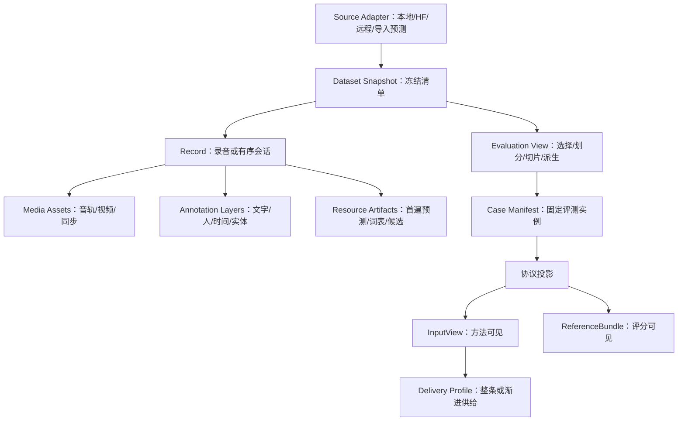

# ASR framework 数据抽象：来源、资产、标注、视图与供给

2026-09-23，设计稿；没有实现 loader、转换脚本或数据处理代码。本文补全[总体设计](ASR-framework-design.md)的数据 Module。核心原则：**数据来源负责说明拥有什么，实验视图负责说明选什么，协议负责说明方法能看什么，供给负责说明何时能看到。**

## 1. 为什么不把 Dataset 设计成 audio/text 列表

音频文件、录音、切片、会话、模型输入和统计样本不是同一概念。

- 一场会议可能有多个麦克风文件和视频；这些文件共享一段实际发生的时间。
- 一个长录音可以生成短句评测视图，也可以保持整体做长录音或流式评测。
- 一组纠错实验只有冻结首遍文本/N-best，也应是合法输入数据，不必伪造音频路径。
- 同一录音的增强版、分离流和重切段是派生数据，不自动变成独立样本。
- 参考文字、speaker 活动、实体、时间标注可能只覆盖部分录音，且版本不同。
- 会话历史有顺序；流式输入有可用时刻；随机 shuffle 不是所有任务都合法的默认操作。

因此 Dataset 的稳定核心应是可寻址、可冻结、可派生的**数据集合描述**，不是一类特定 DataFrame。CSV、HF dataset、JSONL、对象存储或本地目录只是来源 adapter。

## 2. 五层结构与所有权

| 层 | 负责 | 不负责 |
|---|---|---|
| Source Adapter | 将源格式解读为资产、记录、标注、资源、关系；报告未知/歧义 | 为某模型默认降噪、切句、清洗答案 |
| Dataset Snapshot | 固定成员、内容身份、来源修订、标注版本和访问引用 | 决定哪个模型最好或什么算公平 |
| Evaluation View | 固定选择、划分、派生、Case 组装、顺序与抽样 | 隐式提供金标给模型 |
| Protocol Projection | 将资源按用途/权限分成输入和评分，检查任务资格 | 根据测试输出选择容易评分的 Case |
| Delivery Profile | 根据模式交付数据，记录实际时间与资源访问 | 改变文本答案或偷偷读取未来信息 |

Source Adapter 的最小 Interface 是：**枚举记录描述、解析指定资产/标注引用、返回来源与能力说明**。枚举可以分页/惰性读取，实际评测前冻结成有限 manifest；大媒体不必全部预下载到内存。解析可以返回可验证字节流或受控引用，不限定某 Python 类或云厂商 URL。

流式在线采集是另一个来源模式：只能预先冻结收集规则、时间窗口和预算，事后冻结已捕获数据。它不与已经冻结的离线回放混称同一种可复现实验；本框架首版先实现离线快照及受控回放。

## 3. 数据实体及 ID 规则

### 3.1 Collection / Snapshot

Collection 是有来源的逻辑集合，例如一个公开 corpus 或自有会议集合。Snapshot 固定一版：来源 revision、记录清单、内容摘要、标注层版本、导入 adapter 版本、授权/访问约束引用、数据质量报告。

远程 URL 是 locator，不能当内容身份。可变 URL、签名链接、路径搬迁不应改变数据内容身份；文件替换会改变。优先使用不可变对象版本及内容 hash；尚未获取完整媒体时可先冻结 manifest，但执行前必须完成所需内容校验，未知 checksum 不能声称强复现。访问凭证不进入 manifest 或缓存 key，只保存凭证引用和适用的访问策略身份。

内容 hash 不能单独担任记录 ID：同一声学字节可能有不同授权、来源和标注修订。record ID 与 content hash 分开；可另有重复关系以支持泄漏审计。

### 3.2 Record / Episode

Record 是原始来源意义上的观察单位，通常是完整录音；纯文本纠错数据也可以是一个有来源的原始条目。Episode 是有顺序且可能共享状态的一组 Record/turn，不强制对应一个文件。

Record 至少包含稳定 ID、来源记录键、媒体/资源引用、标注层引用、时间轴信息及统计分组信息。Episode 还包含顺序、前置状态来源和重置点。没有可信 chronology 的数据只能做无历史输入实验，不能随意按文件名排序后称为真实会话记忆实验。

`recording_id、episode_id、speaker_group、program/organization_group、parent_record` 是不同关系。speaker 身份未知时保留 unknown，不凭匿名 `S00` 跨文件合并人。

### 3.3 MediaAsset

音频资产包含：编码内容引用、解码格式、采样率、样本数/时长、声道、设备/轨道、时间基准；视频另有帧时间和同步关系。共享录音的多个设备可有 offset 和 drift，而不一定只差一个常量。

同步映射具有来源（设备时钟、人工校准、估计）与精度/有效区间。缺同步信息不会阻止单轨文字评测，但会阻止要求严格同步的融合/时间评价。损坏文件、缺轨、时长不一致在数据验证阶段显式报告。

解码、重采样、声道选择由可追溯的 MediaView 表达；数据 adapter 不全局强制 16 kHz mono。若协议为所有方法固定同一输入变换，它属于 protocol input preparation；若某方法为了自身模型执行重采样/切分，它属于方法并纳入该方法代价。二者都保留原音，报告计时包含范围。

### 3.4 AnnotationLayer

一个 Record 可以挂多层、多个版本，不能只有单个 `text`：

| 标注层 | 最少语义 |
|---|---|
| Verbatim transcript | 忠实逐字规范、语言/字形规范、无法辨认标记及有效区域 |
| Display transcript | 可读化/ITN/标点规范，与逐字层的关联 |
| Speaker activity | 匿名人及其 scope、活动区间、重叠、评分区域 |
| Word/character alignment | 指向确切文字版本的单位时间、来源与精度 |
| Entities / values | 实体跨度、类别、数值单位及评价规范 |
| Acoustic events | 非语音事件、静音/音乐/噪声等标签与覆盖 |
| Alternative references | 替代关系及适用评分规则，不能直接把全部替代项拼接 |
| Uncertainty / exclusion | 不可判定区、排除理由、已审定范围 |

每层包含 layer ID、schema 与 revision、标注来源（人工/仲裁/弱监督/模型）、覆盖域、审核状态、标注规范版本。机器生成不因放入 AnnotationLayer 就变为 gold；协议指定哪些来源可用于参考。预测与人工标注可共享底层表示，但 provenance 和用途不同。

coverage 必须能表达“整条”“若干时间区间”“指定 utterance 集”“仅有句级，没有词级”。至少区分：**已标注且确认空、未标注、不可辨认、明确排除、弱标签**。一段没有 transcript 的录音不是静音金标；未知 speaker 不是一个真实新 speaker 类别；不可辨认不是空串。

文字层与 alignment 绑定具体 revision。人工改字会创建新文字层修订，依赖旧字的 alignment 需要确认或重做。单独改 speaker 参考不必触发文字推理，但会触发相关指标重算。

### 3.5 ResourceArtifact

冻结的首遍转写、N-best、lattice、领域词表、检索库、登记音频都可以成为数据资源。它们使用总体设计的 artifact envelope，保留生成模型、配置、父输入与状态。

纯后处理评测直接以这些资源生成 Case。音频可以缺失，此时只允许文本/候选方法；不伪造“可回听”能力。上游生成成本可以由 lineage 引用历史用量，但本次报告必须标明仅计算后处理增量，不能把它当全链路成本。

## 4. Evaluation View：数据复用的主要 Seam

ViewSpec 是一个可版本化声明，指向 Snapshot，并规定：选择条件、分组划分、允许变换、Case 组装、输入/参考层选择、排列/抽样和随机策略。编译后产生固定 Case Manifest；运行过程中不能根据模型成败改成员。

| View 操作 | 合法行为 | 需要保护的关系 |
|---|---|---|
| Select / stratify | 按冻结元数据选语种、领域、长度、噪声条件 | 选择不依赖当前被测结果；保留抽样规则/权重 |
| Split | 按 group 或时间划分 train/dev/test | 先分父录音/会话，再切片；重复资产跨集需审计 |
| Window / segment | 按固定规则或已冻结产物生成窗口 | 边界来源、上下文 padding、owned scoring region、父时间映射 |
| Assemble | 多轨组成一个录音 Case；多 turn 组成 episode | 同步关系、缺轨规则、顺序与状态重置 |
| Corrupt / augment | 按冻结噪声/混响/变速规则构造挑战输入 | recipe、seed、父资产、时间映射、参考仍有效与否 |
| Import prediction | 将冻结预测组成纠错/候选数据 | producer 身份、任务范围、上游成本与参考隔离 |
| Sample / repeat | 固定随机样本或多个扰动 replicate | replicate 与独立样本不同；保留 base Case 关联 |

View 不必实现任意查询语言、万能 DAG 或 DataFrame 操作。先实现这几种有真实方法需求的操作；新增操作以输入/输出类型、来源变化、参考有效性和顺序约束作为验收条件。

### 一条录音怎样生成多个实验

假设一场 30 分钟会议 `meeting-A` 有 4 路同步音频、speaker 活动和逐字稿：

- **长录音视图**：一个 Case 包含完整 4 轨；模型按允许输入策略选择轨道；评分按整个录音。
- **单通道系统视图**：预先指定同一参考麦克风，形成独立输入条件；不能与允许阵列处理的结果无标记混榜。
- **短句能力视图**：用冻结边界切成若干 Case；如果边界来自人工发言标签，标明 oracle-segmented 条件。
- **真实流式视图**：相同媒体和参考，保持录音顺序，按回放时钟释放块；最终结果仍在原录音范围评分。
- **纠错视图**：把方法 B 的冻结首遍输出作为输入资源；方法不能读用于评分的修订稿。

这些视图有不同 View IDs，共享同一个 parent/group，配对可追溯；不能当作五份独立数据来扩大统计样本量。

## 5. 切片、变换与参考有效性

### 5.1 切片不是简单裁剪字符串

有词时间标注时按冻结规则分配跨界词；只提供整句文字时，任意按秒切片不能产生合法短片 gold。可选保持完整句/录音、补标注，或单开带假设的诊断协议。禁止用被测模型自动对齐来同时制造其参考边界并证明该模型时间准确。

带前后 padding 的窗口同时声明“可见区”与“拥有的评分区”。长录音端到端评测先重建一次完整结果再评分；重叠窗口中的同一参考词不重复进入主分母。短片基准若规定独立片段评分则遵循该协议，统计抽样仍按父录音聚类。

标注不完整的录音，必须在推理前固定有效评分区域。预测如何裁入区域需要时间信息和冻结规则；无预测时间且无法可靠投影时，拒绝这种局部评分，或使用独立提供的合法音频切片。不能从输出里找最像 gold 的子串再评分。

### 5.2 变换的三个不同角色

| 角色 | 举例 | 属于哪里 |
|---|---|---|
| 数据挑战 | 同一干净录音加固定噪声，检验鲁棒性 | View 派生，所有方法面对相同版本 |
| 方法步骤 | 方法选择降噪、VAD、分离、重切段 | MethodSpec，计入方法成本 |
| 评分投影 | 繁简/数字/大小写规则、分词 | ScoreSpec，只作用于评分视图 |

同一种变换可以承担不同角色，角色由实验声明决定。不要因为都叫 preprocessing 就放在同一个全局 hook。

每种数据变换声明 reference effect：保留词内容、只改变时间、改变说话人混合结构、可能使部分词不可辨认、需要新标注。例：变速必须更新时间关系；混入另一条语音若任务要求转写所有发言，参考需合并而非保留第一条；随机降质可以保留原词作为恢复目标，但该选择和不可辨认比例应公开。不能默认所有增强都是标签保持。

随机变换同时保存 recipe/seed 与最终媒体 hash。库或算子版本变化可能使相同 seed 生成不同内容，所以仅保存 seed 不足以复现。增强副本的统计 group 仍指向原录音；也不以复制样本数替代新说话人/新录音数。

## 6. 输入与 Reference 是用途投影，不是源文件分两列

方法侧 InputView 和评分侧 ReferenceBundle 由同一个 Case Manifest 生成，但访问能力隔离。字段可能在一种实验中是参考，在另一种实验中是合法输入：关键是协议角色，不能凭字段名称自动分类。

| 资源 | 正常系统评测 | 单独组件评测 | Oracle 诊断 |
|---|---|---|---|
| 真实语言标签 | 只有协议允许已知语言时输入 | 可明确固定语言条件 | 可作为 oracle LID |
| 真实 speaker 活动 | 评分侧 | 固定给识别器即为条件化组件实验 | oracle diarization |
| 首遍预测 | 方法内部产生 | 冻结后成为纠错输入 | 不等于 gold |
| 人工历史 | 只有业务流程确实提供时输入 | 可作为独立输入条件 | 不可假装无人工辅助 |
| 当前/未来参考文本 | 只在评分侧 | 不能作为一般纠错输入 | 仅诊断且与主榜隔离 |
| 领域词表 | 有独立来源、范围、可用时机 | 消融时冻结版本 | 由测试答案抽出则属于 oracle |

ReferenceBundle 还包含 scoring mask、tokenization target、alternatives policy 和 annotation completeness。它不能只是任意取一列 reference 文本。ScoreSpec 选择符合任务要求的层，缺必需层时编译失败。

CaseManifest 可以记 reference 的内容身份以便复现，但发送到方法进程的是最小 InputView；禁止同时发带金标的原始 dataset 行。缓存/日志目录也必须按访问角色隔离，不能只删除函数参数里的 gold 字段。

## 7. 数据能力与可评分资格

能力采用按范围查询的结构，而不是一个 dataset 级布尔值。某数据有 word timestamps 不能代表每条都覆盖；某会话有两个标注 speaker 不等于已覆盖全部讲话者。

预检对 Case 与所选指标逐项检查：

1. 输入是否可解析、已校验，是否满足方法实际消费的模态/同步条件。
2. 必需参考层是否存在、来源是否被认可、覆盖是否足够、版本是否彼此一致。
3. 有效评分区域能否与预测表示合法对齐。
4. 分组/顺序是否满足状态和统计要求。
5. 输入权限和数据访问约束是否允许执行方式，例如某集合不得发往外部 API。

输出一个 Eligibility Report：可运行 Case、预先不合格 Case 及原因、所有关键群体的数量/时长/参考单位。排除必须发生在看当前方法分数以前。用于直接比较的 cohort 对所有参评方法固定；兼容性不同可另列任务覆盖矩阵，不为各模型偷偷筛不同的“主测试集”。

总体数据缺陷与某个方法不支持要分开。例如文件损坏是数据缺陷；30 分钟录音超出某 adapter 限制是方法/协议不兼容，不能把该录音从其他方法分母删掉后称同一实验。

## 8. 数据身份、划分与缓存传播

至少保持以下身份彼此独立：Source revision、Snapshot ID、Record ID、Asset hash、Annotation revision、ViewSpec ID、Case ID、Delivery schedule ID、ScoreSpec ID。

| 改动 | 是否重跑方法 | 是否重评分/重建视图 |
|---|---|---|
| 搬移文件，字节和访问条件不变 | 否 | locator 校验即可 |
| 修正金标一个错字，方法未见该层 | 否 | 相关 ScoreRun 必须新建；相关 alignment 检查 |
| 修正作为输入的人工历史 | 是，受影响 turn 及有状态后继 | 重评分 |
| 改评分 normalizer | 否 | 新评分视图与 ScoreRun |
| 换 VAD 切片规则 | 若方法输入变化则是 | Case/View 身份变化；不可与旧片分数直接拼榜 |
| 新增一层未参与实验的标注 | 否 | 当前实验身份不必整体失效，快照版本仍记录 |
| 改流式块长/交付顺序 | 实时行为需重跑 | 事件及 ScoreRun 更新 |
| 重采样器版本变化导致媒体字节变 | 是 | 相应依赖后继更新 |
| 改划分或移出泄漏样本 | 新成员需要推理；已有合法结果可复用 | cohort 及统计全部重建 |

依赖身份按实际读取的层/资产绑定，不仅用一个总 DatasetVersion；否则改无关标注也会清空所有推理缓存。反之只用 audio hash 会漏掉历史、上下文、顺序和变换变化。

split 首先隔离父录音/episode，并按研究目标追加 speaker、节目、组织或时间约束。近重复检查记录证据和规则；两条文字相同不充分证明同一录音。无法知道说话人身份时，不能宣称 speaker-disjoint。

## 9. 六类数据接入推演

| 来源 | adapter 映射 | 必须保留的事实 | 不能自动声称支持 |
|---|---|---|---|
| HF 短音频集，如 FLEURS | row→Record，audio→Asset，text→选定 AnnotationLayer | source revision、split、语言、规范 | 无词时间就没有词延迟参考 |
| 自有 WAV+CSV | 文件与主键关联，CSV 字段映射到标注/元数据 | 编码、缺文件、重复 key、标注来源 | 文件名含人名不等于合法输入身份 |
| 多麦会议集，如 AISHELL-4/CHiME 类数据 | 一个录音多 Asset；RTTM/STM 等转层 | 通道、同步、speaker scope、重叠、评分区 | 不能先压 mono 再说支持阵列比较 |
| 纯文本纠错/N-best 数据 | 首遍资源+参考层；音频可选 | 首遍模型、候选语义、数据划分 | 无原音不可做音频锚定二遍 |
| 会话记忆数据 | turns→有序 Episode；资源带 availability | 历史来源、重置、先后和确认状态 | 随机 shuffle 不能保持相同实验 |
| 音视频/损坏挑战数据 | 同步多媒体+派生 View | 同步误差、缺模态、扰动 recipe 与来源 | 视频容器不代表模型使用视觉信息 |

代表数据用途来自[已有数据调研](research-data-evaluation.md)与[本轮方法证据](ASR-framework-method-evidence.md)。上表是接入设计，不是声明具体数据集已经下载或转换。

## 10. 数据层的最小验收

不需要先写通用数据平台；先用手工 fixture 明确这些期待结果，再实现：

| 契约样例 | 预期结果 |
|---|---|
| 两种源格式描述完全相同的录音、标注和协议 | 评分语义一致；来源身份可不同但都可追溯 |
| 未标注音频与确认静音音频 | 前者不能作为空参考打分，后者计算出字/插入 |
| 同一录音两段带 padding 的窗口 | 映射正确；重建主评分不重复计词；统计同一 cluster |
| 任意裁剪只有整句 gold 的录音 | 不能自动产生合法部分 gold，资格检查拒绝 |
| 四轨中一轨缺失且协议要求四轨 | 预检报告，按预先缺轨规则拒绝/分独立条件 |
| 文本参考升级而音频不变 | 模型产物复用、分数新建；旧分数仍能还原 |
| 从真实 speaker 活动生成模型输入 | 需要明确 oracle/组件条件，不能默入主赛道 |
| 第三轮输入含第十轮人工历史 | availability 检查拒绝 |
| 同一媒体改路径 | content identity 不变，历史缓存可验证复用 |
| 添加噪声重复 10 次 | 有 10 个条件观测，独立录音 group 仍只有 1 个 |

数据抽象完成的标准：新增一种数据来源通常只改 source adapter；新增一种评测切法改 ViewSpec；新增标注类型改 schema/validator/相关 scorer；新增供给方式改 Delivery Profile。模型 adapter 不认识数据集名字，数据 adapter 不认识模型名字。只有真实的新公共语义才推动核心版本变化。
