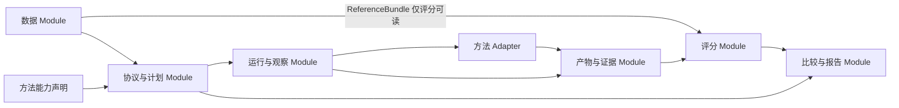

# ASR 评测 framework：协议驱动的方法评测设计

设计日期：2026-09-23。状态：设计评审稿，未实现、未运行模型。本文的接口、约束和实施顺序是设计建议；方法事实来自已有调研和本轮一手资料核查。适配分析表示“能够表达并设计验证”，不表示已经完成集成。

## 1. 设计结论与阅读入口

**把完整方法作为被测对象，把评测协议作为可比性的中心，把不可变产物和观察事件作为二者之间的接口。** 不把全部方法规定成 VAD→ASR→后处理，也不让执行器了解各模型的解码细节。

首选结构是小型评测内核，加独立的方法 adapters、数据 adapters 和评分 adapters。方法可以是一个模型、一个云端接口、一条组合流程，或一个有状态的研究系统。内部可以分支、循环、检索、分离、重识别；外部必须履行输入权限、状态隔离、输出语义、时间观察和失败记录契约。

重要限定：这是统一**评测契约**，不是统一所有推理算法。一个闭源接口不能因为进入框架就获得 N-best、声学重打分或真实流式能力。框架应精确说明能测什么、不能测什么，且在运行前拒绝不成立的实验。

配套文档：

- [数据抽象设计](ASR-framework-data-design.md)：来源、资产、标注层、实验视图、划分与供给。
- [方法适配与反例压力测试](ASR-framework-method-fit.md)：逐类套用设计，记录不能无损统一的部分。
- [架构审查与实施验收](ASR-framework-architecture-review.md)：备选设计、迭代记录、修改范围、验收场景。
- [本轮方法一手证据](ASR-framework-method-evidence.md)：核查最容易挑战抽象的方法事实。
- [具体接入伪代码](ASR-framework-adapter-pseudocode.md)：ElevenLabs、MOSS、Whisper 的数据→运行→结果→评分路径及场景检查。

本文按“评价什么→谁负责→交换什么→怎样运行→怎样比较”阅读即可。已有材料提供的基线包括 [评测框架调查](research-asr-evaluation-frameworks.md)、[数据与指标](research-data-evaluation.md)、[后处理设计](research-postprocessing-design.md)、[系统约束](research-systems.md)。

## 2. 先固定研究问题，不先画插件树

评测的最小声明包含：要回答的问题、数据集合、可用信息、方法配置、运行条件、评分规则、比较方式。不同问题可以共享预测，但不应共享一个含糊的“综合分”。

| 实验问题 | 被固定的条件 | 可以变化的部分 | 应报告的结果 |
|---|---|---|---|
| 哪个完整系统更适合中文听写 | 同一授权输入、交付目标、数据、评分与预算约束 | 模型及其合理配套方法 | 文字错误、失败、成本；有实时要求再看延迟 |
| VAD 是否改善某识别器 | 识别器版本、解码、原录音与评分 | VAD/切分参数 | 净字错变化、漏段、重复、完整链耗时 |
| 纠错是否有效 | 冻结同一首遍预测和允许上下文 | 纠错方法 | 净错误减少、误改、实体损坏、附加成本 |
| 说话人条件是否有效 | 相同识别预算、录音和训练设置说明 | 预测活动/条件方式 | tcpWER 或对应字符指标及对照 |
| 流式方案能否满足体验 | 真实时间供音、到达负载、网络、评分窗口 | 分块、look-ahead、稳定策略 | 最终错误、正确稳定覆盖、延迟、回改、截断 |
| 某个模块还有多大提升空间 | 方法与数据 | 预测输入替换为金标输入 | 独立 oracle 诊断结果，不能进入正常榜 |

两种比较模式必须显式区分：

1. **系统比较**：允许各系统采用不同内部结构。输入权限和交付要求相同，比较完整结果与完整代价。不强行统一所有模型的 beam、VAD、内部采样率。
2. **受控消融**：锁定待研究变化以外的依赖产物、参数与预算。无法拆开联合模型时，可以比较整个方法，不能声称隔离了某个内部模块的因果贡献。

模型 checkpoint、decoder、提示、术语表、后处理、运行时都属于 MethodSpec。数据正常化评分规则属于 ScoreSpec。二者混在一起会让“改了一条清洗规则”看起来像模型改进。

## 3. 核心名词与不变量

| 名称 | 定义与所有者 |
|---|---|
| Case | 一次评测实例；可为短句、完整录音或按顺序发生的会话。数据模块拥有 |
| InputView | 从 Case 投影给方法的可见输入；不含评分金标。协议模块决定权限 |
| ReferenceBundle | 人工参考、有效评分区域和标注策略；只有评分路径可以读取 |
| ProtocolSpec | 固定任务目标、输入权限、时间供给、状态作用域、失败规则与比较口径 |
| MethodSpec | 被测方法的精确版本、实现、参数、资源及上下文策略 |
| ExecutionSpec | 冷/热启动、硬件、并发、供音、网络、重复次数、预算与超时 |
| RunPlan | 上述声明经过检查后的不可变执行计划；包括已展开的实验格子 |
| Attempt | 一次真实执行尝试；重试得到新 ID，不能覆盖原尝试 |
| Artifact | 不可变的内容产物及来源；文本、时间线、候选、音频等都可成为产物 |
| Observation | 观察到的事件，包括结果修订、输入交付、错误和时间。事实不可后写为更早发生 |
| ScoreSpec / ScoreRun | 评分声明 / 对某组产物的独立评分运行 |

全框架必须守住以下不变量：

- 方法只看到协议允许的输入；金标只能用于评分，或显式 oracle 赛道。
- 原始输出、派生输出、评分规范化后的视图不互相覆盖。
- 每个派生产物指向精确的输入产物及方法版本；文字改动不会悄悄继承旧词对齐。
- 缺失能力、执行失败、格式非法、空文本成功、弃答是不同状态。
- 输入来自哪个录音时间、结果何时被观察到，是不同坐标。
- 评分名单在执行前固定；失败样本不会从分母消失。
- 同一实验中的重试、采样和条件路由受预先冻结的选择规则控制；不按测试分数挑最好一次。
- 公开指标不得依赖某 adapter 私有字段；转换过程显式、版本化、可检查。

## 4. Module 划分与依赖方向

这里使用 codebase-design 的术语：Module 是有 Interface 的模块；Seam 是允许替换行为的位置；Adapter 是在该位置实现契约的具体适配。

| Module | 调用者应理解的 Interface | 内部隐藏的复杂性 | 不应负责 |
|---|---|---|---|
| 数据 | 获取冻结 Case 清单；分别提供 InputView 与 ReferenceBundle | 格式读取、媒体索引、标注版本、组划分、时间同步 | 模型专用 VAD/模型提示 |
| 协议与计划 | 根据声明编译计划或返回可定位的不兼容原因 | 输入权限、能力检查、实验展开、评分需求、状态顺序 | 引入 SDK、执行推理、猜默认参数 |
| 运行与观察 | 执行计划，产生 Attempt 与 Observation | worker 生命周期、供音、并发、截止时间、计量、重试 | 文本改写、候选排序、beam 语义 |
| 产物与证据 | 存储/读取不可变产物及来源 | 哈希、索引、原子提交、格式版本、依赖查询 | 调用模型、依据分数筛选结果 |
| 评分 | 对冻结产物和 reference 按 ScoreSpec 评分 | 评分投影、语言切分、指标 adapter、缺失检查、充分统计量 | 重新识别、访问模型凭证 |
| 比较与报告 | 比较可比 ScoreRun，输出差异与证据 | cohort 校验、配对统计、分层、未完成项显示 | 自动把不同协议分数拼榜 |

这些是逻辑 Module，不要求六个微服务。第一阶段可在一个本地项目内实现，方法依赖按 worker 环境隔离。重型模型运行库不能成为安装评分工具的前提。

建议未来代码依赖保持单向：领域契约不引用 SDK；各模块依赖契约；入口组合具体 adapters。报告通过产物 ID 和 ScoreRun 读取结果，不能 import 某厂商推理类。

**删除测试**：删除协议 Module，输入权限与可比性规则会散落在每个 runner、scorer 和报告中；删除产物 Module，缓存和来源追踪会散落在每条 recipe 中，因此二者有真实 depth。反之，仅转发一次 transcribe 调用的 ModelManager、ProviderManager、PipelineManager 三层包装没有独立价值，不设立。

## 5. 方法 Interface：允许不同内部结构，但不给无语义的万能入口

### 5.1 注册声明

每个方法 adapter 提供一份可验证的描述，不要求统一一个巨大的继承树：

| 声明组 | 必要内容 |
|---|---|
| 身份 | adapter 版本、代码修订、权重/服务版本、依赖环境、参数 schema |
| 输入要求 | 媒体类型、采样/声道限制、时长限制、必要上下文及其可用时机 |
| 调用方式 | whole-case 或 incremental；一个方法可以分别实现两种 |
| 输出承诺 | 可输出的产物类型、必需字段、时间粒度、speaker ID 作用域 |
| 状态 | 无状态、case 内状态、顺序 episode 状态；重置及恢复能力 |
| 可选能力 | 词对齐、候选/分数等有版本的类型；每种能力的适用条件 |
| 执行约束 | 资源需求、batch/并发限制、支持的设备、超时/取消行为 |
| 复现条件 | 确定性声明、seed 支持、API 版本是否固定、可缓存性 |

能力不能只写 `streaming: true`。至少要区分：渐进供音是否真实执行、是否原生保留模型缓存、已声明的 look-ahead、提交范围、是否允许回改、输出时间是 provider 自报还是观察者记录。原生/缓冲流式是方法属性；能否进入同一实时质量赛道由供音因果性和相同任务条件决定，不按实现标签自动剔除。

“支持词时间戳”是声明；每条输出是否真的覆盖所有词需要运行后验证。语言/时长/模式是能力前置条件。未知能力不能当作支持；不支持的必需项在预检拒绝，非法运行输出记为失败。

输出承诺由已解析配置决定，例如 `outputs_for(resolved_config)`：同一 adapter 关闭 diarization 或词时间戳后，不能继续声称会提供这些必需字段。参数默认值也应解析并写入 MethodIdentity；服务端未公开或不可固定的默认行为单列 unknown。不要只注册一个与配置无关的永久 capability 集合。

参数保留命名空间，如方法自身的解码配置、recipe 的 VAD 配置。核心只认识协议/运行参数和 adapter 的校验结果，不把 Whisper beam、CTC beam 和 API 提示都转成一个通用 `quality` 参数。声明支持热词也不能证明不同系统的 boost 数值等价。

### 5.2 两种调用生命周期

以下是概念契约，不是实现代码：

| 调用方式 | 生命周期 | 产物与终止 |
|---|---|---|
| Whole-case | 准备已冻结方法 → 提交 InputView → 接收观察与结果 → 结束 attempt | 可只返回最终结果；远程长任务的提交/轮询由 adapter 隐藏，保留远程 job ID 与计量 |
| Incremental | 准备方法 → 新建 session → 按序供给输入事件，同时接收输出 → 输入结束 → 有界 drain → 关闭 | 每次发布内容必须可回放；输入结束不等于系统已经输出完毕 |

实例初始化/模型预热归 worker 生命周期，跨 Case 复用模型权重不等于共享会话记忆。运行 Module 拥有调度和取消；方法拥有隐藏模型状态、内部路由和算法。基线无需实现假的 `push_audio`，流式方法也不必为了复用基线而吞入完整文件。

方法输入只读；方法可写产物、发出观察、报告用量。内部无法观测的云端 GPU 时间记录 unknown，不能由客户端延迟减去猜测值补出。指标要求存在无法观察的信息时，该指标不可评，完整输出仍可参与其他合法任务。

### 5.3 组合方法

提供一个**可选的组合方法 adapter**，让复用 VAD、增强、识别、对齐、纠错的研究流程方便组合。它与完整黑盒方法处于同一 Seam，不是所有方法的必经路线。

- 初期支持具名步骤、类型化输入/输出、有限分支、有限迭代、明确的依赖产物。recipe 本身版本化。
- 步骤复用要求端口类型与语义兼容，不能只因为都是浮点数组就连接 CTC logits 和 RNNT scorer。
- 预算包含总调用次数、最大迭代数、时长/费用上限和结束规则；预算耗尽后的 fallback 也写入方法配置。
- 核心只执行整个方法，不解释任意计算图；recipe 内部的调度是其 Implementation。以后有两个真实使用者时再提取共享 recipe runtime。
- 联合模型不伪造“ASR 步骤”“diarization 步骤”的独立耗时；只有观测到的内部步骤才可进入诊断报告。
- 只复用 artifact 能表达且代价值得保存的步骤；GPU tensor、KV cache 默认留在方法内部。

## 6. 数据与结果：小公共语义，加有约束的扩展

### 6.1 Case 与输入可见性

Case 固定 `case_id、recording_id、episode_id、split、group_ids、input_manifest_revision`。媒体引用包含内容哈希、时长、采样率、声道和时间基准；多设备/视频通过显式同步映射关联。元数据中的参考语言、说话人数、分段边界也可能泄漏答案，不能默认全给方法。

InputView 由输入白名单构造。允许资源至少标明：类型、来源、版本、作用域、可用时刻、是否来自人工确认。例：会前术语表、已经发生的会话文本、预测说话人活动、独立登记音频。用于打分的金标 speaker 活动不得以“上下文”名义进入正常输入。

离线允许读取完整授权输入；实时回放只发已到达的媒体块和上下文事件，不能给可读取整段音频的文件路径。回放可由控制进程预先加载文件，方法进程仅收到已释放块。若需要严格证实因果性，应隔离文件访问和金标挂载；同进程可信 adapter 只能提供较弱的可审计保证，不能宣称防恶意泄漏。

公开语料已知转写、预训练污染无法仅靠进程隔离排除；保存训练暴露声明为 known/unknown，不编造“绝无污染”。

### 6.2 Artifact envelope

所有产物共用轻量 envelope：`artifact_id、type_uri、schema_version、content_hash、producer_attempt、parent_artifacts、scope、created_at、payload_ref`。外加按需的媒体坐标、文本坐标、有效性和来源信息。

公共类型只收录反复出现的语义。payload 可以用 JSON、二进制或远程原始响应保存；不是强迫所有数据变为 JSON。文件系统即可实现首版，无需先建数据库或分布式对象存储。

| 公共产物 | 稳定语义 | 不能暗中推导出的东西 |
|---|---|---|
| AudioView | 由一个或多个源媒体导出的波形及时间映射 | 分离流不自动等于真人 speaker |
| Transcript | 一个指定 view 的文字及有序单元；spoken/display/provider_rendered 分开 | 无 spoken 输出时不能反推真实口语形式 |
| Alignment | 指向精确 transcript revision 的文字跨度到媒体时间关系；粒度/来源明确 | 强制对齐成功不证明字词正确 |
| SpeakerActivity | 允许重叠的匿名说话人活动区间 | 不能当实名识别；exclusive 视图不能代表真实重叠 |
| Attribution | 精确 transcript 单元/跨度到 speaker scope 的归属 | channel、分离 stream、speaker 三者不等同 |
| CandidateSet | 同一输入范围的候选、产生方式、可选分数语义 | 原始分数不可跨模型直接比较 |
| ContextSnapshot | 本次实际使用的检索结果/术语/记忆及来源 | 不能自动升级为参考真值 |
| Trace / Usage | 输入、输出、路由、尝试与资源事实 | 不可见内部耗时不能补为 0 |

扩展类型如 `org.method/lattice@v1`、视觉特征、自定义置信度向量可以由 plugin 声明 validator、producer、consumer 和投影方式。**opaque payload 只能保存和被显式兼容的方法消费，不能因此获得公共评分能力。** 至少出现两个独立使用者、稳定语义及契约样例后，才考虑提升为公共类型。

评分需要的新类型由 scorer 明确声明；计划编译器能读取类型标识与需求，不需要理解 tensor 内容。未知类型可以透传保存；不可以静默当成已知类型。

### 6.3 文本、时间和 speaker 的精确关系

Transcript 允许整段一个单元，因此只输出字符串的模型不需要伪造词结构。有分段时保存输出顺序和稳定单元 ID；文本跨度采用明确的 Unicode code point 半开区间，并绑定文本 revision。语言切词产生新的评分视图，不重写原跨度。繁简、日文数字、韩文空格、组合字符处理由版本化 ScoreSpec 决定。

Alignment 可以是词、字、段级，含 missing/unalignable 状态。更改文字会让受影响 alignment 和 attribution 失效，除非方法明确生成可验证的跨度映射或重新对齐。ITN 多对一映射合法；不能把旧词数组下标直接复制到新文本。

媒体以源文件样本位置/有理时间基准为根。重采样保持物理时间；裁剪、去静音拼接、变速用分段映射；分离保留共同时间线及多个来源；滤波延迟需要声明补偿。映射不连续时返回多个区间，不能用一个 offset 替代。无法回到源时间的结果仍可评文本，但依赖时间的指标失去资格。

speaker ID 是有作用域的局部符号：`录音/会话 + 命名空间 + ID`。跨块关联是方法做出的预测并有版本。评分时以参考进行最优映射属于 scorer 的操作，不得倒灌到预测中。文本流顺序与 speaker 排序分别保存，避免仅改 speaker 标签就意外重排文字。

## 7. 事件与流式：观察用户实际看见的版本

### 7.1 规范事件

每个事件包含 attempt/session、单调序号、观察者单调时钟、原始 provider 事件引用、相关产物 ID。provider 自报时间另存，不覆盖客户端观察时间。

具体实现还需区分 transport/native 收到原事件的 `observed_at` 与规范结果发布的 `published_at`，后者包含解析/队列等待。记录二者及其观察位置，按 ScoreSpec 选择；不能将网络接收时刻与 adapter 后的用户可见时刻混用。具体双向流伪代码见接入文档。

最少输入事件为媒体块、上下文可用、输入结束、取消。最少输出事件为结果修订、提交声明、使用量、错误、attempt 终止。健康心跳等是运行实现细节，不强迫模型实现。

**结果修订**指向指定 view/scope 的不可变 snapshot，并携带父 revision 和被替代/移除的单元。语义是该 scope 的新状态，不是把收到的文字追加。合并/拆分段落可以明确替代一组单元。存储实现可压缩为 delta，但回放结果必须与 snapshot 一致。

scope 标识由 adapter 维护：provider 有稳定段 ID 就映射；没有时可以对整个会话 view 发新 revision。不可将同一句的反复 partial 当成多句。一次 snapshot 原子应用，不能在评分时看到混合版本。

**提交声明**包含 scope、revision、提交的维度（文字/归属/对齐/显示形式）及承诺强度。provider 的词级 Stable、单段 IsPartial=false 与整个 attempt 完成是不同声明。[AWS 官方 partial 说明](https://docs.aws.amazon.com/transcribe/latest/dg/streaming-partial-results.html)给出了前两种不同语义。

普通 partial 是暂定；provider 声称不可改的内容后来被更改，记录承诺违约；显式可修订发布允许后续会话级纠正。在线 view 和会后 offline view 分开，不用会后稿覆盖实时事件。仅提供最终文件输出的系统不具备“曾经的实时显示记录”。

字段补充也有独立来源与时间：若文字先提交、词时间后到，后者生成关联该 transcript revision 的 Alignment，不追加第二份文字。关联必须依据已验证的 provider ID/顺序语义；重复短句不能单靠字符串相同合并。无法可靠关联时保存原事件并标记该字段缺失/歧义，而不是编造关联。

### 7.2 时钟与因果性

至少记录三个时间：源媒体位置、输入向方法实际交付时间、输出被评测观察者收到的时间。真实时间回放有源时间到计划墙钟的映射；另记供音偏差、排队和丢块。不能把供音器阻塞导致的晚交付解释成模型性能提升。

流式方法声明的 look-ahead 是算法设置，供给规则仍不提前发未来样本。离线窗口方法只能等窗口真实到齐后调用。识别结果的结束时间早于当前供音水位并不意味着没看未来；因果保证来自实际输入访问控制，而非检查输出时间戳。

固定输入结束后的 drain 截止时间，晚到结果保存为 late，不能回填早时刻评分。服务过载时明确统计拒绝、迟到、丢音和积压。开放到达负载不因上一请求慢而自动放缓；否则需标明是闭环负载测试。

### 7.3 延迟指标定义

- **首次非空输出**：首段实际语音起点对应的回放墙钟到首次非空结果被观察到。没有语音或没有结果单独分类。
- **正确稳定 token 延迟**：固定参考 token、时间标注和 trace 对齐算法后，找到 token 及规定范围前缀持续保留到观察窗口结束的最早时刻，再减参考 token 结束时间对应的回放墙钟。事后计算，不把 provider 自称 Stable 当真值。不能正确匹配的 token 不纳入成功延迟分位数，但必须进入未覆盖率/超时率分母。
- **显示修订负担**：固定 view、字符单位、snapshot 顺序，分别统计新增内容与替换/删除旧内容；稳定部分被回改另计。未承诺稳定的尾部改动也不是“无成本”。
- **提交延迟**：对参考话轮与提交范围按冻结规则匹配；报告末端到提交的延迟、过早提交、错误合并话轮。未匹配事件不得剔除。

稳定正确性依赖参考词时间与配对；只给句级参考时不伪造词级延迟，可用句级版本。重复词的对齐、同分路径选择、归一化都必须版本化。过早正确猜出可能出现负延迟，保留并单列，不截为零；同时检查泄漏。报告 p50/p95/p99 必须附匹配数、总参考数、观察截止与超时量；样本太少不做可靠尾延迟推断。

最终 CER/WER、到截止时的 CER/WER、稳定覆盖、延迟和修订共同评价实时方法。只测最终正确率或成功 token 延迟都不足以验收。

## 8. 评分协议与可比性

### 8.1 ScoreSpec 是独立冻结的产物

至少固定：reference revision、评测名单、评分区域、目标 view、normalizer 与 tokenizer 版本、指标 adapter 版本与参数、聚合方式、空参考/失败策略、统计分组、随机种子。评分不能访问在线模型；模型不应知道测试分数。

不同语言不共用未经检验的删标点/空格规则。建议每个语言包同时提供原始视图、主要规范化视图和数字/实体等专项视图；与官方基准复现时，精确复用该基准规则，不拿自己的规范化分数冒充官方结果。

| 任务/指标 | 最少预测与参考 | 缺失时的处理 |
|---|---|---|
| 文字 CER/WER | 相同任务目标的文字、固定切分 | 评分失败或按冻结的服务失败策略处理 |
| cpWER/cpCER | 带 speaker scope 的文本；录音级参考 | 无 speaker 不能靠固定一人标签宣称支持多说话人任务 |
| tcpWER/时间约束字符变体 | 上述信息与符合协议粒度的时间 | 缺时间拒绝该任务；可另开非时间约束任务 |
| ORC / MIMO 系列 | 按定义组织的参考发言与输出流 | 明确适用于“输出流”，不把流强称真人身份 |
| DER | 说话人活动、评分区域、collar、重叠规则 | 只有带标签文字不能无声明地推成活动真值 |
| 词时间误差 | 被认可的词匹配与时间金标 | 报可匹配覆盖；伪时间插值只可另列辅助协议 |
| 纠错误改/实体 | 冻结首遍与修改后稿、实体/修改审计参考 | 无修改金标只报告净编辑误差，不捏造精确率 |
| 流式 | 真实记录的 trace 与适当时间参考 | 不能从最终文本反推中间事件 |

[MeetEval](https://github.com/fgnt/meeteval)已提供多说话人及时间约束指标，并有 SegLST 等格式。适合做评分 adapter；具体粒度、词时间近似和支持格式须冻结。其 README 明确不支持 alternate transcripts，因此多参考不能假定所有 scorer 原生可用。

多人重叠没有唯一自然的全文串行顺序。speaker 无关普通文字分数只有在协议定义序列化策略时才能辅助报告；主指标按目标选 cp/tcp/ORC。不要把 ORC 与 cp 的差值当成可加的“纯归属错误”。

多参考允许两种明确协议：仲裁得到一份冻结参考；或由支持该功能的 scorer 按规定规则评分多个完整候选参考。不能逐个词自由挑最有利参考而仍声称普通 WER。缺这项能力在预检拒绝该评分协议。

### 8.2 失败、空参考与聚合

状态至少区分：`ok、abstained、timeout、provider_error、invalid_output、budget_exhausted、cancelled`。预检的 `unsupported` 不算已运行样本；运行后违反已承诺输出是 invalid_output，不能改名为 unsupported 来退出分母。

推荐每次同时报告：

1. 全部预定 Case 的状态分布、交付率、按参考单位/时长的覆盖率。
2. **服务交付口径**：在冻结截止前没有可用输出视为空假设，缺失参考词形成删除；部分有效输出按截止 snapshot 评分并标状态。延迟/cost 保留失败尝试。此口径必须标明包含服务失败。
3. **成功样本口径**：作为诊断，附确切 case IDs；不能用不同模型各自成功子集的分数直接排名。

若强制输出 schema 错误但能抽出一些字，不得由报告临时“抢救”；可选择预定义降级投影形成单独结果。弃答作为服务未交付计入，另报风险—覆盖曲线。用户取消导致实验未跑完时标 incomplete，不发布完整榜。

Corpus 错误率累加 S/D/I/N 后相除，不平均每条百分比。宏平均语言/数据集必须明确权重。N=0 的全静音集不使用普通语料错误率作为主指标，报告插入字符/非语音小时、出字样本率；混合语料仍保留静音插入。WER 可超过 100%。[JiWER](https://jitsi.github.io/jiwer/)可复用编辑统计，空参考语义仍须与本协议对齐。

配对比较按录音/episode 等独立组抽样重算语料统计；会话切片不可当独立样本。报告点估计、配对差、区间、样本/组数量和分层退化。探索性大量配置筛选只使用开发集；测试集确认预先选定的少量方案，避免每轮挑测试最佳。

### 8.3 ComparisonKey 与 MethodIdentity 分开

一个可比 cohort 至少固定：Case 清单及 reference、目标输出、输入**允许规则**、评分规则、数据分组、失败/截止规则。性能比较还需匹配资源/负载/时间范围，或明确采用费用/延迟约束下的 Pareto 比较。

MethodIdentity 包含方法参数与实际使用的上下文版本，应该在 cohort 内允许变化；否则框架会禁止比较两个不同方法。允许信息相同不代表实际检索出的文档必须相同。受控消融则额外锁定上游 artifact IDs、实际输入上下文和非研究参数。

报告应区分：可直接比较；任务相同但运行条件不同仅可分层；参考/任务不同不可比较。oracle 金标辅助、音视频辅助、人工历史辅助有独立赛道，不能靠一个备注混进音频独立榜。

## 9. 状态、重试、成本与缓存

### 9.1 状态所有权

无状态方法按 Case 并行；有会话记忆的方法按 episode 顺序执行，只能跨 episode 并行。每个 episode 起始状态、允许更新来源和更新时机冻结。状态有内容哈希或可复现事件链；读到未来句子即违反因果协议。

模型权重缓存、网络连接池、隐藏推理状态和可影响答案的记忆分别处理。前两项可以 worker 级共享；后两项默认 case/episode 隔离。在线自适应权重也是答案状态，必须声明重置和学习来源；跨测试 Case 无声明适应不允许。

断线恢复有三种明确方式：同一方法支持精确 checkpoint；从 episode 起点重放；终止当前 attempt。方法没有恢复能力时，runner 不能用旧 ID 继续伪装同一条连续会话。新会话/attempt 的延迟、重复输出和成本保留。

### 9.2 重试与预算

RunPlan 固定最大重试数、可重试错误、退避、截止和选择规则。默认取规则允许的第一个有效完成结果，不按 gold 分数择优。API 是否幂等由 provider adapter 声明；响应丢失但可能已计费的调用记为费用未知/待核对，不假定无成本。

预算分为方法预算和基础设施重试预算。模型集成、多次采样、检索、二遍纠错属于方法代价；失败重试属于交付代价；总账都保留。条件路由的“不调用第二模型”是正常决策，不是缺失。

预算也要声明可执行的观察范围：runner 可以强制墙钟截止和经过其计量入口的调用上限；黑盒云端内部采样、隐藏重试或内部模型数未必可见。未验证的内部预算只能记为 provider 声明，不能声称已受框架强制约束。要求硬性计算预算的赛道应拒绝无法验证该预算的方法，或另列按可见费用/时间约束的系统比较。

报告端到端墙钟、累计资源时间、发送音频量/通道量、API 账单单位、token、调用次数分别统计。并行三模型的总墙钟与三次计算量不同；端到端时长不能把重叠阶段简单相加。费用需保存定价版本、货币、估算/实账标记，未知不补零。

### 9.3 缓存规则

预测缓存 key 来自精确输入内容、方法与环境身份、所有影响输出的参数/资源、状态输入哈希、随机策略以及影响行为的协议设置。artifact 内容哈希与一次 execution ID 分开；相同文字不说明同一次执行或相同性能。

评分缓存 key 来自预测产物、reference、ScoreSpec、聚合名单与版本。改评分不重跑模型；改金标但不改允许输入通常也只重评分。上游方法、音频、上下文、提示、状态变化使相关后继失效。

模型不确定性、采样与服务版本漂移需保留 distinct replicate/attempt。seed 不等于确定性；API 无固定版本只能保证“保存结果可重评分”，不能保证未来重新调用相同输出。

性能测试必须新执行；缓存命中只用于复用质量结果/诊断，不作为新延迟样本。方法存在未声明外部状态时禁用预测缓存，或冻结可审计快照后再启用。可缓存的 recipe 中间步骤由实际依赖决定，不由步骤名称相同决定。

## 10. 怎样接入一个未来新方法

按这个顺序接入，而不是先改核心类型：

1. 写 Method Card：输入、状态、输出、信息可用时机、资源、失败方式及目标任务。先说明它是完整系统还是一个步骤。
2. 找已有 Seam：whole-case / incremental 方法 adapter；已有评分任务无需改变。
3. 将可观察结果投影到公共类型，保留原始响应及映射损失。不能无损表达的研究中间量留在版本化扩展类型。
4. 声明必需输入与输出保证，运行前做兼容性检查。没有 N-best 就拒绝 N-best recipe，不复制 1-best 凑数。
5. 若要新增评测问题，再增加 ProtocolSpec/ScoreSpec/metric adapter；仅新增一个模型不应新增一套 scorer。
6. 用契约样例验证状态隔离、空输出、错误、时间、来源、回放和评分，再做小型适配实验。具体清单见架构审查文档。
7. 只有当前公共语义确实无法表示两个独立方法共有的事实时，提出核心版本演进，并附旧产物迁移与反例。拒绝“某厂商字段就叫这个所以核心加字段”。

期望改动范围：普通新模型仅改一个 adapter 包和注册配置；新纠错/分离方法改 recipe/plugin；新语言评分改语言配置与 scorer adapter；新模态增加媒体类型 adapter 和独立协议；真正的新交互范式才可能需要新的执行 profile。

## 11. 复用现有框架的决定

先保留独立评测契约，复用成熟执行/评分实现，不立刻 fork 一套大框架。候选系统可作为完整方法 adapter 包装，也可做可替换执行后端；其默认规范化、失败处理和隐式重试必须显式化。

| 候选 | 可复用的位置 | 本设计不继承的假设 |
|---|---|---|
| UltraEval-Audio | 多模型运行环境与适配经验，必要时 whole-case 后端 | 不把所有系统都简化成 prompt 到最终文本 |
| asr_eval | 方法组合、预测/评分分离和诊断展示经验 | 不让其私有 pipeline/表格格式成为唯一领域模型 |
| Open ASR Leaderboard | 具体基准协议、模型家族运行方式 | 不把公开榜单规则硬编码成唯一业务任务 |
| JiWER / MeetEval | 标准文字、多说话人指标 adapter | 不将工具默认值当作完整冻结协议 |

这不是判定“现有项目不够好”，而是防止框架演进受其当前最主要任务限制。[UltraEval-Audio 官方仓库](https://github.com/OpenBMB/UltraEval-Audio)与 [asr_eval 官方评测指南](https://sibnn.github.io/asr_eval/guide_evaluation_dashboard.html)提供可复用基础。是否选其一作为首版运行后端，应通过相同的本地模型、API、组合方法、流式 trace 四个契约实验决定；当前未做运行验证，不宣称已经选定或验证兼容。

## 12. 分阶段落地与设计完成标准

本次只交付设计。未来实现按风险逐步增加范围：

| 阶段 | 交付能力 | 阶段门槛 |
|---|---|---|
| 0：冻结契约 | Case/产物/失败/评分/方法声明与手工样例 | 方法压力表无未说明的强行适配，样例能人工推演 |
| 1：最小离线闭环 | 一个本地模型、一个 API、相同数据与 scorer；产物重评分 | 加第二模型不改 runner/scorer；改 normalizer 不重推理；失败不丢样本 |
| 2：方法实验 | 冻结首遍纠错、VAD、候选/多模型组合；预算及中间产物 | 可做真实受控消融、精确失效缓存、重试账本 |
| 3：长录音与会议 | 联合模型、模块化分人、重叠/多通道、时间映射 | ID/时间坐标正确，cp/tcp/DER 按任务适用性检查 |
| 4：实时与会话状态 | 渐进供音、修订 trace、状态隔离、负载/断线 | 不能看未来；回放一致；延迟覆盖、迟到及失败完整 |
| 5：按证据扩展 | 视觉、在线学习、新评分任务 | 新语义有独立协议与验证样例，再决定是否升级核心 |

阶段 1 即需保存兼容未来的时间基准、scope 和产物来源，但不必提前实现通用 DAG、分布式调度器、插件市场、可视化拖拽、全能指标或复杂数据库。

当前设计的完成标准是：常见与反常方法均能指出输入/状态/输出/评分路径；无法覆盖的能力有明确拒绝理由；架构改动范围可解释；下一位实现者能据契约写出有意义的验收实验。真正“可用”的完成标准还需要未来运行验证，本文不将纸面适配冒充成功集成。
