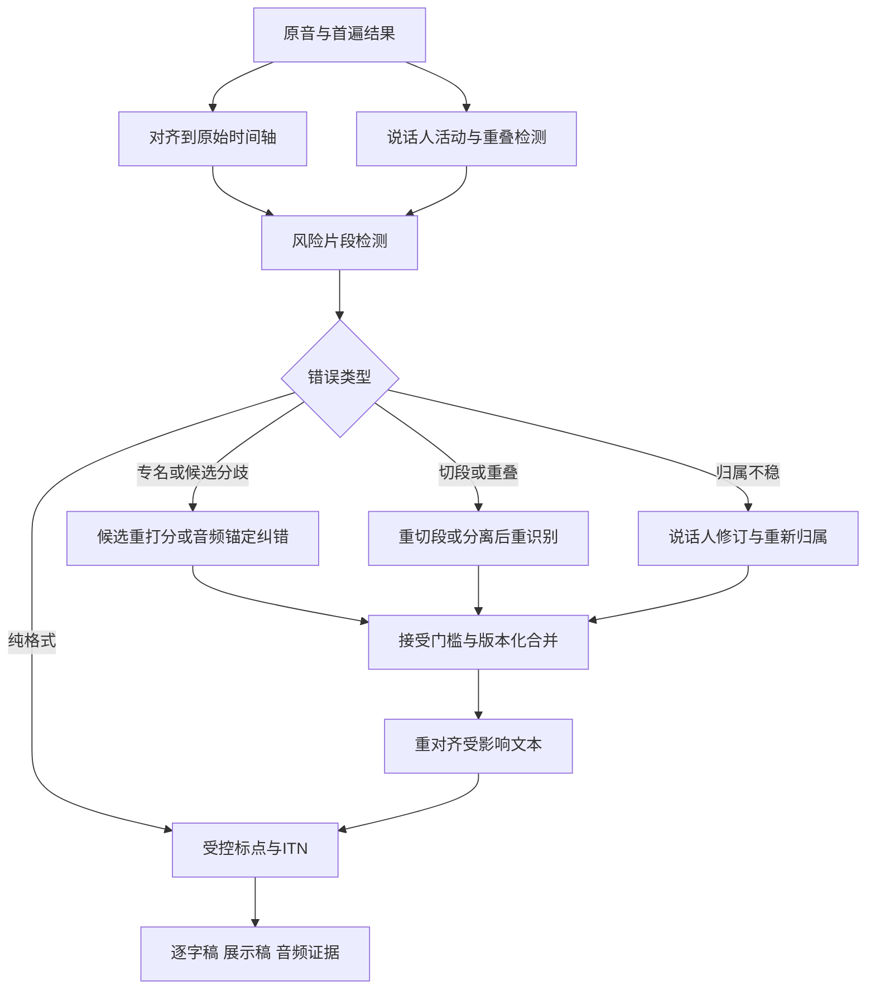

# ASR 后处理与说话人质量提升：方法、证据与实施路线

**研究截止：2026-09-23｜用途：全景理解与技术路线判断**

本专项使用论文、作者代码和官方文档，优先覆盖 2025—2026 新进展，保留有解释力的经典方法。论文数字来自各自实验，未在用户音频上复现；不能横向当成模型排名。下文明确区分研究结果与工程建议。

核心判断：后处理应分别优化文字、说话人归属和可读性。说话人标签本身不会修复错词；将活动边界、重叠与目标说话人信息反馈到局部重识别，才可能改善文字。文本纠错应保留候选与音频证据，并统计把正确内容改错的代价。

**阅读导航**

1. [质量目标与方法地图](#post-goals)
2. [说话人处理及反哺识别的五条路线](#post-speakers)
3. [候选、LLM、置信度与检索纠错](#post-correction)
4. [标点与逆文本规范化](#post-format)
5. [二遍处理流程与资源选择](#post-pipeline)
6. [评测与消融](#post-eval)

## 一、质量目标与方法地图

必须分别回答三个问题：**文字有没有识别得更准确；谁在何时说的话有没有归对；记录是否更可读、更容易使用。** 三者可能同时改善，也可能互相牺牲。为一句正确转写补上问号，主要改善呈现；给正确文字换回正确说话人，改善归属；从重叠声音中追回漏词，才直接改变文字错误。后处理的实验必须写清目标。

| 处理 | 可改善的质量 | 是否直接改善字词错误 | 输入需求 |
|---|---|---|---|
| 标点、分段、大小写 | 可读性、句子结构、下游理解 | 仅格式变化时不应声称降低规范化WER | 文本；可选时间和韵律 |
| ITN数字/日期/单位 | 书面形式与业务字段 | 可能修复表示，也可能错误改变数值 | 文本与字段上下文；必要时音频 |
| 强制对齐 | 时间定位、字幕同步、词与人关联 | 给定文字对齐通常不修复文字 | 原音与文字 |
| 后验说话人标注/聚类修订 | 谁说了什么 | 文字不变时普通WER不变 | 音频或说话人时间线 |
| N-best重打分/受限融合 | 候选选择错误 | 正确内容在候选空间内时可改善 | 多候选、分数与词边界 |
| 领域与音近纠错 | 专名、同音字、缩写 | 能改对，也可能误替换 | 文本、术语；音频更有利 |
| LLM生成式纠错 | 长上下文消歧、跨句一致性 | 需验证净收益，不能用流畅度代替 | 1-best或N-best；可选音频 |
| 重切段/分离后重识别 | 漏词、混叠、边界截断 | 通过新音频输入改变识别结果 | 必须保留原音 |
| 说话人条件化ASR | 抑制串人、追回目标发言 | 有潜力同时改善文字与归属 | 原音、说话人活动/参考 |

这是目标分类表，具体方法和证据见纠错与说话人专题。普通后验贴标签不会改字，是由操作定义直接得到的结论；不要把某条完整流水线的WER收益全部归给标签模块。

## 二、说话人处理怎样反哺识别

### 1. 先分清改善的是哪一种错误

**后验给文字贴说话人标签，可以改善“谁说了什么”，但只要文字内容和顺序不变，就不会降低普通 WER/CER。** 要修复漏词、错词，需要把说话人信息反馈到音频处理或识别解码，或者据此选择更好的识别候选。cpWER 的改善也不能自动解释成文字识别改善：它同时对识别和归属敏感。

| 问题 | 模块及输出 | 对 ASR 的作用 |
|---|---|---|
| 何时是谁发声 | Diarization：录音内匿名 speaker ID、时间区间、重叠活动 | 重分段、归属、重叠路由 |
| 这是谁／是不是某人 | 身份识别、声纹验证：映射已登记身份或拒识 | 名称展示、跨录音匹配；匿名转写不必需要 |
| 把混合声音分开 | 源分离：若干音频流 | 重叠区重新 ASR，争取找回被盖住的词 |
| 只听指定说话人 | 目标说话人提取／ASR：目标音频或目标文本 | 利用登记音频、嵌入或活动掩码抑制其他人 |

这些任务的边界可从 DiCoW 对“独立 ASR + diarization”“分离级联”“目标说话人 ASR”三条路线的区分理解；目标 ASR 不一定要先生成分离波形。[DiCoW 论文](https://arxiv.org/abs/2501.00114)

### 2. 基础后处理：时间、边界和全局 ID

推荐保留词级时间戳，将词区间与说话人活动区间匹配，并给边界附近的词记录不确定性。不要把整个长句机械归给时间重叠最多的人；一个句子中可能有插话，也不要把每个短暂停顿都当作换人。应同时保存允许重叠的真实活动轨和便于显示的单说话人轨。

pyannote Community-1 提供 exclusive diarization，方便与 ASR 时间戳协调；它是输出表示，不能凭此恢复同时说话时丢失的文本。官方模型卡的 DER 评测明确包含重叠、无容忍边界，并提供人数上下界设置；该条件必须与其他表格保持一致才可比较。[Community-1 官方模型卡](https://huggingface.co/pyannote/speaker-diarization-community-1)

长录音还必须解决跨块 ID 一致性：局部 `speaker_0` 不必是下一块的 `speaker_0`。可保留高置信、非重叠片段的说话人嵌入，进行全局聚类或关联，并允许不确定标签。2026-09-19 的 SpeechLM 研究在 AMI 中将原始局部标签通过 VBx 全局关联，DER 从 66.30% 降至 24.40%；重叠区 DER 仍为 46.01%。它支持“全局 ID 关联有效、仍不能解决漏掉的重叠语音”，不代表通用模型都有同等收益。研究另有使用真实登记片段的诊断实验，不能混为可部署结果。[论文及分解表 IV](https://arxiv.org/html/2609.23114v1)

#### 新近工具与路线，不必穷举模型

| 路线 | 近期代表 | 选型意义与限制 |
|---|---|---|
| 分段 + 嵌入 + 聚类／重分割 | Community-1、EEND-VC + TS-VAD | 模块可替换、容易定位错误；初始人数和声纹错误会传播 |
| 在线端到端活动预测 | Streaming Sortformer，2025-07 | Arrival-Order Speaker Cache 按出现顺序维护说话人状态；适合流式，但须评估长会话 ID 漂移和延迟 |
| 商业细粒度控制 | Precision-3，2026-09-17 | 新增独立 VAD／串音灵敏度与 speech、speaker、crosstalk 三类概率，可用于疑难片段路由 |
| 联合文字、时间、说话人 | MOSS Transcribe Diarize，2026-01 | 直接输出联合结构；应与模块化系统比较文字、归属和时间，而不只比较 DER |

Sortformer 的缓存机制见[作者论文](https://arxiv.org/abs/2507.18446)。Precision-3 的日期可核对[官方博客目录](https://www.pyannote.ai/blog)，能力见[发布说明](https://www.pyannote.ai/changelog/precision-3)；厂商 DER 自测不能证明接任意 ASR 后文字错误同步下降。MOSS 的联合 SATS、长上下文定位见[论文](https://arxiv.org/abs/2601.01554)。截至查询日，商业 pyannote 的新进展已是 Precision-3，不应只写 Precision-2。

### 3. 五条实际提升路径

#### A. 用文本修正说话人归属

DiarizationLM 把转写和 speaker 标签序列交给微调语言模型，再将输出标签转回原词序列。Fisher 上 USM + turn-to-diarize 的 WDER 为 5.32%，微调后为 2.37%，cpWER 21.19%→16.93%；Callhome 的 WDER 7.72%→4.25%。实验是英语双人电话，不应外推到中文多人会议；主要收益是词的说话人归属，并非同幅度降低 ASR WER。[论文表 1 与限制](https://arxiv.org/html/2401.03506v2)

落地时建议让 LLM 只返回词索引对应的标签修订，禁止改词；用声学证据复核改动很大的片段。语义合理的问答并非声纹证据，连续附和、接话补句、同一人自问自答都会误导文本推断。作者公开了标签转移、补全解析和评测工具，但 PaLM 2 训练使用内部工具，开源代码不等于完整模型可直接复现。[Google 作者仓库](https://github.com/google/speaker-id/tree/master/DiarizationLM)

#### B. 用说话人边界反馈分段并重新识别

工程上可把“词时间戳跨 speaker 边界”“极短异常换人”“相邻块重复或漏词”列为候选，回取边界前后音频，进行带上下文的局部重识别，再重新对齐并替换这一小段。不要把轮次切得过短：丢掉前后音素和语言上下文可能使结果更差。优先在开发集调节边界缓冲、最短段长和合并规则，保留原候选以便回滚。

该路径的收益机制是减少不合理截断和串人，不能承诺仅靠更准确的 diarization 就改善识别。若系统本来已有合理 VAD 分段、重叠很少，主要收益可能仍是标签质量。需要用“只改标签”和“同边界重识别”两组实验区分。

#### C. 重叠检测 → 分离／提取 → ASR

对多人远场，可由说话人活动指导 GSS，多通道还可结合去混响与波束形成；CSS 则把连续混合语音拆成可识别的输出流。单通道不能照搬依赖阵列空间信息的方案，应选单通道分离或目标说话人提取，并留意失真、漏词和两个输出流重复同一句。

NTT 的 CHiME-8 系统使用 EEND-VC、TS-VAD 修正、GSS、ASR 与候选融合。较干净的组件证据是：固定 baseline ASR、使用真实 diarization 时，新麦克风子集选择使 CHiME-6 tcpWER 20.00%→19.41%，DiPCo 31.43%→29.70%。全系统 50.03%→21.29% 则同时更换多个模块，不能归因于某一个后处理；而且是多麦克风开发集。[论文 6.2–6.4](https://arxiv.org/html/2409.05554v1)

建议仅对高重叠概率、低置信片段运行昂贵分离，并将分离后与原音频识别候选一起评分；“听起来更干净”并非 WER 一定更低。重复消除要同时看时间、声学来源、speaker，不应仅凭文本相同删除真实复述。

#### D. 将说话人直接作为识别条件

这已经超过纯文本后处理，但最直接回答“后面怎样反哺 ASR”。DiCoW 将说话人活动传入识别器，SE-DiCoW 进一步从会话内自动选择目标说话人的登记片段，用交叉注意力作为稳定声学条件；它解决完全重叠时不同人的活动掩码可能近乎相同的问题。2026-01、已录用 ICASSP 2026 的 SE-DiCoW 报告 EMMA 上宏平均 tcpWER 相对原 DiCoW 降低 52.4%，但还同时改善分段、初始化、增强，不能全部归给自登记模块。[SE-DiCoW](https://arxiv.org/abs/2601.19194)

2026-07 ACL 的 TellWhisper 用时间—说话人旋转位置编码联合表达连续发言和换人，并使用 Hyper-SD 估计活动；属于需要训练的模型改造，不能通过给普通 Whisper 增加一个文本提示实现。[ACL 正式论文页](https://aclanthology.org/2026.acl-long.861/)

2026-06 的 Dixtral 把 diarization-conditioned encoder 接入 Voxtral。在相同 DiariZen 分段条件下，AMI SDM cpWER：Dixtral 19.8%、专用 DiCoW v3.3 18.6%；因此“可同时问答”并不等于转写更准。该文的另一消融还发现问答／摘要微调会损伤逐字转写；工程上应分别守住两种质量目标。[论文表 2–3](https://arxiv.org/html/2606.18134v1)

#### E. 用 speaker-aware 上下文做候选选择

可以维护会话公共词表、每位说话人的高置信历史和领域实体，在 N-best 重打分中联合考虑声学分数、文本上下文与 speaker 一致性。这里把“按人组织上下文”作为待测工程假设，而非已证实的通用增益。不要把某人的口音、职业等推断当事实；也不要让错误 speaker ID 把历史错误一路传递。

可先比较全局上下文与按人上下文，再增加声学置信门控；对无可靠候选支持的改写回退原文。重叠且主识别器根本未输出另一人的词时，纯文本重打分通常没有足够证据，优先走 C 或 D。

### 4. 推荐实验矩阵：把收益归因做实

固定原音、ASR checkpoint、解码参数、文本规范化和测试集。按会议划分训练／开发／测试，避免同一人、同一会话跨集合。中文同时报告 CER 和固定分词器的 WER，重点实体另计。

| 实验 | 只改变什么 | 回答的问题 |
|---|---|---|
| B0 | 原 ASR + 基础标签 | 可复现起点 |
| B1 | 词级对齐 + 全局 ID，锁定文字 | 谁说什么是否更准 |
| B2 | B1 + 局部重新分段识别 | 边界是否导致漏错词 |
| B3 | B2 + 重叠路由分离 | 重叠漏词能否恢复，非重叠是否退化 |
| B4 | B2 + 目标说话人 ASR | 与分离路线质量／成本哪个更优 |
| B5 | 最佳声学路线 + 标签／候选精修 | LLM 或重打分是否净收益 |
| O1/O2 | 真实 speaker 标签／真实分段，仅诊断 | 说话人模块尚有多少改善空间 |

同时记录：普通 WER/CER、cpWER、tcpWER、DER 分解、实体错误、重叠区漏词率、处理时间、局部重跑比例、人工校正时间。DER 必须注明 collar 与是否评分重叠；tcpWER 应固定时间容忍窗，使用词级还是段级时间也要一致。MeetEval 提供 cpWER、tcpWER、ORC-WER 和 tcORC-WER，可辅助分辨词内容与归属错误，但不同指标的差值不应被当作严格可加的误差分解。[MeetEval 官方实现](https://github.com/fgnt/meeteval)

若只是单人录音，先投入 ITN、实体纠错与边界质量；双人电话先做 B1、标签纠错和局部复核；多人远场优先 B3/B4；实时系统先稳定在线 ID，结束后再做全局重关联。所有阈值应由本场景开发集确定。最终应选择“净减少真实错词与错归属、成本可接受”的组合，而不是模块越多越好。

## 三、文字纠错的方法与证据

### 1. 先按可用证据选择纠错方式

后处理的信息上限由接口决定：只有一条文本，就只能借语言和上下文推断；有 N-best、词置信度、声学分数，就能比较多个听觉解释；保留原音，还能二次识别或验证。纯文本后处理不能凭空确定一句模糊音频到底说了哪个人名。把“更合理”误当成“实际说过”，是核心风险。

| 方法 | 所需输入与机制 | 适合的收益点 | 主要限制 |
|---|---|---|---|
| 规则、混淆词典 | 已知错误形式→受限候选，结合词边界和领域范围 | 高频且稳定的产品名、缩写错误 | 全局替换同音词会误伤正常句子；词典维护成本 |
| 1-best 专用纠错或 LLM | 学习识别文本到人工原文的映射 | 有足够真实错误样本、错误模式重复 | 看不到已丢失的声学候选；容易补词、规范口语 |
| N-best 重排 | 对 ASR 候选按语言／领域／声学分数重新排序 | 正确句子已出现在候选中 | 受候选 oracle 错误率限制 |
| 受限生成 | 用 N-best 或 lattice 限制输出路径，可组合候选信息 | 保留可听到的候选，减少自由改写 | 首轮剪枝丢掉的词仍可能无法恢复 |
| 音频锚定纠错 | 原音与文本共同输入，或生成候选后用声学分数验证 | 专名、噪声、同音歧义、漏词 | 多模态推理／重识别成本；不保证模型真听音 |
| 置信门控 | 只处理低置信片段，或把词级置信度输入模型 | 首轮已较准，需控制误改和成本 | 置信度需校准；高置信错误可能被漏过 |
| 检索与会话记忆 | 检索领域资料、历史纠错对、会话实体作为证据 | 稀有名词、上下文专有术语 | 检索不到／检索错，历史错误可能被强化 |
| ROVER、MBR | 对多个候选对齐投票，或最小化候选间期望损失 | 离线高质量、多模型错误互补 | 同源错误会形成错误共识；多次识别开销 |

表中应用判断为基于下述机制的工程推导，需以本域数据验证。

### 2. 1-best 与 N-best：并非换一个更大的 LLM 就好

HyPoradise（NeurIPS 2023）提供超过 33.4 万组 N-best—参考文本训练数据，用来研究生成式纠错。生成可在候选列表外提出词，所以能突破“只能选择整条候选”的 oracle；但这同时扩大了无依据修改空间。不能把生成式纠错的优势解释为无需声学证据。[论文](https://arxiv.org/abs/2309.15701)

N-best T5 则把候选列表作为输入，并用 N-best 或 lattice 限制生成路径、结合 ASR 分数。其 LibriSpeech Conformer-Transducer 实验中，test-other WER 为：原 ASR 7.06%、10-best 无约束纠错 6.56%、N-best 约束 6.31%、lattice 约束 6.27%。这里额外信息与约束共同有效，不等于所有任务都该用 10 条候选。[论文与表 4](https://www.isca-archive.org/interspeech_2023/ma23e_interspeech.pdf)

尤其值得看跨域反例：另一项 2023 研究用 LibriSpeech 上学到的 Whisper 纠错器迁移到 MGB，原 WER 13.10%，10-best 无约束生成恶化到 22.88%，限制在候选中则为 12.71%。模型会把新领域说法改成自己熟悉的训练领域说法。[实验表 3](https://www.isca-archive.org/interspeech_2023/ma23f_interspeech.pdf)

**工程建议：**先测 1-best 与 N-best oracle 的差距。差距大，优先研究候选排序／受限融合；差距小，盲目加大 beam 的价值有限，应找领域数据、音频证据或真正互补的第二模型。纠错训练需保留大量“输入原本正确、输出不改”的样本。

### 3. 2026 值得关注：专用小模型加声学验证

Apple 的 *Revisiting ASR Error Correction with Specialized Models* 初稿为 2024，2026-03 更新 v2，不能当作 2026 首次提出。其 ECLM 用真实 ASR 错误及“文本→TTS→ASR”合成错误训练专用 seq2seq；correction-first decoding 从首轮 greedy 文本生成候选，再用原 ASR 声学分数重排。论文报告 LibriSpeech test-clean/other 1.5/3.3% WER，但比较中的通用 LLM 未做 ASR 微调；不能把它解释为所有专用小模型胜过所有 LLM。价值在于展示“学真实错误分布＋声音验证”这条可控路线。[2026 v2](https://arxiv.org/abs/2405.15216v2)

**工程建议：**保留疑难词前后短音频，生成少量拼写／专名候选，再做声学重打分或第二遍识别；对音文相互矛盾的结果保留原文并标为待复核。强制对齐仅说明文字能被安排到时间轴，不能单独证明这句话确实被说过。

### 4. 置信度的价值首先是避免把正确的改错

*Confidence-Guided Error Correction for Disordered Speech Recognition*（2025 预印本）把词级熵置信度加入 LLaMA 3.1-8B 的微调输入，并对比句级、词级触发门控。训练使用 SAP 的约 13 万纠错对；TORGO 是未参与训练的轻中度构音障碍多词语句集，633 条。[论文方法与结果](https://arxiv.org/html/2509.25048v1)

| 同一研究中的 Parakeet 输出 | 原 ASR WER | 无条件 LLM 纠错 | 置信输入纠错 |
|---|---:|---:|---:|
| SAP 非共享／自发内容，表 2 设置 | 9.94% | 10.56% | 9.48% |
| TORGO 跨库 | 10.83% | 20.01% | 10.58% |

论文摘要的约 47% 改善相对的是错误更大的 naive LLM，不是原 ASR。对原 ASR 的 TORGO 收益仅约 2.3% 相对。这些是论文所报设置，门控对比含阈值选择；不能将最优设置当作跨场景默认值。置信输入能减少伤害，但仍需针对模型和场景调整。[同论文表 1、2](https://arxiv.org/html/2509.25048v1)

**工程建议：**不要把接口的 confidence 当作已校准正确概率。用人工集测“各分数区间实际正确率”，再确定触发阈值；以纠错净收益、误改率和调用比例选门控，不能只追求找出更多可疑词。用户没有说完整的句子、口吃和语法错误，并不自动等于识别错误。

### 5. 领域检索、历史记忆怎样实际帮忙

Amazon 的 *Contextual ASR with Retrieval Augmented Large Language Model*（ICASSP 2025）用首轮文本检索相关文档，再让文本 LLM 或音频 LLM 纠错；其混合系统还融合自定义词表。训练加入 context dropout 等机制，减少对偶然检索资料的依赖。这种方法是识别后的上下文纠错，需与首轮解码热词偏置区分。[作者研究页](https://www.amazon.science/publications/contextual-asr-with-retrieval-augmented-large-language-model)

2026-06 的 *Error-Aware TF-IDF RAG* 用历史“错误文本—参考文本”中的易错词统计调整检索权重，针对 1-best，不依赖声学 embedding。值得借鉴的是检索纠错案例，而不只检索同主题文章。其重复词截断规则不能直接套用逐字稿，因为真实重复也可能是用户表达。[论文](https://arxiv.org/abs/2606.24915)

2026-06 的 *Ontology Memory-Augmented ASR Correction* 将会话里的实体、别名和易混形式变成可检索记忆。中文 RAMC-Corr 用 Qwen2-Audio 生成首轮结果，测试只有 43 段会话，并假设起始历史是可靠人工文本。原 C-CER 27.94%；Qwen3.5-9B zero-shot 的记忆方案为 27.26%，但其 few-shot 方案反而 28.89%。论文“9/10 设置优于直接纠错”不等于 9/10 优于原 ASR；多个 Qwen2.5 设置仍比不改更差。[论文表 2](https://arxiv.org/html/2606.13464v1)；[作者代码](https://github.com/fangfang123gh/ontology-asr-correction)

**工程建议：**把“当前会议已确认的人名／产品／项目词”做成有来源的临时词表，检索结合文字、拼音和别名。记忆条目携带来源时间、确认状态、适用会话；不要把一次自动纠错直接升级为全局真值。无可靠记忆时必须允许不改。新术语也不能强行替换成词表中最近的熟词。

### 6. 融合与 MBR 仍然有现实价值

ROVER 将多个识别系统的文字动态对齐成词网络，再投票或加权评分。它适合模型错误互补的离线任务；不能期待三个相似模型对同一专名的同一种错误被多数投票修复。[NIST 原始论文](https://www.nist.gov/publications/post-processing-system-yield-reduced-word-error-rates-recognizer-output-voting-error)

MBR 则选择对候选后验分布具有最小期望编辑损失的输出，目标与“整句概率最高”不同。经典 confusion network 可按词后验构造共识文本。[Mangu 等原论文](https://arxiv.org/abs/cs/0010012) 2025-10／2026-05 的重新评估在 Whisper 及派生模型的英日 ASR、翻译上比较 sample-based MBR 与 beam search，作者把它定位为高准确率离线任务的方向，不能省略采样成本。[新研究](https://arxiv.org/abs/2510.19471) 2026-06 NAR-MBR 利用非自回归模型一次前向得到多个样本，尝试降低这一成本；它属于解码研究，不能当成任何黑盒 ASR API 都能外挂的文本模块。[Interspeech 2026 论文](https://arxiv.org/abs/2606.17537)

还有视频可用时的 2026 DualHyp：把 ASR 与唇读 VSR 的独立候选和模态可靠性提示交给纠错器，在 LRS2 人为损坏条件中验证信息互补。其前提是可用的人脸口型视频，不适用于一般纯音频电话。[ACL 2026 论文](https://aclanthology.org/2026.findings-acl.26/)；[作者代码](https://github.com/sungnyun/dualhyp)

### 7. 如何落到质量改进

建议先建立四组离线对照：不纠错、规则／术语纠错、置信门控文本纠错、音频锚定二遍识别。使用相同首轮输出及相同文本归一化，单独统计人名数字等关键字段和误改。只有疑难片段需要昂贵处理。领域纠错经过人工确认后可沉淀为混淆对、检索案例或训练数据；需要独立留出集，防止同一条会话既入记忆又被用来证明提升。

优先级取决于错误来源：已识别文字但选错同音词，考虑候选／领域证据；首轮漏掉整段，回看 VAD、重叠语音和二遍识别；词都对但说话人错，修改 attribution；只有标点、数字格式错，交给专门的展示后处理。把这些错误都交给一个自由改写 LLM，无法明确知道是哪条链路提高了准确率。

## 四、标点与逆文本规范化

### 标点恢复：优先保留词序与字词

**规则法**利用停顿、固定模式和句末词决定边界，低成本、易审查；但停顿可以是思考而非句末。**序列标注**给每个词/字边界预测逗号、句号、问号等，只插入标点；**生成模型**直接输出新文本，适应上下文但需要额外防止删词或改词；**声学—文本融合**加入停顿、语调或音频编码器特征，适合仅凭词无法区分的语气。西班牙语研究提供声学与词汇融合的例子，其结果不能外推为中文通用收益。[声学—词汇标点研究](https://aclanthology.org/2024.unimplicit-1.3/)

2025年的Cadence用预训练语言模型适配标点恢复，覆盖22种印度语言及英语，并讨论自发语音、口语不流畅和域迁移问题。它是多语种标点研究线索，不能由“多语种”推断支持中文。[Cadence论文](https://aclanthology.org/2025.findings-ijcnlp.110/)

2026年的Weighted Lookahead Scoring在有界右上下文内给标点候选打分，保留输入字词，不自由生成。论文在IWSLT 2017、K=2子词前瞻下报告微调后四类macro-F1为0.937，对照微调ELECTRA为0.913。这是特定数据与前瞻预算下的标点结果，不是WER降低比例。[2026流式标点论文](https://arxiv.org/abs/2606.05179)

还有一个容易漏掉的问题：标点模型常用完整句子训练，线上收到的却是VAD截出的片段。Interspeech 2025研究用模拟VAD分段构造训练文本，针对这类分布差异减少错误标点预测。**工程建议：**训练/评测标点恢复要输入真实ASR片段和错误文本，不能只输入干净人工句子。[VAD-aware文本分段](https://www.isca-archive.org/interspeech_2025/novitasari25_interspeech.html)

实施建议：默认选择边界标注或插入受限生成；标点步骤输出前后去除允许标点后，字词序列应保持一致。流式只修改未稳定尾部，按可用后文延迟提交标点；已经显示的句号如果引发频繁回滚，应计入体验损失。句末标点不能直接作为语音Agent开始执行的唯一信号。

### ITN：确定“该不该改”比会转换更重要

| 路线 | 方法 | 适合情况 | 主要代价 |
|---|---|---|---|
| 规则/WFST | 先识别数字、日期、金额等类别，再做受控映射 | 电话、金额、固定编号、明确语法 | 多语言和歧义规则维护 |
| Token tagging | 为输入token预测复制、删除或替换片段 | 保持输入可追溯、减少自由生成 | 依赖标签集合与训练覆盖 |
| Seq2seq/LLM | 利用长上下文生成书面形式 | 不规则表达、复杂语义 | 可能增删事实、改变数值 |
| 混合 | 模型判类别/候选，规则执行和校验 | 同时需要语义与可控转换 | 需要保留候选和失败回退 |
| 模型内双形式输出 | ASR同时学习口语和书面输出 | 可训练/适配模型的完整系统 | 超出纯后处理，需要数据与训练 |

NeMo ITN以WFST语法为经典可控路线；Thutmose把任务做成单遍token分类与替换，论文在英语、俄语数据验证，目标之一是减少seq2seq不可恢复的幻觉。中文可检查WeTextProcessing的TN/ITN规则实现，但仍要对自己领域的数值和口述方式测试。[NeMo ITN论文](https://arxiv.org/abs/2104.05055)、[Thutmose](https://arxiv.org/abs/2208.00064)、[WeTextProcessing](https://github.com/wenet-e2e/WeTextProcessing)

2025年Dynamic Context-Aware ITN研究动态块长及右上下文，在越南语流式场景验证；它说明ITN也有上下文—延迟取舍，不能总在当前数字刚出现时定稿。[流式ITN论文](https://www.isca-archive.org/interspeech_2025/ho25_interspeech.html)

2026年中文Dual-Form ASR使用口语/书面成对监督与ITN-MWER，提出REQUIRE-ITN和FORBID-ITN分别评估必须转换与不应转换的跨度。该工作是预印本、属于ASR训练层扩展；其评测思想可以用于现有后处理：既看该改处有没有改对，也看不该改处有没有被破坏。[中文Dual-Form ASR](https://arxiv.org/abs/2609.02901)

例如“型号是一三零零”不应未经领域规范就解释成数值1300；“三点一四”可能是小数也可能是版本的片段。建议将 `spoken_text、display_text、normalized_value、unit、source_span` 分开保存。字段规范可决定展示，但如果原音实际说的是“十五”，后处理不能凭业务常识自动改成“五十”。无法确定时保持原文或提供待复核候选。

**去口吃与口语整理也单独处理。** “星期四，不，星期五”在逐字记录里两者都应保留，在最终预约槽位里可能采用更正后的星期五；两种输出都应能追溯同一原音。把逐字稿剪成书面稿会改变任务，不应混进“识别准确率提高”的结果。

## 五、二遍处理与资源选择

### 一个可实现的二遍质量增强流程

以下为本报告提出的设计方案，不是某个开源工具的现成功能组合。

**第一步：保留证据。** 首遍保存原音、声道、分段偏移、模型版本、文字、可用置信度、N-best和中间事件。黑盒API不一定有N-best或词置信；此时可以用第二识别器分歧、重叠概率、对齐异常等定位风险，但这些是代理信号，不是金标。模型重采样、VAD压缩和源分离后必须能映射回原始时钟。

**第二步：只对风险区投入。** 风险包括低置信、候选分歧、长段异常重复、语音区无字、说话人切换附近的短词、多人重叠、罕见实体和数字。不同信号分别在开发集校准，不把所有API的0.8当成同样可靠。稳定正确的原文作为明确的“不修改”样本。

**第三步：先选能处理该错误的路径。** 少标点走标点模块；专名分歧走候选与领域词表；被截断的尾词回原音扩大边界；重叠漏词试分离后重识别；串人但字正确就只改归属。对于会议可保留两路结果：快首遍用于实时预览，高质量二遍作为会后记录。不要把所有失败都送给纯文本LLM。

**第四步：有限修改与可回退。** 接受逻辑可以综合音频支持、候选分数、上下文与编辑风险；门槛需开发集验证，不能用LLM自称“很确定”代替校准。输出原跨度、新跨度、修改类别和依据；未通过则保留原文并标记不确定。文本插入/删除后需重算受影响区间的对齐和说话人归属，不能沿用旧词下标。

**第五步：拼接与反馈。** 重跑窗口含上下文边缘，但只提交有证据的目标区修改；重复话语不能用字符串去重随意删除，应结合时间。词表可按会话与已确认实体共享，说话人记忆须区分全会话主题和个人表达，不因说话人误聚类就让错误上下文永久累积。循环次数要有上限，并记录每轮真实净收益。

### 按现有条件选择方案

| 目前拥有的资源 | 推荐起点 | 暂时不能做的事 |
|---|---|---|
| 只有一份文字 | 受控标点/ITN、很保守的词典纠错 | 可靠恢复漏掉的重叠语音、判断真实说话人 |
| 文字加原音，无N-best | 独立对齐/分人，风险区二次ASR与候选对照 | 把两模型共识当作正确概率 |
| 原音加N-best/分数 | 重打分、受限融合、置信筛选 | 无校准直接混合不同模型原始分数 |
| 多声道/分轨录音 | 保留每通道及同步，分别识别再合并 | 把声道永久等同于一个真实人 |
| 允许训练/微调 | 学习错误检测、领域纠错、说话人条件模型 | 用测试集答案造词表或筛门槛 |
| 实时产品 | 稳定前缀加暂定尾部，重处理异步运行 | 将离线收益假定为同样实时收益 |

**优先次序建议：**先建立对齐、版本和评测；再做可控格式层；会议先检验分人和重叠问题；随后加入候选纠错或局部二遍；有稳定错误模式和足够数据后才训练复杂后处理。这里的“先后”按信息价值与可诊断性排列，不是所有场景都必须部署所有模块。

## 六、怎样证明质量提高

冻结首遍输出，所有方案对同一输入做配对比较。测试集至少包含：原本正确的文本、真实ASR错误、专名数字、短插话、重叠、长会议、方言/混说和非语音；开发集用于阈值与提示调整，测试集不可用于术语注入。人工参照同时保留逐字、时间/说话人以及显示规范。

设同一参照下首遍编辑错误数为E0、后处理为E1，直接报告 `净错误减少=E0−E1` 与 `相对错误减少=(E0−E1)/E0`；E0为零时只报告新增错误。局部编辑可能重新排列最优对齐，因此不能简单把所有字符diff都当成修复；另对修改跨度人工标为有效修复、无害格式变化、错误修改或无法判定。

| 评估层 | 至少报告 | 能排除什么误判 |
|---|---|---|
| 文字 | 固定规范化CER/WER、S/D/I、最差场景 | 标点改变造成的假提升 |
| 修改行为 | 修改精确率、错误修复召回、原正确片段受损率 | 改得多却净收益低 |
| 实体/数字 | 完整实体、数值+单位、否定词正确率 | 平均分掩盖关键事实损坏 |
| 说话人 | DER、cpWER/tcpWER或明确中文字符变体 | 字对但人错、短插话丢失 |
| 时间 | 词边界偏差、未对齐比例 | 改文字后旧时间戳失效 |
| 格式 | 标点F1、ITN必须转换/禁止转换两类 | 不该转的编号被转成金额 |
| 流式 | 稳定文本延迟、回改量、句后修订时间 | 离线准确率换来不可用延迟 |
| 运营 | 每音频小时成本、人工复核分钟数 | 算力省但校对变贵 |

消融建议：A首遍；B=A+纯说话人归属；C=A+保守格式；D=A+受限纠错；E=A+风险区二遍；F=A+说话人/重叠引导二遍；G选择已证明有效的组合。B的普通WER原则上不应变化，若变化就说明还发生了别的处理；F必须与使用同样二遍预算但不利用说话人信息的对照比较，才能判断收益来自哪里。不要只做A→B→C的累计链，因为相互作用可能掩盖模块退化。

配对置信区间按录音/说话人聚类抽样；同时检查各语言、重叠程度和关键实体的退化。试点门槛应由业务容忍度决定，本文不虚构“后处理普遍提升20%”或统一误改率阈值。当前尚无用户录音、首遍结果和金标，本研究交付方法依据与实验设计，不宣称实际收益。

## 来源索引

1. [DiCoW 论文](https://arxiv.org/abs/2501.00114)
2. [Community-1 官方模型卡](https://huggingface.co/pyannote/speaker-diarization-community-1)
3. [论文及分解表 IV](https://arxiv.org/html/2609.23114v1)
4. [作者论文](https://arxiv.org/abs/2507.18446)
5. [官方博客目录](https://www.pyannote.ai/blog)
6. [发布说明](https://www.pyannote.ai/changelog/precision-3)
7. [论文](https://arxiv.org/abs/2601.01554)
8. [论文表 1 与限制](https://arxiv.org/html/2401.03506v2)
9. [Google 作者仓库](https://github.com/google/speaker-id/tree/master/DiarizationLM)
10. [论文 6.2–6.4](https://arxiv.org/html/2409.05554v1)
11. [SE-DiCoW](https://arxiv.org/abs/2601.19194)
12. [ACL 正式论文页](https://aclanthology.org/2026.acl-long.861/)
13. [论文表 2–3](https://arxiv.org/html/2606.18134v1)
14. [MeetEval 官方实现](https://github.com/fgnt/meeteval)
15. [论文](https://arxiv.org/abs/2309.15701)
16. [论文与表 4](https://www.isca-archive.org/interspeech_2023/ma23e_interspeech.pdf)
17. [实验表 3](https://www.isca-archive.org/interspeech_2023/ma23f_interspeech.pdf)
18. [2026 v2](https://arxiv.org/abs/2405.15216v2)
19. [论文方法与结果](https://arxiv.org/html/2509.25048v1)
20. [作者研究页](https://www.amazon.science/publications/contextual-asr-with-retrieval-augmented-large-language-model)
21. [论文](https://arxiv.org/abs/2606.24915)
22. [论文表 2](https://arxiv.org/html/2606.13464v1)
23. [作者代码](https://github.com/fangfang123gh/ontology-asr-correction)
24. [NIST 原始论文](https://www.nist.gov/publications/post-processing-system-yield-reduced-word-error-rates-recognizer-output-voting-error)
25. [Mangu 等原论文](https://arxiv.org/abs/cs/0010012)
26. [新研究](https://arxiv.org/abs/2510.19471)
27. [Interspeech 2026 论文](https://arxiv.org/abs/2606.17537)
28. [ACL 2026 论文](https://aclanthology.org/2026.findings-acl.26/)
29. [作者代码](https://github.com/sungnyun/dualhyp)
30. [声学—词汇标点研究](https://aclanthology.org/2024.unimplicit-1.3/)
31. [Cadence论文](https://aclanthology.org/2025.findings-ijcnlp.110/)
32. [2026流式标点论文](https://arxiv.org/abs/2606.05179)
33. [VAD-aware文本分段](https://www.isca-archive.org/interspeech_2025/novitasari25_interspeech.html)
34. [NeMo ITN论文](https://arxiv.org/abs/2104.05055)
35. [Thutmose](https://arxiv.org/abs/2208.00064)
36. [WeTextProcessing](https://github.com/wenet-e2e/WeTextProcessing)
37. [流式ITN论文](https://www.isca-archive.org/interspeech_2025/ho25_interspeech.html)
38. [中文Dual-Form ASR](https://arxiv.org/abs/2609.02901)
