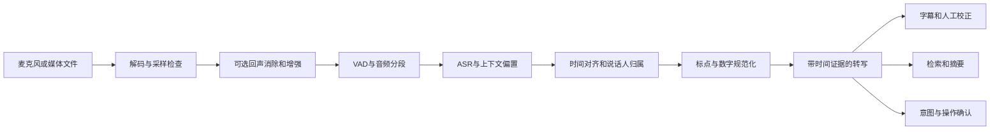

# ASR 全景研究：问题定义、产业生态与技术路线判断

研究日期：2026-09-23。ASR 指 Automatic Speech Recognition（自动语音识别）。面向全景理解与技术路线判断，兼顾中文场景。

## 阅读与证据说明

本报告是基于公开一手论文、作者仓库、官方数据集、服务文档和定价页的案头研究，没有运行跨模型基准测试，也没有进行供应商账户内验证。文中“支持”通常指文档声明，不等于已经证明在你的语言、设备和场景上可用；“建议”“判断”“推断”是对证据的工程综合。价格是查询时快照，不能当作合同报价。搜索摘要可能滞后于正文，例如本次 AssemblyAI 搜索摘要仍出现 Universal-3 Pro，打开定价正文则已是 Universal-3.5 Pro；涉及选型时应固定模型版本和接口。

建议先读本篇的问题地图与路线表，再读模型、数据评测、生产系统三个专题，最后回到路线决策与研究机会。本文不提供缺乏可比实验的“最佳 ASR 排名”，也不引用口径不透明的市场规模预测。

## 一、先理解 ASR 究竟交付什么

将波形变成文字只是最窄的任务定义。可用的语音系统还必须说明：哪一段声音产生了哪段文字、何时可以把文字视为稳定结果、谁在说话、什么内容不确定、用户说的是事实记录还是操作命令。识别、对齐、说话人分段、身份识别、翻译、摘要和语音理解是不同任务，能做其中一项不意味着能做其余各项。官方转写 API 对普通文字、说话人结果、时间戳的模型限制分别定义，正反映了这些边界。[OpenAI 文件转写文档](https://developers.openai.com/api/docs/guides/speech-to-text)

| 任务 | 需要回答的问题 | 常见混淆 |
|---|---|---|
| ASR / STT | 说了哪些词或字？ | 语句通顺不代表忠于原音 |
| VAD | 当前有没有语音活动？ | 静音不必然代表说完 |
| Endpoint / turn detection | 一句或一轮是否结束？ | 识别出最后一个词不等于可以开始回复 |
| Diarization | 什么时间由哪个匿名说话人发言？ | speaker_1 不等于某个真实姓名 |
| Speaker verification / identification | 是否为声明的人、属于哪个已登记的人？ | 需要身份依据，风险与匿名分段不同 |
| Forced alignment | 给定文字在声音中对应何时？ | 对齐器不能证明给定文字正确 |
| Punctuation / ITN | 如何恢复标点和数字书写？ | “一二三”可能是编号，也可能是一百二十三的口语 |
| Speech translation | 用另一种语言表达什么？ | 翻译会失去原语言逐字证据 |
| Spoken language understanding | 意图、实体、事件是什么？ | 完成意图任务未必需要逐字转写 |
| Speech-to-speech | 如何直接用语音交互？ | 可听见的流畅回答不是可审计的原话记录 |

以上表是本报告的任务划分，不是某一厂商的产品分类。

## 二、决定技术路线的六个维度

**第一是时间约束。** 文件转写拥有完整后文，可以离线分段、批量计算、反复校正。实时字幕必须在说话过程中提供文字，还要控制回改。对话系统除了尽快出字，还要避免过早抢话、过晚回应。单纯传输使用 WebSocket 并不足以证明模型是因果流式；文件上传后逐步返回文本也可以被称为 streaming。火山文档明确区分双向流式和流式输入、句级输出；OpenAI 文件流式输出也有单独说明。[火山产品说明](https://docs.volcengine.com/docs/6461/1354871?lang=zh)、[OpenAI 文件流式转写](https://developers.openai.com/api/docs/guides/speech-to-text)

**第二是错误代价。** 播客搜索可容忍少量虚词错误，订单里的数量、否定词和地址却可能直接影响任务。建议用业务实体与操作结果补充 WER/CER，并保留关键实体确认机制。这里的取舍是风险设计，不是对某个模型精度的主张。

**第三是声学条件。** 近讲输入、电话、远场会议、车内语音不是同一种数据分布。产品路线应先确定话筒位置、声道来源、回声和重叠说话情况，再挑识别模型。尤其不能把能保留的独立声道提前混成单声道，再指望后端完全恢复身份与重叠内容。

**第四是语言与文字契约。** 普通话、带地方口音的普通话、粤语、吴语、中英混说必须分别描述；还要确定简繁体、口语词、数字和专名如何记录。语言数量只能作覆盖提示，不能作质量分数。阿里云官方表对不同实时/文件版本分别列出语言和功能，说明能力应落到精确版本。[阿里云 ASR 模型概述](https://help.aliyun.com/zh/model-studio/asr-model)

**第五是部署边界。** 云 API 降低启动负担，自托管提供版本与数据路径控制，端侧能适应离线与隐私要求，但约束是硬件覆盖、电耗、内存和分发维护。Apple SpeechAnalyzer 提供系统级语音分析与端侧转写路径，说明端侧路线也应把操作系统能力纳入候选。[Apple WWDC25 SpeechAnalyzer](https://developer.apple.com/videos/play/wwdc2025/277/)

**第六是可追溯性。** 对一份需要核对的记录，原始转写、显示文本和摘要应作为三个版本存储；每次规范化与纠错都应保留出处。建议把“准确且可追溯的文本”定义为系统输出，而不是只保存一段被 LLM 润色的字符串。

## 三、全链路地图与三种架构

这是逻辑责任图；实际模型可能合并若干节点，说话人模块也可以与 ASR 并行，不要求严格按图串行。目标是保证每项责任被测量，而不是增加模块数量。

| 架构 | 优先优化 | 典型组成 | 最应验证的风险 |
|---|---|---|---|
| 离线高质量转写 | 完整性、长音频吞吐、校对成本 | VAD分段 + 大模型 + 对齐/分人 + 可选二次复核 | 切段遗漏、长文漂移、说话人串号 |
| 原生实时识别 | 稳定文字延迟、连续运行 | 有限右上下文编码器 + 增量解码 + 状态缓存 | 回改、端点误判、断线恢复 |
| 流式首遍 + 句后/会后二遍 | 交互速度与最终质量 | 快速草稿 + 音频复核 + 版本更新 | 用户已按旧文字行动，后台才修正 |
| 直接语音交互 | 轮次自然度、韵律和打断 | 语音理解与生成 + 工具执行边界 | 缺乏忠实逐字记录，动作与转写不同步 |

**判断：这几条路线会共存。** 一旦要求稳定字幕、可追溯记录、断网运行或低价高吞吐，问题就不会归约为“哪个参数量更大”。模型能力合并能简化部署，系统仍需保留可观察的时间、归属与置信边界。

## 四、商业生态：先按交付层划分

本节的供应商是代表性样本，不是穷尽清单；功能来自官方资料，后面的“验证重点”是本报告建议。

| 层次/代表 | 已核实的产品方向 | 技术路线上的验证重点 |
|---|---|---|
| OpenAI | GPT-Transcribe 覆盖文件与 Realtime 已提交轮次输入；另有 diarize 专用模型 | 文件输出流式与实时输入区别；逐词时间戳、分人和上下文不能跨模型假定一致 |
| Deepgram | Nova-3 转写、Flux 面向实时对话，区分单语/多语种与流式/文件 | 目标语言、端点策略、附加功能费用和促销价格有效期 |
| AssemblyAI | Universal-3.5 Pro 文件与 Realtime 产品，另有同步短音频接口 | 同一品牌不同接口的能力与计费时长；中文必须查确切语言列表 |
| Google Cloud | Chirp 3 与 Cloud Speech-to-Text V2 体系 | 区域、具体语言、同步/流式/批处理模式的功能交集 |
| Microsoft Azure / MAI | MAI-Transcribe-2；另有Azure实时、快速、批量、Custom Speech及部分容器能力 | MAI接入预览、长录音分人限制；不能把不同产品功能合并推断 |
| AWS | Amazon Transcribe 及云存储、权限与加密集成 | 区域、声道、词表、脱敏支持，S3与日志的访问控制 |
| ElevenLabs | Scribe v2文件、Scribe v2 Realtime、09-22公告GA的Scribe v2 Medical | 医疗版为batch；领域收益与通用准确率分别验证 |
| Soniox | v5 Real-Time与v5 Async | 老ID自动路由会改变模型版本；检查结构化输出、语言混用与完成语义 |
| Speechmatics | 批量与实时 STT，以及企业部署选择 | 目标语言、多说话人结果、部署合同与运行资源 |
| 阿里云 | Qwen-Audio-3.x-ASR-Flash、Fun-ASR、Paraformer 等多系列 | 云端商品名与开放权重分开；streaming/filetrans/普通flash功能分别核对 |
| 火山引擎 | 大模型流式与录音文件识别 | 双向/句级输出、二遍模式、说话人信息对延迟的影响 |
| 科大讯飞 | 实时与录音文件转写大模型、方言相关能力 | 精确产品与接口版本的方言覆盖、音频格式和返回结构 |
| 腾讯云 | 多种识别接口及热词能力 | 热词类型、权重与引擎兼容性，用负例检查误插入 |
| 操作系统/端侧 | Apple SpeechAnalyzer 等系统接口 | 设备/系统/语言支持矩阵、模型下载、离线和长录音行为 |

来源：[GPT-Transcribe](https://developers.openai.com/api/docs/models/gpt-transcribe)；[Deepgram](https://deepgram.com/pricing)；[AssemblyAI](https://www.assemblyai.com/pricing/)；[Chirp 3](https://docs.cloud.google.com/speech-to-text/docs/models/chirp-3)；[Azure](https://learn.microsoft.com/en-us/azure/cognitive-services/speech-service/speaker-recognition-overview)、[MAI](https://learn.microsoft.com/en-us/azure/ai-services/speech-service/mai-transcribe?pivots=ai-foundry)；[AWS](https://docs.aws.amazon.com/transcribe/latest/dg/data-protection.html)；[Scribe](https://elevenlabs.io/docs/overview/capabilities/speech-to-text)、[Medical发布](https://elevenlabs.io/blog/scribe-v2-medical-generally-available)；[Soniox v5](https://soniox.com/blog/soniox-v5-real-time)、[Soniox Async](https://soniox.com/blog/soniox-v5-async)；[Speechmatics](https://www.speechmatics.com/developers)；[阿里云](https://help.aliyun.com/zh/model-studio/asr-model)；[火山](https://docs.volcengine.com/docs/6461/1354871?lang=zh)；[讯飞](https://static.xfyun.cn/doc/spark/asr_llm/rtasr_llm.html)；[腾讯热词文档](https://cloud.tencent.com/document/product/1093/40996)；[Apple](https://developer.apple.com/videos/play/wwdc2025/277/)。腾讯热词能力也应按产品与引擎分别核对。

### 价格样本：只比较明确口径

美元价格，2026-09-23 查询；不含税费、传输存储、人工校正和其他模型调用。下面换算仅用单价乘60，不构成相同服务质量下的价格排名。

| 服务/模式 | 公布单价 | 换算美元/小时 | 关键口径 |
|---|---:|---:|---|
| OpenAI gpt-transcribe | 0.0045/分钟 | 0.27 | 官方列为 estimated cost |
| OpenAI gpt-4o-transcribe | 0.006/分钟 | 0.36 | 官方估算；实际计费应核对token用量 |
| OpenAI gpt-4o-mini-transcribe | 0.003/分钟 | 0.18 | 官方估算 |
| Deepgram Nova-3 单语文件 | 0.0043/分钟 | 0.258 | Pay As You Go |
| Deepgram Nova-3 单语流式 | 0.0048/分钟 | 0.288 | 查询时促销价；正常价标为0.0077/分钟 |
| AssemblyAI Universal-3.5 Pro 文件 | 0.21/小时 | 0.21 | 附加能力单独核算 |
| AssemblyAI Universal-3.5 Pro Realtime | 0.45/小时 | 0.45 | 流式按会话时长计费 |
| Google V2 Standard 起始档 | 0.016/分钟 | 0.96 | 前50万分钟/月档位 |
| Google Standard Dynamic Batch | 0.003/分钟 | 0.18 | 异步动态批处理，不能作为实时价格 |

价格来源：[OpenAI 定价](https://developers.openai.com/api/docs/pricing)、[Deepgram 定价](https://deepgram.com/pricing)、[AssemblyAI 定价](https://www.assemblyai.com/pricing/)、[AssemblyAI 计费规则](https://support.assemblyai.com/articles/3853403741-how-does-pricing-work)、[Google 定价](https://cloud.google.com/speech-to-text/pricing)。国内服务套餐、赠送额度、并发授权与地域组合不同，本报告没有取得足够统一的条件，因此不填未经核实的人民币横向报价。

**成本判断。** 对全月连接保持开放、实际发言较少的系统，会话计费和音频计费可能产生很大差异。假设人工校正成本为每小时30美元，方案A每音频小时0.30美元、需校正6分钟，总计3.30美元；方案B每音频小时0.60美元、需校正2分钟，总计1.60美元。这是演算假设，用来说明应优化“每小时合格结果成本”，而非预测任何模型的人工耗时。

## 五、模型以外的竞争力在哪里

以下是基于能力分层的产业判断，并非已验证的企业市场份额结论。

**数据与评测闭环。** 用户词表、真实噪声、地方表达和人工修订可以构成有用资产，前提是取得相应数据使用权限、标注一致且能证明修订改善了未见样本。堆积录音并不等于形成有效训练集。

**采集与工作流。** 会议设备能否分轨、电话是否有两路音频、字幕是否允许一键回听、校对是否能迅速定位错误，会直接改变可用性。对产品而言，“用户完成任务的时间”比转写展示是否流畅更有意义。

**运行可靠性。** 版本固定、区域部署、峰值并发、断线恢复、保密和可解释的失败处理是独立能力。API 能调用只是接入起点。

**领域整合。** 医疗记录、呼叫中心、媒体字幕和语音输入法需要不同的文本契约与审核流程。领域模型可能有优势，也可能只改善特定词表；应分别测领域词、普通语言与异常音频，防止专用化后的退化。

**证据链与控制权。** 音频定位、改写记录、权限与删除传播做得好，会降低人工复核成本，也能减少未来替换识别引擎时的迁移难度。

## 六、数据治理与安全边界

ASR 的数据资产至少包括原始音频、分段音频、逐字文本、显示文本、说话人特征、词表、人工修订、日志、摘要与向量索引。建议用统一录音ID串联，但对身份映射和声纹单独授权；删除一条录音时，应能追踪派生副本和备份策略。

在中国，《个人信息保护法》第28条将生物识别、医疗健康等列为敏感个人信息；处理敏感个人信息还有严格条件和相应告知/同意要求。并非所有声音处理都等同于声纹身份识别，具体义务取决于可识别性、目的和场景。跨境部署还需单独核对适用条件，不能仅凭“加密传输”判断可出境。[全国人大法律原文](https://www.npc.gov.cn/npc/c2/c30834/202108/t20210820_313088.html)

GDPR 对为唯一识别自然人而处理的生物识别数据规定了特殊类别规则；不能把“任何音频都自动属于该类别”或“没有姓名就不是个人数据”当作通用规则。实际录音、监控、员工和医疗场景需按管辖地与用途确认法律基础。本段是研究边界说明，不替代具体合规意见。[GDPR 官方文本](https://eur-lex.europa.eu/eli/reg/2016/679/oj)

工程上要独立确认：供应商是否用于训练、默认保留多久、日志是否包含音频/文本、区域处理与备份范围、分包商、删除接口、客户管理密钥和异常访问审计。AWS 官方明确云厂商与客户各自有安全责任，并提供传输和静态加密选项；这些机制不自动解决业务授权或过度留存问题。[AWS 数据保护](https://docs.aws.amazon.com/transcribe/latest/dg/data-protection.html)、[AWS 加密](https://docs.aws.amazon.com/transcribe/latest/dg/data-encryption.html)

机器脱敏也需要评测。AWS 官方提示自动PII脱敏可能遗漏敏感内容，因此“开启脱敏”不能当作零泄露的证明。建议测实体级漏检率，并把原音访问控制与文本脱敏分开设计。[Amazon Transcribe PII redaction](https://docs.aws.amazon.com/transcribe/latest/dg/pii-redaction.html)

如果转写接入 Agent，声音里的内容应按用户输入或外部资料处理；来自录音的“忽略所有限制”不应该变成系统权限。对执行类任务，建议把识别文本、解析出的意图和可授权动作分开记录，关键数值/收件人/设备动作采用明确确认。这是系统安全设计建议。

## 七、技术路线决策表

| 真实目标 | 建议先建立的基线 | 何时转向另一条路线 | 必须保留的验收项 |
|---|---|---|---|
| 多语言文件/播客转写 | 通用开放模型 + 一个云API | 硬语言失败时增加专用候选；规模稳定再算自托管 | 分语言错误、长文遗漏、人工分钟数 |
| 中文会议纪要 | 中文候选 + 独立/联合分人 + 音频证据 | 重叠严重优先分轨/采集，必要时分离 | 人名、行动项归属、漏说话者 |
| 实时字幕 | 原生流式或经过测量的增量方案 | 草稿够快但错字多时增加二遍 | 稳定延迟、回改幅度、断线 |
| 语音客服/Agent | 流式ASR + 轮次检测 + 可控动作 | 对自然度要求提升时比较直接语音模型 | 抢话率、迟回应、否定/数量错误、任务成功 |
| 端侧听写 | 系统接口或小型本地模型 | 语言覆盖不足时可选云端补充 | 离线、电耗、冷启动、设备下限 |
| 隐私或隔离网络 | 满足许可证的自托管候选 | 本地硬件不足时评估受控私有部署 | 日志、升级、全链路数据出口 |
| 垂直领域 | 通用模型 + 热词/上下文 | 错误稳定且有高质数据时适配/微调 | 领域实体和通用集同时回归 |
| 学术探索 | 可复现公开基线与严格分层测试集 | 明确瓶颈后研究模型结构或学习策略 | 同条件消融、数据泄露控制、资源成本 |

此表是验证顺序，不意味着所有项目都需要多模型长期运行。应先用足够不同的候选定位收益来源，再减少维护面。

### 投入改进的推荐顺序

1. 固定业务文本规范和评价口径，先确认“错”指什么。
2. 检查录音质量、声道、切分、语言设置与超长输入。
3. 测通用基线和领域/语言候选，输出失败样本分类。
4. 对专名问题试热词、上下文与词典；同时加入不存在的热词负例。
5. 对时延问题分解采集、排队、模型、端点和网络开销。
6. 在有证据时做微调、蒸馏、量化或二遍重识别，并测副作用。
7. 上线后用经过授权的修订样本形成回归集，固定一份不用于调参的测试集。

这一步序是本报告建议，目的在于把每次投入绑定到已测量的瓶颈。

## 八、值得继续跟踪的研究问题

| 方向 | 为什么值得研究 | 什么结果才算进步 |
|---|---|---|
| 声学证据约束的生成式识别 | 语言先验能补全，也能无依据插入 | 同时降低困难语音错误与静音假文字 |
| 稳定增量输出与自修正 | 用户需要早出字，也不希望频繁回改 | 在相同最终错误率下降低稳定延迟与回改 |
| 原生多说话人长音频 | 切段、说话人归属和重叠相互影响 | 长会话分人/时间/文字联合改善 |
| 稀缺语言与非标准语音 | 平均分会掩盖低资源、儿童、病理语音失败 | 分群收益、适配数据量和不确定性清楚 |
| 上下文注入的可靠性 | 产品词典能帮助专名，也可能强行匹配 | 实体召回提高且误插入受控 |
| 可校准置信与拒识 | 实际系统必须知道何时应回听/确认 | 拒识覆盖与剩余错误有可预测关系 |
| 端侧效率 | 服务器吞吐无法代表手机体验 | 在实际设备测功耗、热降频和长时稳定性 |
| 语音理解与忠实记录共存 | 流畅理解未必给出完整原话 | 任务成功同时保留可验证逐字证据 |
| 模型更新与可复现性 | API别名和数据集标签都可变化 | 固定版本、可比较历史输出和可回滚 |

这些是根据本报告各专题提出的研究议程，不是对未来发布时间或市场赢家的预测。

## 九、阅读路线与术语速查

先读模型专题理解 CTC、Transducer、Attention、非自回归与语音大模型的设计取舍；接着读数据评测专题理解为什么排行榜不能替代真实样本；最后读系统专题，把模型输出接到完整产品上。

| 缩写 | 含义 | 判断时的用途 |
|---|---|---|
| CTC | Connectionist Temporal Classification | 无需逐帧对齐标注的序列训练 |
| RNN-T | Recurrent Neural Network Transducer | 常见流式序列建模路线 |
| AED | Attention Encoder-Decoder | 编码音频后生成文本 |
| SSL | Self-Supervised Learning | 利用无转写音频学习表征 |
| VAD | Voice Activity Detection | 定位语音活动 |
| AEC | Acoustic Echo Cancellation | 减少扬声器回声进入输入 |
| ITN | Inverse Text Normalization | 口述数字等变为书面形式 |
| WER/CER | Word/Character Error Rate | 词/字编辑错误比例 |
| DER | Diarization Error Rate | 说话人分段错误 |
| RTF | Real-Time Factor | 处理时间除以音频时长，越小越快 |
| TTFT | Time To First Token | 必须注明起点，不能代替完整交互延迟 |
| SLO | Service Level Objective | 服务质量目标 |
| TCO | Total Cost of Ownership | 包括运维与人工的全部成本 |

尚不能由这次案头研究回答的问题：哪个模型在你的录音上最好；真实并发下每GPU吞吐；你所在区域的实际API时延；具体账户权限与合同；各厂商未公开的训练数据构成。技术路线的下一步应是小规模、同条件、带错误分析的实测，而不是再收集一轮营销分数。
