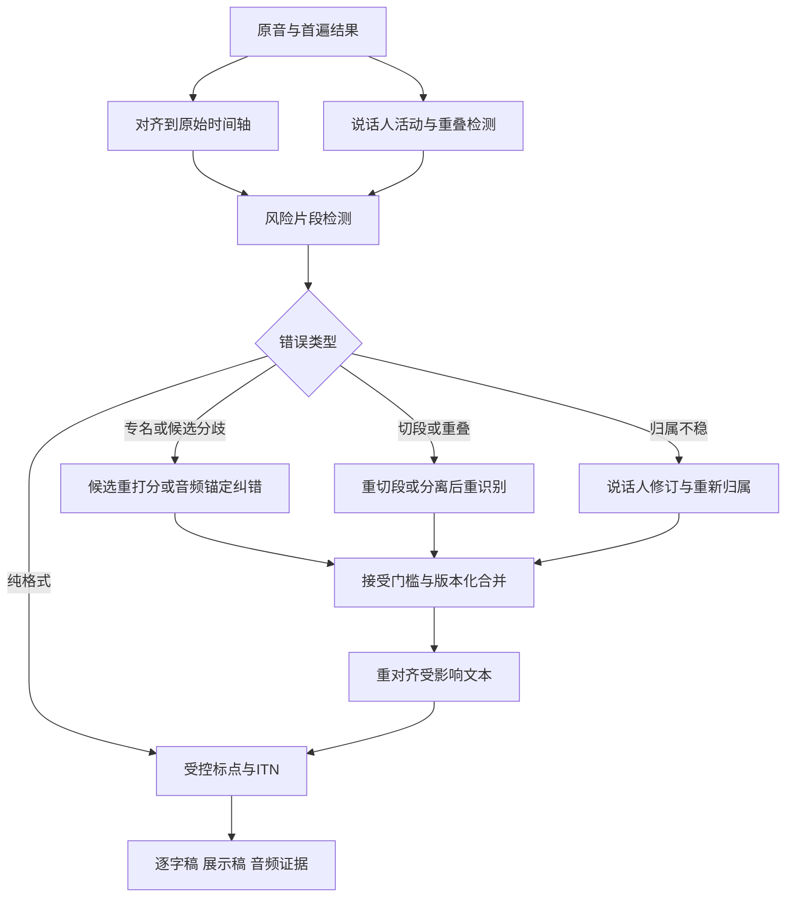

# ASR 后处理：质量目标、文本规范化与实施方案

查询截止2026-09-23。下文结合论文事实与工程设计；标为“建议”的流程尚未在用户音频上实测。后处理指第一遍ASR之后的处理，其中回到音频再次识别的部分应准确称为二遍处理，而非纯文本修饰。

## 1. 什么才算提高 ASR 质量

必须分别回答三个问题：**文字有没有识别得更准确；谁在何时说的话有没有归对；记录是否更可读、更容易使用。** 三者可能同时改善，也可能互相牺牲。为一句正确转写补上问号，主要改善呈现；给正确文字换回正确说话人，改善归属；从重叠声音中追回漏词，才直接改变文字错误。后处理的实验必须写清目标。

| 处理 | 可改善的质量 | 是否直接改善字词错误 | 输入需求 |
|---|---|---|---|
| 标点、分段、大小写 | 可读性、句子结构、下游理解 | 仅格式变化时不应声称降低规范化WER | 文本；可选时间和韵律 |
| ITN数字/日期/单位 | 书面形式与业务字段 | 可能修复表示，也可能错误改变数值 | 文本与字段上下文；必要时音频 |
| 强制对齐 | 时间定位、字幕同步、词与人关联 | 给定文字对齐通常不修复文字 | 原音与文字 |
| 后验说话人标注/聚类修订 | 谁说了什么 | 文字不变时普通WER不变 | 音频或说话人时间线 |
| N-best重打分/受限融合 | 候选选择错误 | 正确内容在候选空间内时可改善 | 多候选、分数与词边界 |
| 领域与音近纠错 | 专名、同音字、缩写 | 能改对，也可能误替换 | 文本、术语；音频更有利 |
| LLM生成式纠错 | 长上下文消歧、跨句一致性 | 需验证净收益，不能用流畅度代替 | 1-best或N-best；可选音频 |
| 重切段/分离后重识别 | 漏词、混叠、边界截断 | 通过新音频输入改变识别结果 | 必须保留原音 |
| 说话人条件化ASR | 抑制串人、追回目标发言 | 有潜力同时改善文字与归属 | 原音、说话人活动/参考 |

这是目标分类表，具体方法和证据见纠错与说话人专题。普通后验贴标签不会改字，是由操作定义直接得到的结论；不要把某条完整流水线的WER收益全部归给标签模块。

## 2. 标点恢复：优先保留词序与字词

**规则法**利用停顿、固定模式和句末词决定边界，低成本、易审查；但停顿可以是思考而非句末。**序列标注**给每个词/字边界预测逗号、句号、问号等，只插入标点；**生成模型**直接输出新文本，适应上下文但需要额外防止删词或改词；**声学—文本融合**加入停顿、语调或音频编码器特征，适合仅凭词无法区分的语气。西班牙语研究提供声学与词汇融合的例子，其结果不能外推为中文通用收益。[声学—词汇标点研究](https://aclanthology.org/2024.unimplicit-1.3/)

2025年的Cadence用预训练语言模型适配标点恢复，覆盖22种印度语言及英语，并讨论自发语音、口语不流畅和域迁移问题。它是多语种标点研究线索，不能由“多语种”推断支持中文。[Cadence论文](https://aclanthology.org/2025.findings-ijcnlp.110/)

2026年的Weighted Lookahead Scoring在有界右上下文内给标点候选打分，保留输入字词，不自由生成。论文在IWSLT 2017、K=2子词前瞻下报告微调后四类macro-F1为0.937，对照微调ELECTRA为0.913。这是特定数据与前瞻预算下的标点结果，不是WER降低比例。[2026流式标点论文](https://arxiv.org/abs/2606.05179)

还有一个容易漏掉的问题：标点模型常用完整句子训练，线上收到的却是VAD截出的片段。Interspeech 2025研究用模拟VAD分段构造训练文本，针对这类分布差异减少错误标点预测。**工程建议：**训练/评测标点恢复要输入真实ASR片段和错误文本，不能只输入干净人工句子。[VAD-aware文本分段](https://www.isca-archive.org/interspeech_2025/novitasari25_interspeech.html)

实施建议：默认选择边界标注或插入受限生成；标点步骤输出前后去除允许标点后，字词序列应保持一致。流式只修改未稳定尾部，按可用后文延迟提交标点；已经显示的句号如果引发频繁回滚，应计入体验损失。句末标点不能直接作为语音Agent开始执行的唯一信号。

## 3. ITN：确定“该不该改”比会转换更重要

| 路线 | 方法 | 适合情况 | 主要代价 |
|---|---|---|---|
| 规则/WFST | 先识别数字、日期、金额等类别，再做受控映射 | 电话、金额、固定编号、明确语法 | 多语言和歧义规则维护 |
| Token tagging | 为输入token预测复制、删除或替换片段 | 保持输入可追溯、减少自由生成 | 依赖标签集合与训练覆盖 |
| Seq2seq/LLM | 利用长上下文生成书面形式 | 不规则表达、复杂语义 | 可能增删事实、改变数值 |
| 混合 | 模型判类别/候选，规则执行和校验 | 同时需要语义与可控转换 | 需要保留候选和失败回退 |
| 模型内双形式输出 | ASR同时学习口语和书面输出 | 可训练/适配模型的完整系统 | 超出纯后处理，需要数据与训练 |

NeMo ITN以WFST语法为经典可控路线；Thutmose把任务做成单遍token分类与替换，论文在英语、俄语数据验证，目标之一是减少seq2seq不可恢复的幻觉。中文可检查WeTextProcessing的TN/ITN规则实现，但仍要对自己领域的数值和口述方式测试。[NeMo ITN论文](https://arxiv.org/abs/2104.05055)、[Thutmose](https://arxiv.org/abs/2208.00064)、[WeTextProcessing](https://github.com/wenet-e2e/WeTextProcessing)

2025年Dynamic Context-Aware ITN研究动态块长及右上下文，在越南语流式场景验证；它说明ITN也有上下文—延迟取舍，不能总在当前数字刚出现时定稿。[流式ITN论文](https://www.isca-archive.org/interspeech_2025/ho25_interspeech.html)

2026年中文Dual-Form ASR使用口语/书面成对监督与ITN-MWER，提出REQUIRE-ITN和FORBID-ITN分别评估必须转换与不应转换的跨度。该工作是预印本、属于ASR训练层扩展；其评测思想可以用于现有后处理：既看该改处有没有改对，也看不该改处有没有被破坏。[中文Dual-Form ASR](https://arxiv.org/abs/2609.02901)

例如“型号是一三零零”不应未经领域规范就解释成数值1300；“三点一四”可能是小数也可能是版本的片段。建议将 `spoken_text、display_text、normalized_value、unit、source_span` 分开保存。字段规范可决定展示，但如果原音实际说的是“十五”，后处理不能凭业务常识自动改成“五十”。无法确定时保持原文或提供待复核候选。

**去口吃与口语整理也单独处理。** “星期四，不，星期五”在逐字记录里两者都应保留，在最终预约槽位里可能采用更正后的星期五；两种输出都应能追溯同一原音。把逐字稿剪成书面稿会改变任务，不应混进“识别准确率提高”的结果。

## 4. 一个可实现的二遍质量增强流程

以下为本报告提出的设计方案，不是某个开源工具的现成功能组合。

**第一步：保留证据。** 首遍保存原音、声道、分段偏移、模型版本、文字、可用置信度、N-best和中间事件。黑盒API不一定有N-best或词置信；此时可以用第二识别器分歧、重叠概率、对齐异常等定位风险，但这些是代理信号，不是金标。模型重采样、VAD压缩和源分离后必须能映射回原始时钟。

**第二步：只对风险区投入。** 风险包括低置信、候选分歧、长段异常重复、语音区无字、说话人切换附近的短词、多人重叠、罕见实体和数字。不同信号分别在开发集校准，不把所有API的0.8当成同样可靠。稳定正确的原文作为明确的“不修改”样本。

**第三步：先选能处理该错误的路径。** 少标点走标点模块；专名分歧走候选与领域词表；被截断的尾词回原音扩大边界；重叠漏词试分离后重识别；串人但字正确就只改归属。对于会议可保留两路结果：快首遍用于实时预览，高质量二遍作为会后记录。不要把所有失败都送给纯文本LLM。

**第四步：有限修改与可回退。** 接受逻辑可以综合音频支持、候选分数、上下文与编辑风险；门槛需开发集验证，不能用LLM自称“很确定”代替校准。输出原跨度、新跨度、修改类别和依据；未通过则保留原文并标记不确定。文本插入/删除后需重算受影响区间的对齐和说话人归属，不能沿用旧词下标。

**第五步：拼接与反馈。** 重跑窗口含上下文边缘，但只提交有证据的目标区修改；重复话语不能用字符串去重随意删除，应结合时间。词表可按会话与已确认实体共享，说话人记忆须区分全会话主题和个人表达，不因说话人误聚类就让错误上下文永久累积。循环次数要有上限，并记录每轮真实净收益。

## 5. 按现有条件选择方案

| 目前拥有的资源 | 推荐起点 | 暂时不能做的事 |
|---|---|---|
| 只有一份文字 | 受控标点/ITN、很保守的词典纠错 | 可靠恢复漏掉的重叠语音、判断真实说话人 |
| 文字加原音，无N-best | 独立对齐/分人，风险区二次ASR与候选对照 | 把两模型共识当作正确概率 |
| 原音加N-best/分数 | 重打分、受限融合、置信筛选 | 无校准直接混合不同模型原始分数 |
| 多声道/分轨录音 | 保留每通道及同步，分别识别再合并 | 把声道永久等同于一个真实人 |
| 允许训练/微调 | 学习错误检测、领域纠错、说话人条件模型 | 用测试集答案造词表或筛门槛 |
| 实时产品 | 稳定前缀加暂定尾部，重处理异步运行 | 将离线收益假定为同样实时收益 |

**优先次序建议：**先建立对齐、版本和评测；再做可控格式层；会议先检验分人和重叠问题；随后加入候选纠错或局部二遍；有稳定错误模式和足够数据后才训练复杂后处理。这里的“先后”按信息价值与可诊断性排列，不是所有场景都必须部署所有模块。

## 6. 怎样证明是在改好，而不是改得更漂亮

冻结首遍输出，所有方案对同一输入做配对比较。测试集至少包含：原本正确的文本、真实ASR错误、专名数字、短插话、重叠、长会议、方言/混说和非语音；开发集用于阈值与提示调整，测试集不可用于术语注入。人工参照同时保留逐字、时间/说话人以及显示规范。

设同一参照下首遍编辑错误数为E0、后处理为E1，直接报告 `净错误减少=E0−E1` 与 `相对错误减少=(E0−E1)/E0`；E0为零时只报告新增错误。局部编辑可能重新排列最优对齐，因此不能简单把所有字符diff都当成修复；另对修改跨度人工标为有效修复、无害格式变化、错误修改或无法判定。

| 评估层 | 至少报告 | 能排除什么误判 |
|---|---|---|
| 文字 | 固定规范化CER/WER、S/D/I、最差场景 | 标点改变造成的假提升 |
| 修改行为 | 修改精确率、错误修复召回、原正确片段受损率 | 改得多却净收益低 |
| 实体/数字 | 完整实体、数值+单位、否定词正确率 | 平均分掩盖关键事实损坏 |
| 说话人 | DER、cpWER/tcpWER或明确中文字符变体 | 字对但人错、短插话丢失 |
| 时间 | 词边界偏差、未对齐比例 | 改文字后旧时间戳失效 |
| 格式 | 标点F1、ITN必须转换/禁止转换两类 | 不该转的编号被转成金额 |
| 流式 | 稳定文本延迟、回改量、句后修订时间 | 离线准确率换来不可用延迟 |
| 运营 | 每音频小时成本、人工复核分钟数 | 算力省但校对变贵 |

消融建议：A首遍；B=A+纯说话人归属；C=A+保守格式；D=A+受限纠错；E=A+风险区二遍；F=A+说话人/重叠引导二遍；G选择已证明有效的组合。B的普通WER原则上不应变化，若变化就说明还发生了别的处理；F必须与使用同样二遍预算但不利用说话人信息的对照比较，才能判断收益来自哪里。不要只做A→B→C的累计链，因为相互作用可能掩盖模块退化。

配对置信区间按录音/说话人聚类抽样；同时检查各语言、重叠程度和关键实体的退化。试点门槛应由业务容忍度决定，本文不虚构“后处理普遍提升20%”或统一误改率阈值。当前尚无用户录音、首遍结果和金标，本研究交付方法依据与实验设计，不宣称实际收益。
